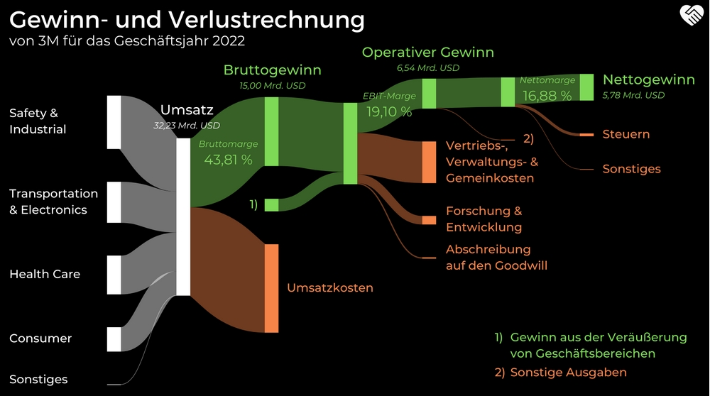

# Aktienbewertung

## Aktien- & Chartanalysen by MVI

- Bruttomarge       54 %

- operative Marge 28 %

- Interest Coverage 18 %

- Cacheconversion >100 %

- Kapitalrendite 20 %

# Die Margen

von [Margen ► Operative, Netto, Brutto Marge erklärt](https://wir-lieben-aktien.de/aktien-und-boersen-lexikon-definitionen/margen/)

## Was ist eine Bruttomarge

Die Bruttomarge bei [Aktien](https://www.alleaktien.de/lexikon/aktie-wertpapier) wird auch Gross Margin genannt und ist der prozentuale Anteil des [Umsatzes,](https://www.alleaktien.de/lexikon/umsatz) der nach Abzug der direkten Herstellungskosten beim Unternehmen 
verbleibt. Die Bruttomargen haben wir auch als festen Bestandteil bei 
Eulerpool zu jeder einzelnen Aktie verfügbar.

**Formel:**

> Gesamtumsatz - Herstellungskosten (COGS)

### Wie kosteneffizient und profitabel ist ein Unternehmen?

Die Bruttomarge ist eine Kennziffer, die angibt, wie viel Prozent des
 Umsatzes nach Abzug aller Herstellungskosten verbleiben. Sie macht also
 eine Aussage über die Kosteneffizienz eines Unternehmens und ist ein 
guter Anhaltspunkt, um die [Profitabilität](https://www.alleaktien.de/lexikon/profitabilitaet-ertragskraft) eines Geschäftsmodells abzulesen. Je höher die Prozentzahl, desto mehr 
Kapital hat ein Unternehmen zur Verfügung, um in Sales, Marketing, 
Forschung und Entwicklung zu investieren. Die Bruttomarge ist nicht mit 
dem Betriebsergebnis gleichzusetzen.

Die Kennziffer ist überwiegend für den Vergleich innerhalb einer 
bestimmten Branche geeignet, da unterschiedliche Marktsegmente 
verschiedene potenzielle Gewinnspannen bergen. Mithilfe der Bruttomarge 
kann sowohl die Situation des Unternehmens im Zeitverlauf als auch im 
Vergleich zur Konkurrenz analysiert werden. Auch für die Prognose des [Free Cashflow](https://www.alleaktien.de/lexikon/free-cash-flow-fcf) ist die Gross Margin ein wichtiges Instrument.

### **Auch Dividenden werden über die Bruttomarge finanziert**

Für [Privatanleger](https://www.alleaktien.de/lexikon/privatanleger-definition-tipps-und-fehler-2) ist die Bruttomarge eines Unternehmens so wichtig, weil auch die [Dividenden](https://www.alleaktien.de/lexikon/dividende) über diese finanziert werden. Nicht nur Ausgaben für Werbung. 
Grundsätzlich solltest du dich erst einmal nach Unternehmen mit hohen 
Bruttomargen umschauen. Die Unterschiede je nach Branche sind enorm.

### **Auch auf die Entwicklung der Bruttomarge achten**

Wenn du die Bruttomarge eines Unternehmens analysierst, dann achte 
unbedingt auch auf die Entwicklung der Bruttomarge über die Jahre 
hinweg. In diesen Zahlen findest du ganz interessante Erkenntnisse. 
Idealerweise sollte sie über mehrere Geschäftsjahre hinweg steigen, 
mindestens aber konstant bleiben. Eine sinkende Bruttomarge deutet 
darauf hin, dass nicht alle Kostensteigerungen an die Kunden 
weitergegeben werden können. Die Marktmacht schwindet und der [Gewinn](https://www.alleaktien.de/lexikon/gewinn-earnings) sinkt in Folge dessen.

Gehen wir davon aus, dass die Umsätze des Unternehmens von Jahr zu 
Jahr steigen. Gleichzeitig ist die Bruttomarge aber innerhalb von fünf 
Jahren von ehemals 40 % auf 36 % gesunken. Gleichzeitig hat das 
Unternehmen weniger in Entwicklung und in Marketing investiert. Das 
gleicht die sinkende Bruttomarge kurzfristig aus, ja es wird sogar ein 
steigender Jahresgewinn ausgewiesen. Der wiederum eine höhere 
Dividendenzahlung zur Folge hat.

### **Was sind Gründe für eine sinkende Bruttomarge?**

Doch die Frage, die sich der Anleger stellen sollte ist, woher kommt 
die rückläufige Bruttomarge? Gründe für eine rückläufige Bruttomarge 
gibt es viele. Zum Beispiel:

- Das Unternehmen kann seinen Umsatz nur noch steigern, in dem es 
  die Verkaufspreise senkt. Entweder weil die Produkte zu teuer sind oder 
  preiswerte Konkurrenten in den Markt getreten sind. Also hoher 
  Wettbewerbsdruck.
- Das Marketingkonzept und die Werbekampagne haben versagt und die Qualität des Produktes wurde nicht richtig kommuniziert
- Der Zahn der Zeit nagt schon an den Produkten, weil zu lange auf Innovation verzichtet wurde

Bevor
 du in Aktien eines Unternehmens mit einer rückläufigen Bruttomarge 
investierst, solltest du genau untersuchen, auf was das Problem 
zurückzuführen ist.

### **Grenzen der Bruttomarge**

Die Bruttomarge enthält keine Gemeinkosten. Und das ist ihr großer 
Nachteil, respektive hier stößt sie bezüglich Aussagekraft an ihre 
Grenzen. Ob beispielsweise Vertrieb oder Verwaltung effektiv und 
kostensparend arbeiten, kann nicht beurteilt werden. Zudem sind nicht 
nur unternehmensinterne Faktoren für die Bildung der Bruttomarge 
verantwortlich. Auch externe Einflüsse wie die allgemeine Konjunkturlage
 oder Preise von Rohstoffen können die Bruttomarge verschlechtern, ohne 
dass das Unternehmen diese Faktoren beeinflussen kann. Die Auswirkungen 
einer steigenden oder sinkenden Bruttomarge sind klar abzuleiten, aber 
die Ursache der Veränderungen bleibt teilweise offen.

### **Unterschied zwischen Brutto- und Nettomarge**

Für die Berechnung der Nettomarge, auch Net Profit Margin genannt, 
werden die nicht produktspezifischen Kosten sowie Steuern und Zinsen 
eingerechnet. Die Nettomarge entspricht daher beinahe dem [operativen Gewinn](https://www.alleaktien.de/lexikon/ebit-operatives-ergebnis). Die Bruttomarge ist dagegen nur eine Vorstufe dieser Berechnung und ist ein wenig allgemeiner gehalten als die Nettomarge.
