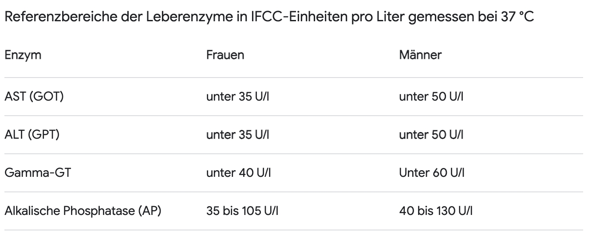
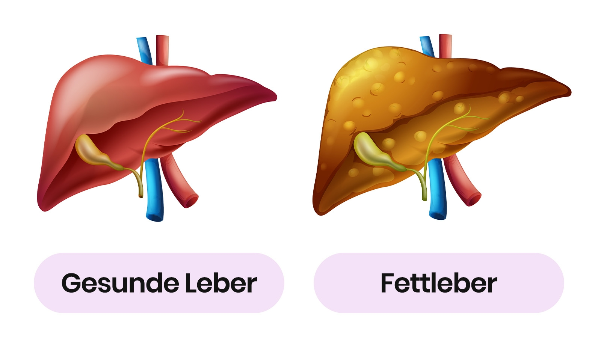
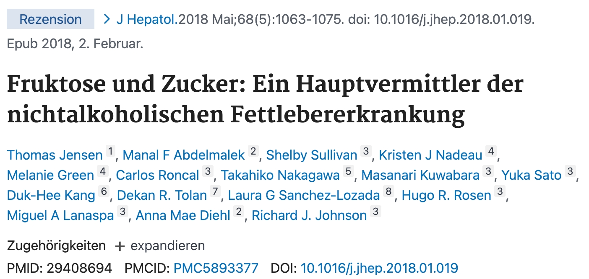
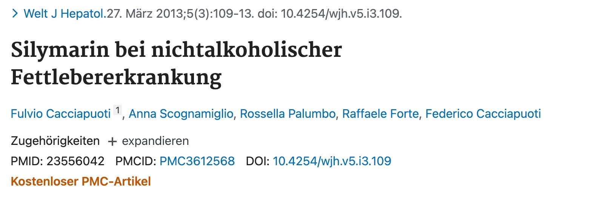
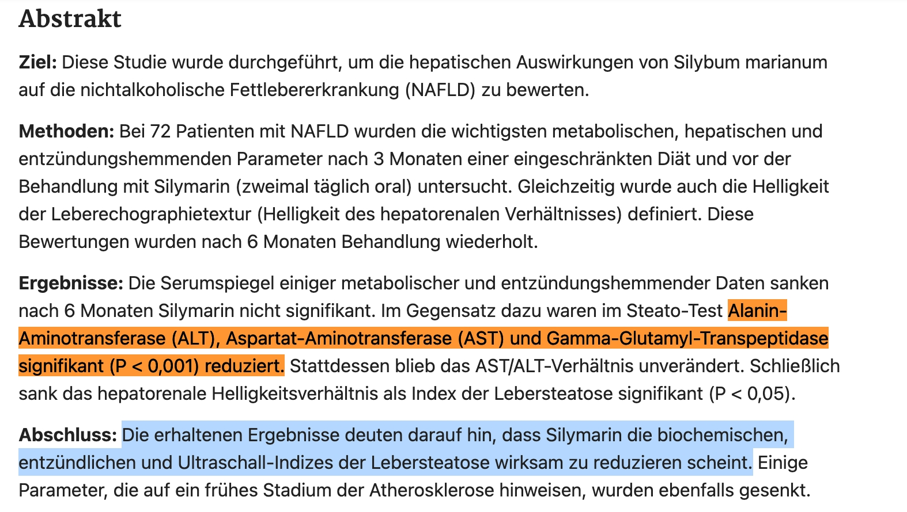
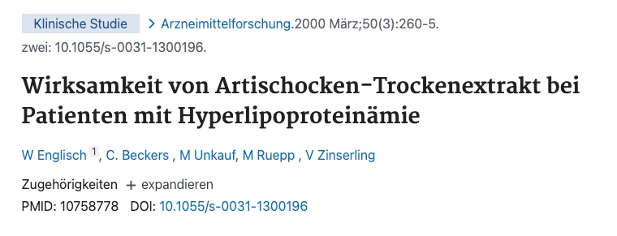
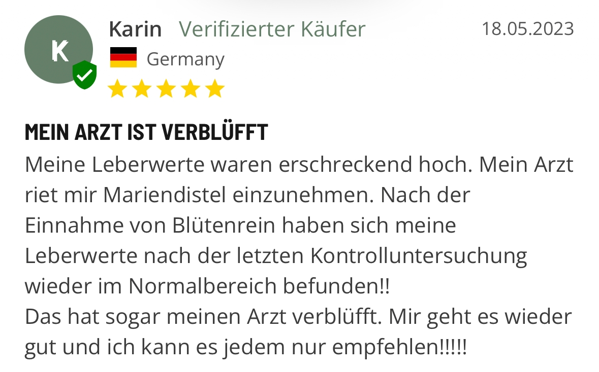
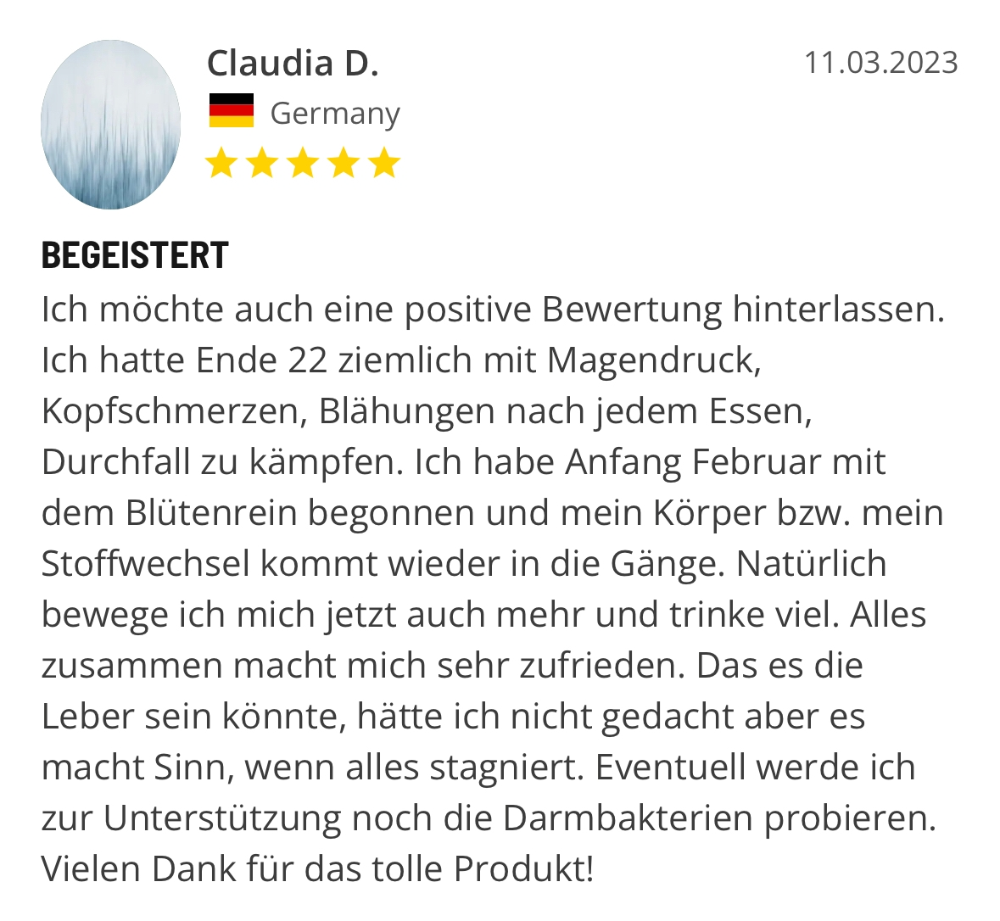
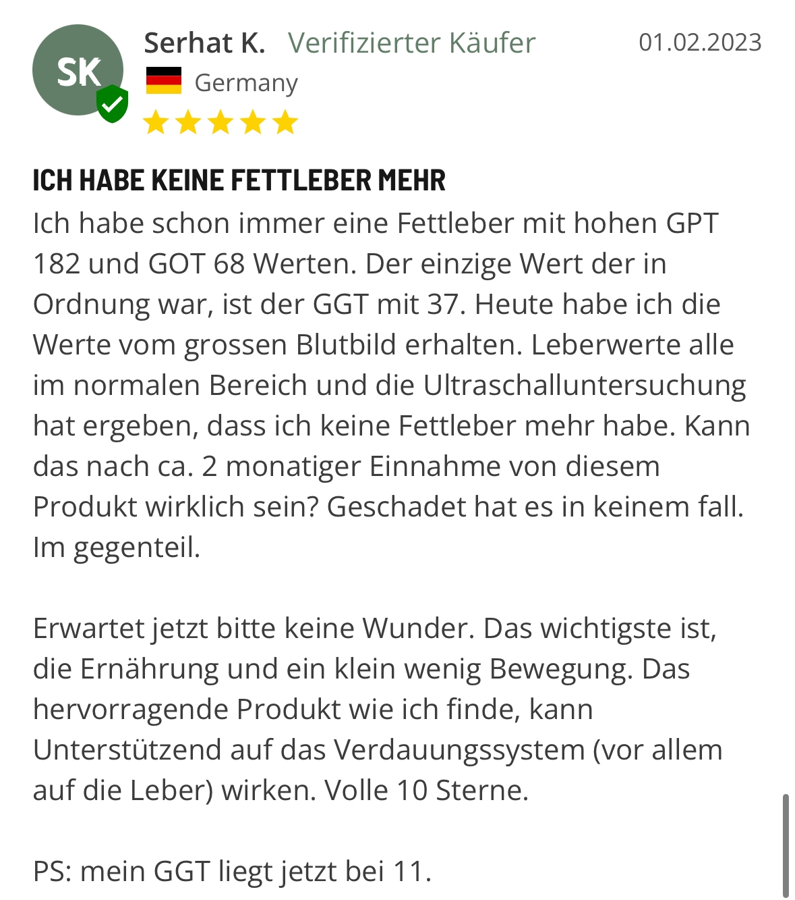
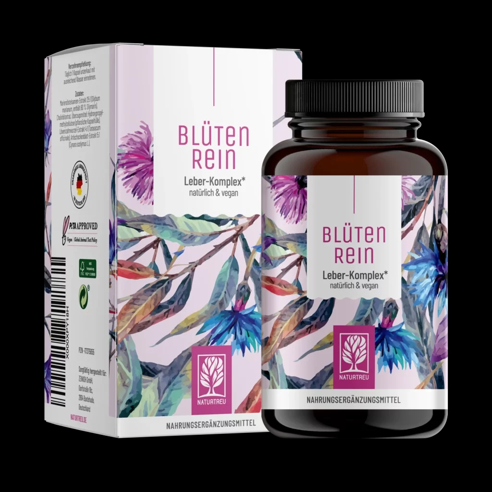

# Fettleber geheilt! Jetzt klappt es auch wieder mit dem Abnehmen

aus: https://thehealingmagazine.de/fettleber-abnehmen-hs-lang-v2/?tw_source=ig&tw_adid=120200911475560124&sca_ref=280550.44TFZYtYJu&sca_source=Facebook&fbclid=PAAabL-S5I9-Ck8avoxsdbRp2ffoKx2h9BGz6j8zUs2iz-FgITKUFz3PCVRF4_aem_AS1Pd5xumi0V6965-Hh6HPQbcm82-Sl5myu-TOImqS7FxZmdPprcB5jwXwU4XxJsCZv2YwIyBUSxjXRnW3WU7cbg&utm_source=facebook&utm_medium=paid&campaign_id=120200911475550124&ad_id=120200911475560124

Endlich purzeln die Pfunde wieder. Wie ich in 12 Wochen meine Fettleber geheilt und meinen Stoffwechsel angekurbelt habe.

Geschrieben von: Barbara Lang

Hallo, ich bin Barbara und kämpfe seit 10 Jahren mit **Übergewicht**.

Seit meiner Schwangerschaft vor 10 Jahren habe ich **20kg zugenommen**. Und ich wusste lange Zeit nicht warum.

Wenn du diesen Artikel liest, hast du vermutlich ebenfalls mit **Übergewicht** zu kämpfen.

Ich muss dir also nicht mehr erklären, welche **große Belastung** es darstellt.

Deswegen spare ich mir die Zeilen über **Scham**, fehlendes **Selbstbewusstsein** und gesundheitliche **Zukunftssorgen**.

Worauf ich aber eingehen möchte, ist die nicht seltene **Pauschalverurteilung** der Mitmenschen.

Oft heißt es: **“Mach doch einfach mehr Sport”** oder **„Ernähre dich doch einfach gesünder.”**

Oder mein Favorit: “wenn du einfach weniger isst, wirst du auch abnehmen. So schwer ist das nicht.”

Lange Zeit habe ich diesen Menschen geglaubt.

Und mich dann noch schlechter gefühlt, als **eine Diät nach der anderen gescheitert** ist.

Jetzt weiß ich: Nein, einfach nur weniger essen oder mehr Sport zu machen, ist nicht immer die Lösung.

Ja, ich weiß, was ein Kaloriendefizit oder ein Grundumsatz ist.

In der Theorie gilt: wenn du weniger Kalorien zu dir nimmst, als dein Körper verbrennt, nimmst du ab.

In der Praxis ist es aber nicht immer so.

Ich ernährte mich zum Beispiel **5 Jahre lang vegan**.

Kein Fleisch, Fisch oder Eier. Viel Gemüse, wenig Kohlenhydrate.

Ich habe meine **Kalorien bis aufs Genaueste gezählt**. 1.600kcal pro Tag.

Laut Theorie hätte mein **Hüftgold** nur so dahinschmelzen müssen.

Leider tat es das aber nicht.

Für mich machte es einfach keinen Sinn.

Wie kann es sein, dass ich bereits so wenig esse und trotzdem nicht mehr abnehme?

Heute weiß ich, woran es lag.

**Ich habe ein entscheidendes Puzzlestück übersehen.**

## Nach über 10 Jahren Leidensweg machte ich eine entscheidende Entdeckung

Ich fand eine Methode, mit der ich innerhalb von 6 Wochen sage und schreibe **5kg abgenommen** habe.

Nach insgesamt 3 Monaten waren es sogar 10 kg. Und mein neues Gewicht konnte ich bis heute halten.

Ich fühle mich **gesünder, aktiver und voller Energie.**

Das Ganze gelang mir **ohne Ernährungsumstellung, Diäten oder medizinischen Eingriffen**.

Und das Beste daran: es handelt sich um eine **völlig natürliche Methode,** die sogar meine **Blutwerte verbessert** hat.

Doch nicht nur das: Im Zuge meiner Recherche habe ich auch herausgefunden, warum es so vielen Menschen so schwer fällt, ihr Bauchfett zu verlieren.

Obwohl sie sich bereits im **Kaloriendefizit** befinden und sich gesund ernähren.

Ich habe herausgefunden, was die **Handbremse** ist, die man lösen muss, um endlich abzunehmen.

Wenn du die gleichen Probleme wie ich hast, dann lies dir diesen Artikel unbedingt durch.

Ich habe in den letzten Jahren mein Herzblut in dieses Thema gesteckt und wie eine Besessene nach einer Lösung für mein Problem gesucht.

Meine Erkenntnisse möchte ich nun mit der Welt teilen. Denn ich bin mir sicher, dass es auch dir helfen wird.

Bis heute konnte ich mein Wunschgewicht mühelos halten

## Wie kam ich also zu dieser Entdeckung und was hat es damit auf sich?

Wie oben bereits erwähnt, habe ich nicht nur **alle möglichen Diäten probiert**, sondern ernähre mich auch seit 5 Jahren vegan.

Jede einzelne Diät scheiterte.

Bei den besten Diäten habe ich in den ersten Wochen gut abgenommen, kam dann aber entweder nicht mehr weiter, oder der berühmte Jojo-Effekt setzte ein.

Weißt du, wie **frustrierend** das ist? 

Man quält sich durch die Diät und **verzichtet monatelang auf zahlreiche Nahrungsmittel** –  nur um dann am Ende gar nicht abzunehmen, oder das abgenommene Gewicht in Form des Jojo-Effekts direkt wieder zuzunehmen. 

Oder so wie bei mir: man nimmt die ersten 5-7kg ab und dann geht es einfach nicht mehr weiter. Als würde der Körper sagen: „bis hierhin und nicht weiter“.

Als ich damit begann, über einen Zeitraum von 6 Monaten meine Nahrungsaufnahme genauestens zu dokumentieren, wurde mir klar, dass etwas nicht stimmen kann.

Im Durchschnitt kam ich auf **1.600 kcal pro Tag**.

Für eine 172cm große Frau mit 86 kg Körpergewicht bedeutet das, dass ich eigentlich abnehmen hätte müssen.

Jeder **Kalorienrechner** im Internet bestätigte mir, dass mein Grundverbrauch bei über 2.000 kcal pro Tag liegt.

Trotzdem hat sich auf der Waage nichts bewegt.

Es fühlte sich an, als hätte mein Körper die **Grundgesetze der Physik lahmgelegt.**

Als wäre irgendwo in meinem Körper eine **Handbremse** angezogen, die dazu führt, dass sich die Zahl auf der Waage einfach nicht mehr bewegte.

Doch damit nicht genug: ich fühlte mich auch **immer müder und schlapper**.

Es war ganz schön schwierig, hier nicht in eine **Abwärtsspirale** zu gelangen.

Mit viel Mühe schleppte ich mich trotzdem zweimal pro Woche zum Sport.

Aber nichts wurde besser.

Zu allem Überfluss stand zu dem Zeitpunkt in meinem Leben eine **äußerst unangenehme Veranstaltung** an.

Nein, es war Gott sei Dank nicht meine Hochzeit.

Es war ein **Klassentreffen**.

## Das Klassentreffen des Grauens. Oder doch das fehlende Puzzlestück?

Ich war nie ein dickes Kind, aber auch nie besonders schlank.

Zugegeben: Vor allem in **jüngeren Jahren** habe ich mich **nicht immer gesund ernährt**.

Da gab es dann zum Frühstück auch gerne mal **Cornflakes**, **Orangensaft** und einen Bissen vom leckeren **Croissant**.

Umso nervöser fühlte ich mich beim Gedanken an das anstehende Klassentreffen.

Was würden meine ehemaligen KollegInnen von mir denken?

Die Barbara, die nun auf **einmal 15 kg schwerer** aussieht?

Wie es so oft im Leben ist: Man macht sich unnötigerweise Sorgen über irgendwelche Zukunftszenarien, die dann nicht eintreffen.

Mein Gewicht war natürlich Gesprächsthema. Und es war mir anfangs unangenehm.

Aber meine **Klassenkolleginnen** standen auch hilfsbereit mit Rat und Tat zur Seite.

Genauer gesagt war es meine damalige **Freundin Sabine,** die mich darauf angesprochen hat.

Sabine hat nach ihrem Abitur Medizin studiert und dabei ihren **Ehemann Oliver** kennengelernt.

Ein **angesehener Diätologe aus den USA**, den sie bei einem **Auslandssemester** kennenlernte und der inzwischen in Berlin lebt und arbeitet.

Als ich ihr von dem **Phänomen** erzählte, dass ich seit Monaten **trotz Kaloriendefizit nicht abnehmen** konnte, gingen bei ihr sofort die **Alarmglocken** an.

Das kam ihr nämlich bekannt vor.

Ihr Mann Oliver hatte damit schon oft zu tun. Für ihn war es alles andere als überraschend.

Sabine bot mir dann freundlicherweise an, **zu ihrem Mann in die Praxis zu kommen.**

Genau das tat ich dann bereits eine Woche später.

## Die Fettleber als Übeltäter

Oliver begrüßte mich ganz herzlich in seiner Praxis und kam dann direkt zum Punkt.

Angesprochen auf meine **vielen gescheiterten Abnehmversuche**, rückte Oliver direkt mit seinem Verdacht raus.

Er meinte:

“Wenn ich höre, dass Frauen trotz Kaloriendefizit nicht abnehmen und sich darüber hinaus auch noch oft müde fühlen, hängt das in **9 von 10 Fällen mit dem Stoffwechsel** zusammen”

Für den **Stoffwechsel** verantwortlich ist vor allem ein Organ:

**Die Leber.**

Deswegen ordnete mir Oliver zuerst einen **ausführlichen Bluttest** an.

Zwei Wochen später saß ich wieder bei ihm in seiner Praxis in Berlin.

Das Ergebnis des Tests war **erschreckend**.

Trotz meiner inzwischen gesunden, fettarmen Ernährung, waren meine **Cholesterin- und Triglyceridwerte leicht erhöht**.

Auf Nachfrage habe ich erfahren, dass die Ernährung nur **beschränkt Auswirkungen auf diese Werte** hat.

Vieles ist **erblich bedingt** und hängt mit dem **erhöhten Zucker- und Fettkonsum in jüngeren Jahren** zusammen.

Auch der sogenannte **Gamma GT Wert** (Gamma-Glutamyltransferase) war erhöht, was auf eine Fettleber hinweist.

**ALT** (Alanin-Aminotransferase) und **AST** (Aspartat-Aminotransferas) waren an der Grenze, aber (noch) nicht überhöht.

Erhöhte Gamma-GT, AST und ALT Werte können auf eine Fettleber hinweisen

“Die Wahrscheinlichkeit ist sehr hoch, dass Sie eine Fettleber haben“, meinte Oliver dann zu mir.

Die Leberwerte und ihre Aussagekraft

In meinem Fall sprachen die Leberwerte eine klare Sprache.

Ist der **Gamma-GT** Wert erhöht (bei mir war er bei 49 U/l), ist das ein Anzeichen für eine Fettleber.

Sind **ALT** und **AST** erhöht, befindet man sich oft schon in Stufe 2 – einer entzündeten Fettleber.

Mit dem Leberwerten muss man jedoch auch aufpassen: **selbst wenn die Werte gut aussehen** kann man an einer Fettleber leiden. Vor allem der Cholesterin-Wert wird oft missverstanden.

Deswegen empfiehlt Oliver, in erster Linie auf seine **Symptome zu hören**. 

Unerklärliche Gewichtszunahme, bzw. **hartnäckiges Bauchfett** trotz Kaloriendefizit, sowie starke Müdigkeit selbst nach ausreichend Schlaf zählen zu den Symptomen. 

## Was ist eine Fettleber?

Von einer Fettleber spricht man, wenn ein **Großteil der Leberzellen Fett** enthält.

So wie der Körper außen Fett ansetzen kann, setzt sich auch innen Fett an – manchmal sogar an den **Organen**.

Deswegen ist bei **übergewichtigen Menschen** mit viel Körperfett in den meisten Fällen auch eine Fettleber vorhanden.

Schätzungen zufolge leiden **20-30% aller Deutschen** an einer Fettleber.

Ja, richtig gelesen. Ungefähr **jede vierte Person in Deutschland hat eine Fettleber.**

Viele sogar ohne dass sie es wissen. 

Denn das klassische Symptom – ein **Druckgefühl in rechten Oberbauch** – tritt oft nur bei einer fortgeschrittenen Fettleber auf.

Viel häufiger sind Symptome wie **gescheiterte Abnehmversuche** trotz Kaloriendefizit, **trockene Haut** und Juckreiz, übermäßiges **Schwitzen** und **ständige Müdigkeit**.

Oft wird die Fettleber in drei Stufen eingeteilt:

1. eine **Fettleber ohne Entzündung**. Hier hat man meinst noch keine Schmerzen, weil die Leber keine Schmerzrezeptoren hat
2. die **Steatohepatitis** bzw. **Fettleberhepatitis**, also eine Fettleber mit entzündlicher Reaktion. Druckgefühl im Oberbauch, Blähungen und häufiges Völlegefühl zählen zu den Symptomen dieser Stufe.
3. die Leberzirrhose. Ab hier ist die Krankheit nicht mehr umkehrbar!

Schätzungen zu Folge kommen knapp die Hälfte aller Betroffenen von Stufe 1 zu Stufe 2. 

Bei knapp 10% kommt es zu einer Leberzirrhose.

Vor allem **übergewichtige Menschen** sind besonders oft von einer Fettleber betroffen. Darunter auch immer mehr Kinder und Jugendliche.

“Durch ungesunde Ernährung, Bewegungsmangel oder eine andere Krankheit kann sich die sogenannte nicht-alkoholische Fettleber entwickeln.” - Universitätsspital Zürich

Oft ist die **Fettleber** eine Folge von **ungesunder Ernährung** oder der **Einnahme starker Medikamente** zur Behandlung von anderen Krankheiten.

In der Medizinersprache heißt es **NAFL – nichtalkoholische Fettleber**. 

Besonders **Zucker** spielt eine große Rolle.

Oliver hat mir dazu folgende Studie gezeigt.

In dieser Studie wurde nachgewiesen, dass ein **hoher Konsum von Fruktose und Zucker** zu einer **Fettleber** führen und sogar das Darm-Mikrobiom stören kann.

Das Problem dabei? Man kann dem Zucker und **zuckerähnlichen Stoffen** inzwischen kaum noch ausweichen.

Die **Lebensmittelindustrie** “versteckt” den Zucker inzwischen auf den Beschreibungen der Inhaltsstoffe vieler Lebensmittel.

Dort findet man dann statt Zucker so Wörter wie **Maltrose, Laktose** oder **Maissirup**.

Selbst vermeintlich gesunde Lebensmittel wie **Müsliriegel oder diverse Light Produkte** sind davon betroffen.

Ja, sogar **zu viel Obst oder Smoothies** begünstigen eine **Fettleber**. 

Denn die enthaltene Fruktose wird genauso in Zucker und später in Fett umgewandelt.

**Was für eine Ironie:** man kauft ein Light Joghurt mit extra wenig Fett, um sich gesund zu ernähren, und begünstigt am Ende aufgrund des Zuckerzusatzes nur noch die **Fettlebererkrankung!**

## Wie hängt nun die Fettleber mit meinen gescheiterten Abnehmversuchen zusammen?

Die **Fettleberdiagnose** war erstmal ein **ziemlicher Schock** für mich.

Doch so ganz verstanden habe ich nicht, warum mich eine **Fettleber plötzlich am Abnehmen hindern** soll.

Oliver erklärte mir daraufhin, welche Rolle die Leber genau spielt.

Nach dieser Erklärung fiel es mir wie **Schuppen von den Augen** und für mich war klar, warum ich nicht mehr weiter abnehmen konnte und mich immer so müde fühlte.

Auf einmal machte es auch Sinn, warum meine **Diäten alle gescheitert sind**.

„Die Leber ist das zentrale Organ des gesamten Stoffwechsels. Ist die Leber in ihrer Funktion eingeschränkt, ist es **fast unmöglich, effektiv abzunehmen**“ meinte Oliver.

### Die Leber und der Stoffwechsel

Hast du dich schon einmal gefragt, was der Stoffwechsel eigentlich sein soll?

Was inzwischen als Modewort die Runden macht, bedeutet nichts anderes als die **Umwandlung von Stoffen im Körper**.

Die Stoffwechselprozesse spielen sich vor allem in der Leber ab.

Die Leber kann man sich als **Müllsortier- und entsorgungsanlage** vorstellen.

Alles, was von uns aufgenommen wird, wird chemisch oder physikalisch so **umgewandelt**, dass wir es für weitere Prozesse verwenden können.

Früher oder später gelangt alles, was wir aufnehmen, in die Leber und wird dort abgebaut. 

Das gilt für **Medikamente** genauso wie für **Nahrung**.

Ein **Stück Kuchen** wird zum Beispiel im Magen und Darm gespalten und zerkleinert.

Ein Teil davon wird dann zur Leber transportiert, wo die **brauchbaren Nährstoffe umgewandelt** werden, je nachdem, was der Körper gerade braucht.

Die **unbrauchbaren Teile** werden von der Leber für den Abbau und die “**Müllentsorgung**” fertig gemacht.

Deswegen gilt die Leber auch als **Entgiftungsorgan**.

Bis hierhin war die Erklärung von Oliver nachvollziehbar und wenig überraschend. 

Was er aber dann erzählte, hatte ich zuvor noch nie gehört.

Er meinte: **“Übergewicht hängt oft mit den Schadstoffspeichern der Leber zusammen.”**

Wenn jemand essen kann, was er oder sie will und einfach nicht zunimmt, wird das in der Volkssprache als **“schneller Stoffwechsel**” abgetan.

In Wahrheit bedeutet das einfach nur, dass die Leber dieser Person in ihrer Funktion einfach noch nicht beeinträchtigt ist und **problemlos alles verstoffwechseln** kann.

Im Umkehrschluss bedeutet das: **eine ungesunde Leber** – so wie bei mir – **kommt schneller an ihre Grenzen**. 

Und das zeigt sich dann in der Form von **Müdigkeit und Gewichtsproblemen**.

Das ist übrigens auch der Grund, warum man in jüngerem Jahren nicht so leicht an Gewicht zunimmt – die Leber ist einfach noch fitter und wurde noch nicht so stark mit Medikamenten, ungesundem Essen oder Alkohol belastet.

Im Idealfall ist eine gesunde Leber in der Lage, **Fette, Giftstoffe und Hormone** mühelos zu verarbeiten. 

Das Ganze kann man sich wie eine **Müllsortieranlage** mit einem **Fließband** vorstellen. 

Die Fließbandarbeiter (die sogenannten **Leberläppchen**) haben den Job, all das Brauchbare von Unbrauchbaren zu sortieren.

Sind die Arbeiter jedoch **überlastet** und können nicht mehr mithalten, muss die Leber als Notlösung einfach alles zusammen (Fette, Gifte, Hormone) am gleichen Ort verstauen.

Bei manchen Menschen ist die **Leber schon so träge**, dass sie Fett nicht mehr so gut verarbeiten kann, wie früher. 

Die mit der Nahrung aufgenommenen Fette werden dann **nicht als Energie verbrannt**, sondern landen als **Fettpölsterchen** auf der Hüfte.

Das ist der Grund, warum ich **trotz 1.600kcal pro Tag nicht abnehmen konnte**.

Meine Leber kann die Kalorien, die ich jeden Tag zu mir nehme, nicht mehr optimal verarbeiten.

Es setzt sich mehr **Hüftspeck** an, als bei einer Person mit einer gesunden Leber.

Laut **Kalorienrechner** sollte mein Körper pro Tag 2.000 kcal verbrennen. 

Doch woher weiß ich, wie viel er mit einer trägen Leber wirklich verbrennt? 

Was, wenn er nur 1.500 kcal verbrennt? 

„Ihr Stoffwechsel läuft mit **angezogener Handbremse**, weil Ihre Leber überlastet ist“ war das Fazit von Oliver.

Für mich war klar: ich muss die Handbremse lösen.

Zusammenfassung bis hierhin:

- **20-30% aller Menschen** in Deutschland haben eine **Fettleber**. Vor allem übergewichtige Menschen sind davon betroffen
- **Ständige Müdigkeit**, trockene Haut und Juckreiz, sowie **Probleme beim Abnehmen trotz Kaloriendefizit** können Hinweise auf eine Fettleber sein.
- **Übergewicht hängt mit der Lebergesundheit** zusammen. Eine träge, überlastete Leber führt dazu, dass vermehrt Fett im Körper angelagert wird, selbst wenn man nicht zu viele Kalorien zu sich nimmt.
- Ohne gesunde Leber ist unglaublich schwierig, sein Gewicht zu halten oder abzunehmen.

## Die Fettleber kann geheilt werden

Oliver hatte aber auch gute Neuigkeiten für mich.

Die Leber ist nämlich das **einzige Organ** im menschlichen Körper, dass sich von selbst vollständig heilen kann.

Eine Fettleber zu heilen, ist laut ihm sogar **ziemlich einfach**. Manche seiner Patienten schaffen das sogar **innerhalb weniger Wochen**.

Eine reine Ernährungsumstellung ist dabei überraschenderweise **nicht die effizienteste Methode**.

Außerdem ist eine zu **radikale Diät** sogar schädlich für die Leber.

Deswegen sollte man Abstand von Diäten und dem aktuell so beliebten **Leberfasten** halten.

Beim Leberfasten nimmt man 2 Wochen lang hauptsächlich Gemüse und Eiweißpulver zu sich.

Für die Leber ist das sehr **stressig** und kontraproduktiv.

Oft verstärkt man damit sogar noch bestimmte **Nährstoffmängel**.

Übrigens: Cholesterinsenker (sogenannte Statine) sind hier ebenfalls keine gute Lösung.

Die kaschieren nämlich nur die Symptome, entfetten aber die Leber nicht.

Man **manipuliert** damit sozusagen nur seine Cholesterinwerte. 

Statine sollten nur dann zum Einsatz kommen, wenn man ein hohes Risiko für Herz-Kreislauferkrankungen hat.

Oliver setzt bei seinen Patienten stattdessen auf eine **speziell entwickelte Fettleberkur**.

## Die Fettleber-Detox Methode

Die Fettleber-Detox-Methode wurde von Oliver **speziell für Menschen entwickelt, die aufgrund ihrer Leber nicht mehr weiter abnehmen können**.

Es wird dabei nicht nur die Fettleber abgebaut, sondern auch noch andere Organe gestärkt, die für ein **effektives Abnehmen** förderlich sind.

Dazu gehört zum Beispiel auch die **oft unterschätzte Gallenflüssigkeit.**

Das Besondere daran: man muss sich **nicht durch eine Diät quälen** und die Methode basiert zu **100% auf natürlichen Inhaltsstoffen**.

Man setzt auf eine **normale, ausgewogene Ernährung** und holt sich zusätzlich die **Kraft der Natur**, indem man gezielt auf **Pflanzenstoffe** setzt, die von der Menschheit schon **seit Jahrhunderten für die Leberentgiftung** eingesetzt werden.

Die Basis der Fettleber-Detox Methode bildet deswegen das Produkt **Blütenrein** des deutschen Familienunternehmens Naturtreu, welches alle Inhaltsstoffe vereint, die für die **Lebergesundheit** essentiell sind.

Außerdem bietet das Produkt einen **unschlagbaren Preisvorteil** für uns Anwender.

Wer kennt es nicht? Irgendwelche teure Leberkuren, die über 100€ kosten und wo man direkt mehrere Dosen bestellen muss.

Bei Blütenrein ist das anders: eine Dose enthält 120 Kapseln. Man nimmt eine Kapsel pro Tag.

So reicht eine Dose Blütenrein für eine **4-monatige Leberkur** aus!

Statt 40-50€ pro Monat kommt man so auf gerade einmal **6€ pro Monat**.

Wenn man den Doppelpack bestellt, bekommt man sogar noch 5% Rabatt.

Das nenne ich mal eine faire Preisgestaltung.

Knapp 6€ im Monat für die Chance, endlich mein Wunschgewicht zu erreichen und noch dazu meine Leber zu entgiften?

Und das mit nur **einer Kapsel am Tag?**

Mit Inhaltsstoffen, die auf **wissenschaftlichen** Studien basieren?

Für mich war klar: das ist einen Versuch wert.

### Was ist drin? Und warum?

Nur mit einer reinen Ernährungsumstellung, wird es sehr lange dauern, bis die Leber neue, gesunde Zellen bildet und das Fett abbaut.

Eine Ernährungsumstellung ist zwar ratsam, wird aber die Fettleber alleine nicht heilen.

Es heißt zwar immer: **„wenn man 4-5kg abnimmt, wird man auch seine Fettleber los“.**

Diesen Rat wirst du vielleicht auch von deinem Arzt bekommen.

Doch hier beißt sich die **Katze in den Schwanz**.

Denn das Problem ist ja, dass man ausgerechnet wegen der Fettleber nicht nachhaltig abnehmen kann.

Deswegen ist es umso wichtiger, dass man **aktiv zur Regeneration der Leber** und zur Neubildung der Leberzellen beiträgt.

Man muss also zuerst die Leber reparieren und dann dann abnehmen. Und nicht umgekehrt.

Stattdessen muss man den Körper und die Leber **aktiv mit Nährstoffen versorgen**, die die Leber bei der Entgiftung und Regeneration unterstützen.

Und genau dafür wurde Blütenrein gemacht.

Blütenrein besteht aus hochdosierter **Mariendistel**, **Artischocke** und **Löwenzahnwurzel**.

Seit Jahrhunderten werden diese natürlichen Stoffe für die Lebergesundheit eingesetzt.

Mittlerweile wurden die darin enthaltene Wirkstoffe bereits in wissenschaftlichen Studien in Verbindung mit einer Fettleber untersucht.

Achtung: was jetzt folgt, wird dich bestimmt vom Hocker hauen.

Denn die oben genannten Pflanzen wurden bereits in **wissenschaftlichen Studien** in **Verbindung mit einer Fettleber** untersucht.

Und die Ergebnisse sind absolut erstaunlich.

Mariendistel

Die Mariendistel ist eine wahre **Wunderpflanze**, wenn es um die Lebergesundheit geht.

Sie gehört zu den **antioxidativ wirksamen Heilpflanzen**. Das bedeutet, sie neutralisiert freie Radikale und reduziert den oxidativen Stress.

In Bezug zur Lebergesundheit ist die Mariendistel inzwischen sehr gut erforscht. 

Hier ist vor allem folgendes Forschungspapier aus Italien hervorzuheben:

Aus den Untersuchungen ließen sich folgende Schlüsse ableiten:

- Die Mariendistel fördert die Ausleitung alter, roter Blutkörperchen aus der Leber
- Sie macht **Giftstoffe** und **Schlackenstoffe** in den Venen der Leber **unschädlich**
- Sie verhindert, dass Giftstoffe in die Leberzellen eindringen
- Sie fördert die **Regeneration** der Leber und die **Neubildung gesunder Leberzellen**
- Bei Tieren kann die Leber sogar vor der Einnahme mancher Medikamente (z.B. Paracetamol), sowie Alkohol schützen
- Sie **verbessert** die **Gallensaftproduktion** in der Leber und **reinigt die Gallengänge** in der Leber
- Sie unterstützt die Leber in ihrer **Entgiftungsfunktion**, vor allem wenn man Mariendistel mit Löwenzahn und Artischocke kombiniert 

Es gibt aber noch eine zweite, viel beeindruckendere Studie:

An dieser Studie nahmen 72 **Fettleber-Patienten** teil, die zweimal täglich den Wirkstoff Silymarin (der auch in der Mariendistel vorkommt) zu sich nahmen.

Die Studie ging über **3 Monate** und die Probanden wurden regelmäßig auf die wichtigsten Leberwerte untersucht.

Das erstaunliche Ergebnis: die Einnahme von Silymarin führte zu **signifikanten Verbesserungen** der **ALT**, **AST** und **Gamma-GT** Werte! 

Wir erinnern uns: genau diese Werte sind sind es, die auf eine Fettleber hindeuten.

Sogar laut **Ultraschall** hat sich die Fettleber bei den Probanden verbessert.

Das Ergebnis der Studie

Artischocke

Obwohl die Mariendistel sich sehr gut eignet, um AST, ALT und Gamma-GT Wert zu verbessern, konnte bisher noch keine Auswirkung auf die Cholesterinwerte  nachgewiesen werden.

Aus diesem Grund empfiehlt Oliver noch eine andere Heilpflanze: die Artischocke.

Die Artischocke kann als **natürlicher Cholesterinsenker** eingesetzt werden, wie diese Studie zeigt:

An dieser Studie nahmen 143 Erwachsene teil, die **6 Wochen lang täglich Artischockenblattextrakt** zu sich nahmen. 

Das Ergebnis: im Durchschnitt konnte die Kontrollgruppe ihre **Cholesterinwerte um 18,5% senken.**

Auch auf die Verdauung und die Gallenflüssigkeit hat die Artischocke positive Auswirkungen. Es **verbessert den Gallenfluss** und **fördert die Funktion der Bauchspeicheldrüse**.

Am beeindruckendsten war aber diese Studie, die dem Artischockenblattextrakt eine **hepatoprotektive Wirkung** zuschreibt.

Das bedeutet, dass die Artischocke **Leberzellen schützt**, und zur **Regeneration** anregt:

An dieser Studie nahmen 100 Personen teil, die mit einer **Fettleber** diagnostiziert wurden.

Die Probanden nahmen 2 Monate lang jeden Tag Artischockenblatt-Extrakt zu sich.

**Das Ergebnis:** verglichen mit der Placebo-Gruppe, die nichts genommen hatte, war die Leber der Artischocken-Gruppe nach 2 Monaten **besser durchblutet und kleiner**, was auf **geringere Fetteinlagerungen** hinweist.

Genau deswegen funktioniert die Methode von Oliver so gut. 

Man regeneriert und schützt die Leber aktiv, anstatt sich einfach nur fettärmer zu ernähren.

Die Folge davon: eine **gesunde Leber**, sowie bessere Cholesterin-, AST-, ALT-, und Gamma-GT Werte.

„Keine Diät der Welt kann mit der Kraft der Artischocke und Mariendistel mithalten“, meinte Oliver.

Löwenzahn-Wurzel

Löwenzahnwurzel mit dem Wirkstoff **Taraxacin** ist ein absoluter **Geheimtipp** in Blütenrein.

Löwenzahnwurzel-Extrakt liegt in den Kapseln im ebenfalls hohen **4:1 Verhältnis vor.**

Taraxacin aktiviert die **Produktion des Gallensaftes**, was zu einem **besseren Stoffwechsel f**ührt.

Die Gallenflüssigkeit spielt nämlich eine große Rolle bei der **Fettverbrennung** des Körpers.

Die Leber ist über den Gallengang mit der Gallenblase verbunden.

Bereits in der Leber wird Gallenflüssigkeit produziert.

Diese Flüssigkeit wird dann über den Gallengang in die Gallenblase transportiert.

Dort wird die Flüssigkeit gespeichert.

Von der Gallenblase gelangt die Flüssigkeit dann weiter in den Darm, wo es bei der **Verdauung hilft.**

Für eine optimale Verdauung, aber auch für eine gute **Verarbeitung des Fettes**, ist eine hochwertige Gallenflüssigkeit wichtig.

Ist diese nicht vorhanden (z.B. aufgrund einer Fettleber), kann es zu **Verdauungs- und Verarbeitungsprobleme von Fetten** kommen.

Oder kurz gesagt: je besser die Gallenflüssigkeit, desto leichter „verbrennt“ man **überschüssiges Fett.**

Außerdem kann es dank der enthaltenen Bitterstoffe auch bei Blähungen, Völlegefühl und Sodbrennen helfen.

### Und bezüglich Ernährung?

Oliver empfahl mir, meinen Zuckerkonsum runterzuschrauben.

Indem man seine Ernährung so anpasst, dass man weniger Zucker zu sich nimmt, verhindert man, dass sich die Fettleber verschlimmert.

Man muss nicht vollständig auf Zucker und Kohlehydrate verzichten.

Oliver empfiehlt jedoch, nicht mehr als 50g Zucker pro Tag zu sich zu nehmen.

Wichtig: eine Leberentgiftung sollte nicht als Diät gesehen werden. Es geht nicht darum, sich zu quälen und zu hungern.

Stattdessen streben wir eine ausgewogene, normale Ernährung an.

Die Fettleber-Detox-Methode

Um Oliver’s Methode umzusetzen, musst du also folgende Schritte befolgen:

1. **Ein Fortschreiten der Fettleber verhindern**, indem du deinen Zuckerkonsum reduzierst.
2. **Die Leber regenerieren**. Hierzu benötigst du Mariendistelsamen- und Artischockenblatt-Extrakt.
3. **Die Gallenflüssigkeit verbessern**. Das geht am besten mit Löwenzahnwurzel.

Die 3 Schritte der Fettleber-Detox Methode

## Das Unternehmen hinter Blütenrein

Was mir zusätzlich noch ein Gefühl von Sicherheit vermittelte: Blütenrein ist nicht nur das Produkt eines **deutschen Familienunternehmens**, sondern wurde von einem **unabhängigen Labor geprüft**.

Das ist gerade bei Leber-Präparaten ein sehr wichtiger Faktor.

Das Hamburger Unternehmen hat es sich zur Aufgabe gemacht neue **Qualitäts- und Nachhaltigkeitsstandards** bei Naturprodukten zu setzen.

Jedes ihrer Produkte wird auf der Basis neuester **Erkenntnisse und Forschungsergebnisse** konzipiert und aus den **besten erhältlichen Rohstoffen** hergestellt.

## Mein Experiment mit Blütenrein beginnt

Blütenrein enthält die oben erwähnten Inhaltsstoffe.

Und zwar in hochdosierter Extrakt-Form.

**Mariendistelsamen-Extrakt** liegt im 25:1 Verhältnis vor. Das bedeutet, dass der Extrakt ist 25-mal höher konzentriert ist, als das Ausgangsmaterial. 

Es handelt sich dabei zu 80% um den Wirkstoff **Silymarin**, um den aus auch in den zahlreichen Studien ging. 

Das ist wichtig zu betonen. Du benötigst die richtige Sorte des Mariendistelsamen-Extraktes.

Übrigens: viele andere Leber-Präparate kosten mehr Geld und haben eine zu geringe Dosierung von Silymarin.

**Artischockenblatt-Extrakt** liegt im 5:1 Verhältnis vor.

**Löwenzahnwurzel-Extrakt** liegt im 4:1 Verhältnis vor. 

Bevor ich mir das Produkt als Test bestellte, durchstöberte ich noch die **Kundenbewertungen**.

Ich wollte sehen, ob es bereits Menschen mit einer Fettleber gibt, die das Produkt einnehmen.

Das habe ich dabei gefunden: 

Wow.

Vor allem die letzte Rezension fand ich spannend.

Ich beschloss, dem Produkt für **vier Monate eine Chance** zu geben. 

Um das Experiment spannender zu machen, ließ ich nach den vier Monaten nochmal ein **großes Blutbild** machen.

**Das Ergebnis war erstaunlich!**

Mein **Cholesterin** war leicht **reduziert**, auf nun 190mg/DL. Damit zwar immer noch hoch, aber jetzt immerhin innerhalb des Referenzbereiches.

Das Erstaunliche war jedoch der **Gamma-GT Wert**, der vor 4 Monaten noch auf eine Fettleber hinwies.

Mein Gamma-GT Wert fiel **von 49 U/l auf nur mehr 22 U/l.** 

Bei Frauen sollte der Wert unbedingt unter 40 U/l liegen.

AST und ALT haben sich ebenfalls leicht verbessert.

Der größte Unterschied machte sich aber auf der **Waage** bemerkbar.

Meine Ernährung habe ich **nicht umgestellt**. Ich war also immer noch im Kaloriendefizit.

Aber nun spürte ich das Defizit endlich auch auf der Waage.

Im ersten Monat nahm ich „nur“ 2kg ab. 

Mehr habe ich aber auch nicht erwartet.

Immerhin musste sich laut Oliver ja die **Leber zuerst heilen**, damit der Stoffwechsel in Schwung kommt.

Was ich aber bereits früh merkte: ich fühlte mich **weniger müde**, der Sport fiel mir leichter und auch mein Schlaf wurde besser.

Ab dem zweiten Monat **purzelten die Pfunde dann richtig**. 

Was früher noch eine Abwärtsspirale war, wurde jetzt zur **Aufwärtsspirale**:

Gesunde Leber –> mehr Energie –> höhere Kalorienverbrauch –> weniger Körperfett –> weniger Fett an der Leber

Nach 3 Monaten habe ich 10kg abgenommen und das Gewicht seitdem halten können.

**Die Handbremse war endlich gelöst.**

Meiner Leber ging es so gut, wie nie zuvor.

Wie du siehst: ich bin vollends von Blütenrein überzeugt.

Ich kann Dir nur empfehlen, probier es einfach aus.

Du hast nichts zu verlieren. Du kannst nur an Lebensqualität gewinnen – das sogar mit Garantie.

Naturtreu bietet nämlich eine 30-Tage-Geld-zurück-Garantie.

Deswegen verlinke ich dir hier den **Online Shop von Naturtreu**, wo du exakt das gleiche Produkt ebenfalls bestellen kannst.

## Was mir an Blütenrein gefällt

1. Es wird von einem seriösen Unternehmen in Deutschland produziert.
2. Die Zusammensetzung macht sehr viel Sinn. Man merkt, dass bei der Entwicklung des Produktes die aktuelle Studienlage in Betracht gezogen wurde
3. Naturtreu bietet das Produkt zu einem absolut fairen Preis an. Andere Leber-Komplexe, die qualitativ weniger gut sind, kosten teilweise 30-50€ pro Monat. Blütenrein gibt es bereits für 5,75€ pro Monat. Wenn man den Doppelpack bestellt, kostet es sogar noch weniger.
4. Die Inhaltsstoffe bestechen durch höchste Reinheit und Qualität.
5. Die Verpackung finde ich wunderschön.
6. Ich muss nur 1 Kapsel pro Tag nehmen.

## Zur Redakteurin

Barbara Lang kämpfte über 10 Jahre lang mit Übergewicht. Trotz diverser Diäten konnte sie einfach nicht mehr weiter abnehmen. Erst als sie ihre  Fettleber geheilt hat, konnte sie endlich ihr Wunschgewicht erreichen und seitdem halten.

## Nachtrag

Aufgrund der vielen positiven Rückmeldungen habe ich noch einmal einige Fragen beantwortet, die häufig gestellt wurden:

Was unterscheidet Blütenrein von anderen Leberprodukten?

Wo wird Blütenrein produziert?

Wie lange dauert es, bis man erste Veränderungen sieht?

Kann ich Blütenrein auch einnehmen, obwohl ich keine Fettleber habe?

Gibt es eine Garantie?

Ist das Produkt für schwangere und stillende Frauen geeignet?

Wer steckt hinter Blütenrein?

Die Firma Naturtreu (ZENKOH GmbH) ist der Hersteller von Blütenrein.

Naturtreu ist ein dynamisches Familienunternehmen aus Hamburg, gegründet von Alexander Adlung und Alexander Jansen, das seit 2018 am Markt ist.

Ihre Mission  ist es, Nahrungsergänzungsmittel auf pflanzlicher Basis zu entwickeln und dabei neue Qualitäts- und Nachhaltigkeitsstandards zu setzen. Jedes ihrer Produkte wird auf der Basis neuester Erkenntnisse und Forschungsergebnisse konzipiert und aus den besten erhältlichen Rohstoffen hergestellt.

**Der Markenname ist dabei eine Selbstverpflichtung: Bei allem, was wir tun, der Natur treu zu bleiben.**

Unser Magazin arbeitet bereits seit 2 Jahren mit Naturtreu zusammen und finden das Team sehr seriös und sympathisch. Die zahlreichen positiven Bewertungen auf Trusted Shops bestätigen dabei unseren Eindruck.

## Quellen (Studien im englischen Original):

1. Fructose and sugar: A major mediator of non-alcoholic fatty liver disease (https://pubmed.ncbi.nlm.nih.gov/29408694/)
2. Milk thistle in liver diseases: past, present, future (https://pubmed.ncbi.nlm.nih.gov/20564545/)
3. Efficacy of Artichoke dry extract in patients with hyperlipoproteinemia (https://pubmed.ncbi.nlm.nih.gov/18424099/)
- [Impressum](https://thehealingmagazine.de/impressum/)
- [Datenschutzerklärung](https://thehealingmagazine.de/datenschutzerklaerung/)