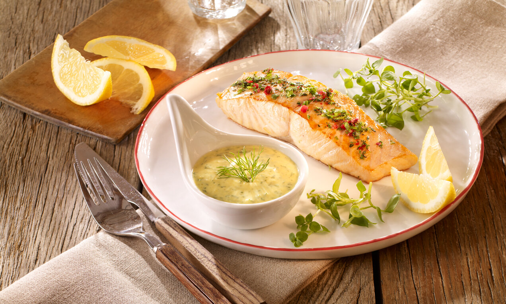

# Honig-Senf-Dip

## Zutaten

für das Rezept Honig-Senf-Dip

### Zutaten:

|        |                                 |
| ------ | ------------------------------- |
| 250 g  | Crème fraiche                   |
| 2 ½ EL | Wildblüten Honig                |
| 3 TL   | mittelscharfer Senf             |
| 3 TL   | Sahnemeerrettich (aus dem Glas) |
| 2 TL   | Zitronensaft                    |
| 3 EL   | gehackter Dill                  |
|        | Salz                            |
|        | frisch gemahlener Pfeffer       |

Alle Zutaten miteinander verrühren. Den Honig-Senf-Dip mit Salz und Pfeffer abschmecken und bis zum Verzehr kalt stellen.
