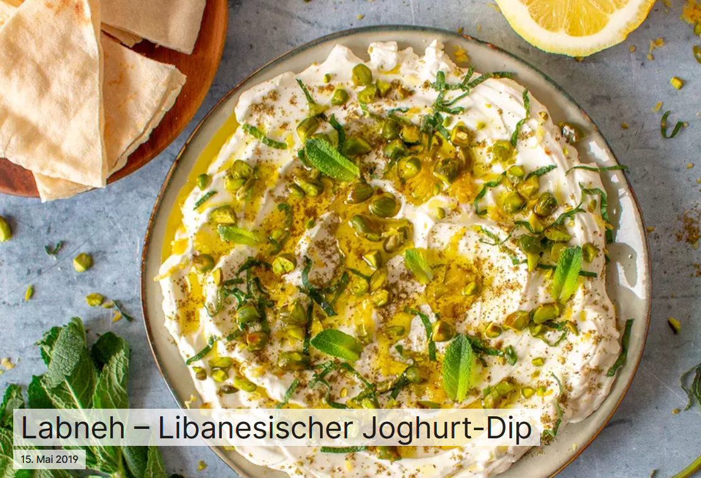

# Labneh-Dip

**Libanesisch** 

von https://qblog.qoqa.ch/de/posts/3702

**Für das Labneh**  
250g griechischer Joghurt  
250g Schafsjoghurt  
1 Prise Fleur de Sel  

**Für die Garnitur**  
1 EL Zaatar  
abgeriebene Schale einer Zitrone  
1/2 Bündel Minze  
2 EL Pistazien  
Fleur de Sel  
Frisch geriebener Pfeffer

### Sabah el kher

Heute schlage ich euch eines der authentischsten
 Mezze-Rezepte der libanesischen Küche vor: das Labneh! Es handelt sich 
dabei um einen Joghurt-Dip, der traditionell mit Zaatar, Olivenöl und 
libanesischem Brot als Aperitif oder als Vorspeise mit anderen kalten 
Mezzès wie Hummus, Tabouleh oder Babyganoush serviert wird.  
Ich bereite das Labneh hier mit frischer Minze, Zitronenschale und etwas gerösteten Pistazien zu.  
Ausserdem mische ich griechischen Joghurt mit Schafsjoghurt, für noch 
mehr Aroma. Natürlich kannst du aber auch nur Joghurt aus Kuhmilch 
verwenden.
