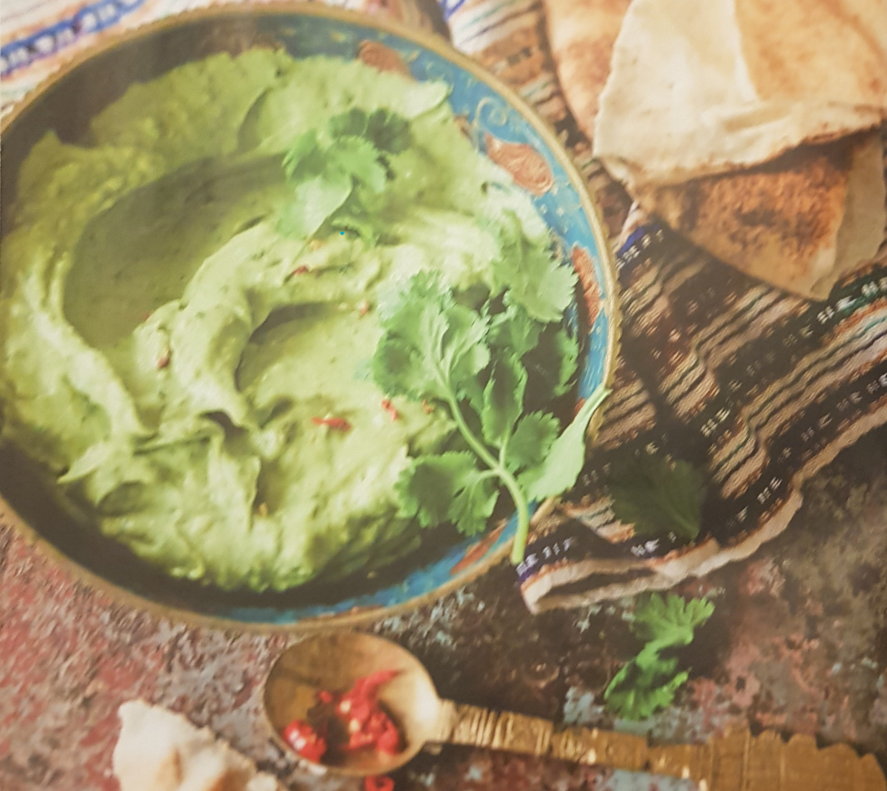

# AVOCADO-TAHIN-PASTE

ZUTATEN FÜR 4 PORTIONEN

## DAS BRAUCHT MAN:

- Stabmixer 

- 1 kleine rote Chili

- 1/2 Bund Koriander

- 1—2 Knoblauchzehen

- 2 reife Avocados

- ca. 5 EL Zitronensaft

- 2 gehäufte EL Tahin (ca. 50 g)

- 1 TL gemahlener Kreuzkümmel

- 1 TL gemahlener Koriander

- Salz
1. Chili waschen, längs auschneiden und die Kerne
   entfernen. Chili fein hacken. 

2. Den Koriander waschen, trocken schütteln und die Blättchen
   abzupfen. 

3. Knoblauch abziehen und fein hacken.

4. Die Avocados halbieren, den Kern entfernen und
   das Fruchtfleisch mit einem Löffeln herauslösen.
   Fruchtfleisch in einen Rührbecher geben.

5. Dann Knoblauch, Koriander, Zitronensaft. Tahin,
   Kruzkümmel und Koriander dazugeben. Alles
   fein pürieren. 

6. Die gehackte Chili unterrühren
   und die Avocado-Paste mit Salz abschmecken.

Pro Portion: 226 kca11946 kJ
5 g Kohlenhydrate, 4 g Eiweiß, 22 g Fett

Zubereitungszeit: 10 Minuten
