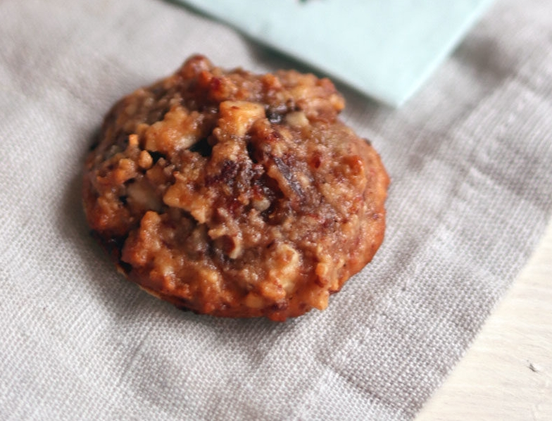

# Dattelmakronen Weihnachtsgebäck mit Datteln

### Zutaten für 2 Bleche Dattelmakronen

- 300 g Datteln entsteint
- 100 g gemahlene Haselnüsse
- 100 g Marzipan Rohmasse
- Idealerweise Mark einer halben Vanilleschote
- 3 Eiweiß von Eiern Größe M
- 100 g Zucker und 100 g Honig
- 100 g gehackte Walnüsse
- 2 EL Mehl
- 1 EL Kakao
- 25 g Orangeat
- 25 g Zitronat
- Backoblaten

## Zubereitung der Dattelmakronen

1. Die
   Datteln mit einem Messer fein hacken, die gemahlenen Haselnüsse in 
   einer Pfanne rösten, bis sie duften. Achtung nicht anbrennen lassen ;).
2. Das
   Marzipan zerkleinert in einen Topf geben, die gemahlenen und nun 
   gerösteten Haselnüsse sowie die etwas gröber gehackten Walnüsse 
   dazugeben. Zusätzlich kommen noch die drei Eiweiß, Zucker und Honig in 
   den Topf.
3. Bei mittlerer Hitze unter Rühren erwärmen, bis sich am
   Boden eine fester werdende Schicht vom Eiweiß bildet. Dann vom Herd 
   nehmen und abkühlen lassen.
4. Wenn die Masse abgekühlt ist, 
   mischst du Mehl mit Kakao, Orangeat und Zitronat, Datteln sowie dem Mark
   einer halben Vanilleschote und gibst alles zu den anderen Zutaten in 
   den Topf. Alles gut verrühren, damit die Zutaten gut verteilt sind.
5. Den Backofen auf 180°C Umluft stellen. Ein Backblech mit Backpapier belegen. Nun brauchst du die Oblaten.
6. Mit
   einem Messer walnussgroße Portionen auf die Oblate geben und wie zu 
   einer Kuppel verstreichen. Falls die Masse zu sehr klebt, kannst du das 
   Messer zwischendurch immer wieder anfeuchten. Bei mir hat es aber auch 
   so gut geklappt.
7. Die Makronen nebeneinander auf das Backblech setzen und ca. 8 bis 10 Minuten auf mittlerer Schiene backen.

## Tipps

- Wenn
   du keine Vanilleschote da hast, kannst du auch Vanillezucker nehmen 
  oder einfach weglassen. Mit ist natürlich schmackhafter. Alternativ geht
   auch Vanille Aroma.
- Die Nüsse kannst du auch gegen Mandeln oder Cashews ersetzen.
- Du kannst auch noch weiße geschmolzene Schokolade oder Zitronenguss auf die Dattelmakronen geben.
