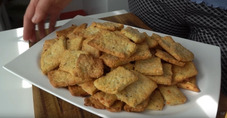

# Käsecräcker Kräuter

von https://www.youtube.com/watch?v=iVOd_T1t0GQ&t=408s

- 1 Ei

- 150 gr Käse

- 100 ml Wasser 

- 260 gr Mehl

- 50 gr Öl

- getrockneter ital. Kräuter, Sesam

- 1/2 TL Salz

- 1/2-1 TL Backpulver

Ei, Käse, Wasser und Öl mischen, Gewürze und Salz hinzu. Dann Mehle gemischt mit Backpulver zu geben und einen Teig kneten

Im Kühlschrank ruhen lassen

Ausrollen und in Vierecke schneiden und auf Blech mit Backpapier legen

Bei 190 grad oberer Schiene 15 min Backen, je nach Bräune rausnehmen
