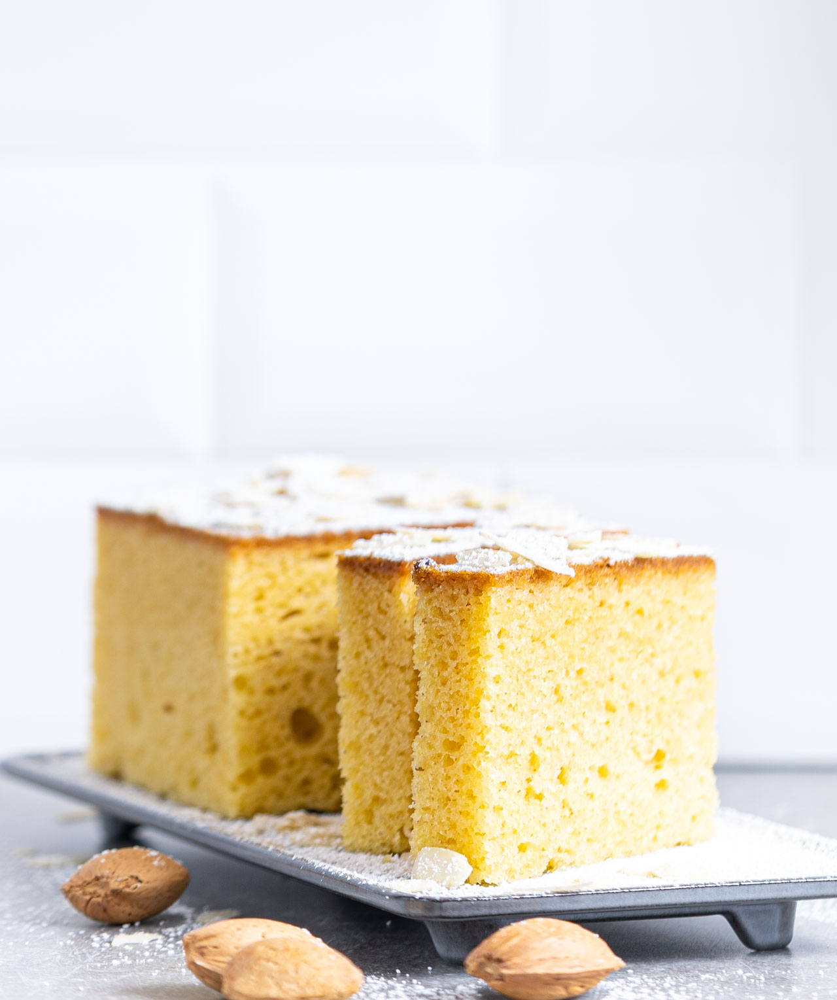

# Mandelbuiskuit

https://www.mannbackt.de/2021/05/14/mandelbiskuit-grundrezept-85823/

### Zutaten für den Mandelbiskuit

Für ø20cm Kuchen (ca. 8cm hoch), für einen großen Kuchen also die 1,5 bis 2 fache Menge verwenden.

5 Eier (Gr. L)   
150 g Zucker  
150 g Mehl  
25 g Speisestärke  
75 g Mandel fein gemahlen (idealerweise blanchiert)  
25 g Öl (neutral im Geschmack)  
Vanille, Zimt, fein gerieben Zitronenschale oder andere Gewürze nach Belieben

### Zubereitung des Mandel-Biskuits

1. Den Backofen auf 175°C [Ober-/Unterhitze](https://www.mannbackt.de/2018/01/29/ober-unterhitze-oder-heissluft-das-ist-hier-die-frage-6296/) vorheizen.
2. Die Eier zusammen mit dem Zucker so lange schaumig schlagen, bis sich das Volumen verdoppelt hat und eine richtig fluffige Masse entstanden ist.
3. Währenddessen die Mandeln sehr fein mahlen. _Tipp: ihr könnt Mandeln mit Schale oder blanchiert verwenden. Bei blanchierten Mandeln wird der Teig hell. Das sieht sehr schön aus. Für ein sehr intensives Mandelaroma, könnt ihr diese auch in einer beschichteten Pfanne ohne Fett leicht anrösten._ Optional: funktioniert dieser Teig aber natürlich auch mit Haselnüssen, Walnüssen, Pecannüssen, Macadamia und Co.
4. Die Mandeln mit dem Mehl und der Stärke vermengen.
5. Nun die Mandel-Mischung portionsweise vorsichtig unter die Eimasse heben. Erst am Schluss noch kurz das Öl und die Aromen unterheben.
6. Die [Masse in eine Backform mit ø20cm geben](https://www.mannbackt.de/produkt-kategorie/backformen/) und alles zusammen für ca. 45 Minuten backen. Unbedingt die Nadelprobe machen ob der Teig durch ist.
7. Den fertigen Kuchen nach dem Auskühlen luftdicht in Frischhaltefolie einpacken (noch in der Form) und einige Stunden oder über Nacht stehen lassen, damit er sich setzen kann.

11.8.2023

## Etwas abgewandelt für Kinoabend:

    - 5 Eier (Gr. L)   
    - 100 g Zucker  
    - 100 g Mehl  
    - 25 g Speisestärke  
    - 125 g Mandel fein gemahlen (idealerweise blanchiert)  
    - 25 g Öl (neutral im Geschmack)  
    - Vanille Creme

- erst auf 8 gebacken, 15 min, dann Früchte drauf Plaumenähmliche und Heidelbeeren , sind leider nicht eingesunken, wieder 15 min auf 7, dann Nüsse mit Zuckersud drauf, wieder 15 min aber auf 8
- vielleicht mit 7 beginnen, da Früchte nicht mehr eingesunken sind 

14.08.23

## Almond Biscuit

English Version for Simonetta

I use  a ø20cm cake form.

### Ingredients

    - 5 eggs (size L)
    - 150 grams of sugar
    - 100 grams of flour
    - 25 g cornstarch
    - 125 g finely ground almonds
    - 25 g oil (neutral in taste,sunflower)
    - Vanilla, cinnamon, finely grated lemon zest or other spices of your choice
    - Some fruits as blueberries, plums, mirabelle, apple, ...
    - Some nuts, almonds and some (1-3 spoons)  sugar and butter (~2x2 cm or less)

### Preparing the almond biscuit

1. Set the oven to 175°C  preheat, top bottom heat .
2. Beat the eggs together with the sugar until the volume has doubled and a really fluffy mass has formed.
3. Mix the grounded almonds with the flour and starch.
4. Now carefully fold the almond mixture into the egg mixture in portions. Only at the end briefly fold in the oil and the aromas.
5. Grease baking form with butter, bring in dough and put form into the oven.
6. Cut fruits into pieces, take out stones and other not eatable  stuff, after 10-15 min baking put on top of the cake the fruits. If top of cake has already a skin, you could cut with a knife, to be shure that fruits are going to sink. Bring back to oven.
7. Heat pan with butter. Bring in nuts (probably cut, if to large) and sugar. Let it melt, if it is to dry add a tea spoon of water. Before it is getting stuck remove pan from heating. Put on top of cake after cake was 30 min in oven.
8. With another 15 min (total 45 min) the cake should be finished. Be sure to do the needle test to see if the dough is done.
9. Once the cake has cooled, you can wrap it airtight in cling film (still in the tin) and leave for a few hours or overnight to set, but I never did.
