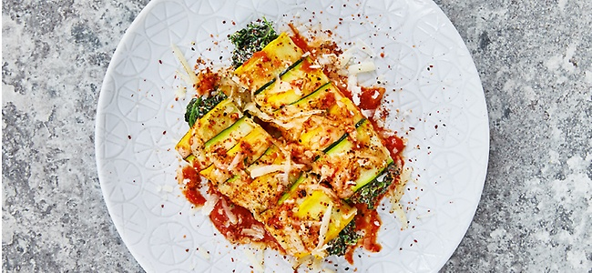

Pro Portion ca. 2.017 kJ (482 kcal) | Zubereitungszeit: 20 Min. + 20–30 Min. Backzeit | Schwierigkeitsgrad: einfach

• Zutaten (für 4 Personen)
• 
• • 2 Zucchini (je 1 gelbe und 1 grüne)
• • 100 g dmBio Canihua*
• • 2 Knoblauchzehen
• • 1 rote Zwiebel
• • 1 EL dmBio Olivenöl*
• • 500 g TK-Blattspinat, aufgetaut und abgetropft
• • 250 g Ricotta
• • Meersalz
• • weißer Pfeffer, gemahlen
• • Muskat, gemahlen
• • 1 Glas (340 g) dmBio Tomatensoße Ricotta Pecorino*
• • 150 g Pecorino, gerieben
• 
• * dmBio-Produkte in allen dm-Märkten erhältlich
• 

 
• Ofen auf 160 Grad (Umluft) vorheizen. Zucchini waschen, mit Reibe oder Sparschäler längs in feine, lange Scheiben hobeln. Canihua nach Packungsanleitung kochen.
• Knoblauch und Zwiebel schälen und fein hacken, in der Pfanne mit Öl kurz andünsten.
• Spinat und Canihua vermengen, Ricotta unterheben, Knoblauch und Zwiebel hinzufügen. Mit den Gewürzen abschmecken.
• Eine gelbe und eine grüne Zucchini-Scheibe übereinander legen, die Canihua- Spinat-Mischung darauf verteilen und vorsichtig zu kleinen Cannelloni rollen. In eine Auflaufform setzen, die Tomatensoße großzügig darüber verteilen und mit Pecorino bestreuen.
• Circa 20 bis 30 Minuten backen, bis der Käse goldbraun ist. Fertig!