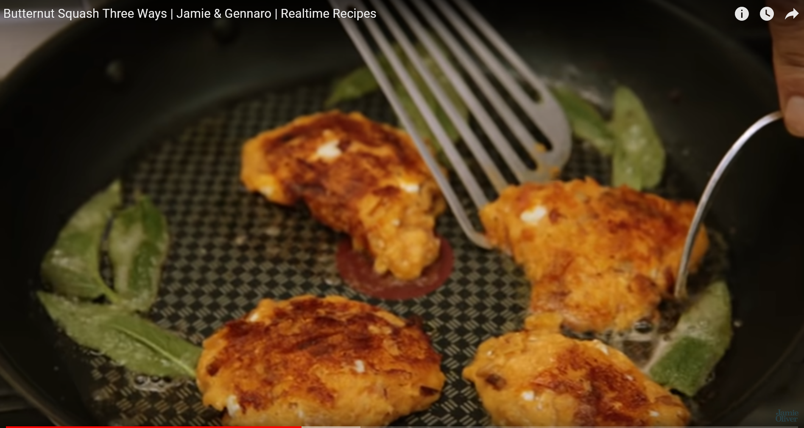

# Butter Squash

Nch einem Rezpet von Jamie Oliver und Gennaro Contaldo

- Butternutkürbis

- 200 gr Cottagecheese (Hüttenkäse)

- 100 gr Mehl

- 1 Ei

- Oliven Öl zum anbraten (geht auch Butter)

- Salz und Pfeffer

- Parmesanenkäse 20 - 40 g

- ein paar Salbeiblätter
1) Butternutkürbis im Backofen bei 180 Grad 1 Stunde backen

2) halber Kürbis nehmen und entkernen

3) Alles mit Haut grob hacken

4) Mit Hüttenkäse vermengen

5) 100 gr. Mehl unterrühren

6) Das Ei unter mischen

7) Salzen und pfeffern

8) Parmesanenkäse reinreiben

9) Mit Öl in Pfanne anbraten, kleine Pfannkuchen rausbraten

10) Am Ende etwas Butterflocken in Pfanne geben und dazu den Salbei darin braten
