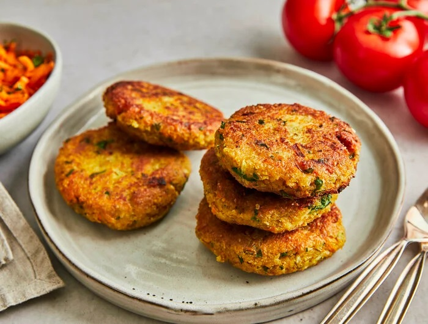

# Grünkernbratlinge

#### Für die Grünkernbratlinge:

- 200 g Grünkernschrot
- 250 ml Gemüsebrühe
- 4 Schalotten
- 1 Möhre
- 1 Bd. Petersilie
- 2 Eier
- 60 g Semmelbrösel
- ½ TL Salz
- etwas Pfeffer aus der Mühle
  
  #### Außerdem:
- etwas Sonnenblumenöl zum Braten
1. (200 g Grünkernschrot, 250 ml Gemüsebrühe) Den Grünkernschrot in eine Schüssel geben. Die Gemüsebrühe einmal aufkochen, über den Grünkernschrot gießen und etwa **20 Minuten** quellen lassen.
2. (4 Schalotten, 1 Möhre, 1 Bd. Petersilie ) Währenddessen die Schalotten schälen und fein würfeln. Die Möhre waschen, putzen und mit der Reibe fein raspeln. Die Petersilienblätter von den Stielen zupfen und fein hacken.
3. (2 Eier, 60 g Semmelbrösel, ½ TL Salz, etwas Pfeffer aus der Mühle ) Die Schalotten, die Möhren und die Petersilie zusammen mit den Eiern und den Semmelbröseln unter die Grünkernmasse mischen und mit Salz und Pfeffer würzen. Die Masse weitere **10 Minuten** ziehen lassen.
4. (etwas Sonnenblumenöl zum Braten) Mit feuchten Händen gleich große Bratlinge formen. In einer Pfanne das Sonnenblumenöl erhitzen. Die Bratlinge ca. **3 Minuten** **pro Seite** goldgelb und knusprig braten.
