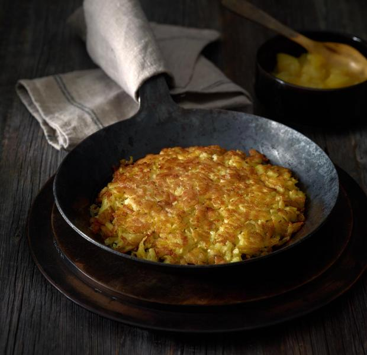

Zutaten

Für 2 Portionen

- 400 g Kartoffeln, vorwiegend festkochende
  • - Salz
  • - 1 Ei
  • - Pfeffer
  • - Muskat
  • -  3 El Butterschmalz

Zubereitung

1. Kartoffeln mit Salzwasser bedeckt zugedeckt aufkochen und bei mittlerer Hitze 15 Min. angaren. Abschrecken und pellen. Mind. 3 Std. (am besten über Nacht) abkühlen lassen.

2. Kartoffeln raspeln. Ei in einer Schüssel mit Salz, Pfeffer und Muskat kräftig würzen und verquirlen, vorsichtig mit den Kartoffeln mischen.

3. 11/2 El Butterschmalz in einer kleinen Pfanne (15 cm Ø) erhitzen. 
   Die Hälfte der Kartoffelmasse ins heiße Butterschmalz geben und dabei flach drücken. 5–8 Min. bei mittlerer Hitze goldbraun braten, 
   dann auf einen Teller gleiten lassen. Einen zweiten Teller kopfüber darüberlegen, Rösti stürzen, wieder in die Pfanne gleiten lassen und 
   weitere 5–8 Min. braten. Im heißen Ofen bei 100 Grad (Umluft 80 Grad) auf einem Blech warm halten. Zweiten Rösti ebenso zubereiten. 

4. Dazu passt Apfelkompott.
