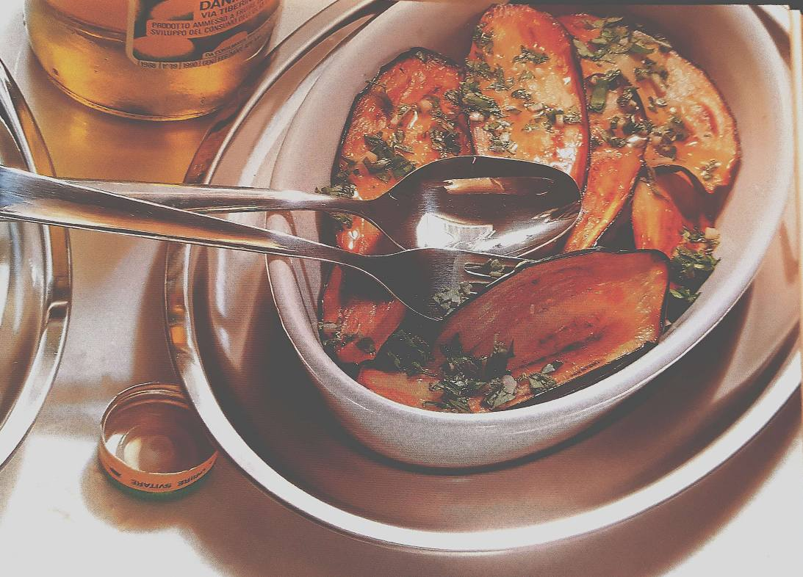

# Marinierte Auberginen

## (Malazane marinate) aus Emilia Romana

Zutaten für 4 Portionen:

- 4 kleine Auberginen (etwa 500 g)

- 1/2 Bund glatte Petersilie

- 1/2 Bund Basilikum

- 6-8 Salbeıblätter

- 3 Knoblauchzehen

- 2-3 EL Schweineschmalz

- 5 EL Weinessig

- Salz, Pfeffer aus der Mühle
  
  Zubereitungszeit: 7O Min. (+ 12 Std, Marinieren)
  Pro Portion: 420 kJ / 100 kcal
1. Auberginen waschen und in 1/2 cm breite Scheiben
   schneiden, Stielansatz entfernen. Scheiben salzen, lagen-
   weise auf einem großen Teller stapeln, mit einem zweiten
   Teller abdecken und ein Gewicht darauf stellen. Mindestens
    30 Mın. ziehen lassen.

2. Ein großen Pfanne mit etwas Schmalz erhitzen. Die Auberginenscheiben portions-
   weise hineingeben, von beiden Seiten je 2 Min. braten. Nach
   Bedarf übriges Schmalz dazu geben. Gebratene Auberginen
   aus der Pfanne nehmen, auf Küchenkrepp gut abtropfen lassen.

3. Je 1/2 Bund Petersilie und Basilikum, 6-8 Salbei Blättchen 
   und 3 Knoblauchzehen sehr fein hacken und mischen.
   Auberginenscheiben lagenweise in eine Schüssel schichten,
   jede Lage salzen, pfeffern, mit etwas Weinessig beträufeln
   und mit der Kräuter-Knoblauch-Mischung bestreuen, Zugedeckt 
   im Kühlschrank über Nacht durchziehen lassen. Als
   Beilage zu gekochtem oder gebratenem Fleisch servieren.

An Aroma und Eigenwilligkeit haben die violetten Eierfrüchte
kaum etwas zu bieten - aus diesem Grunde bringt es auch
wenig Genuss, sie roh zu verzehren. Doch wenn's ans
Braten, Grillen, Marinieren und Schmoren geht, entfalten sie
überraschendes Temperament: Sie vertragen sich nämlich mit
allem, was an kräftiger Würze denkbar ist. Unersättlich zeigen
sie sich auch beim Aufsaugen von heißem Fett und OI - des-
halb immer nur ganz frische Zutaten verwenden und die
gebackenen Auberginen sofort auf Küchenkrepp abtropfen
lassen.
