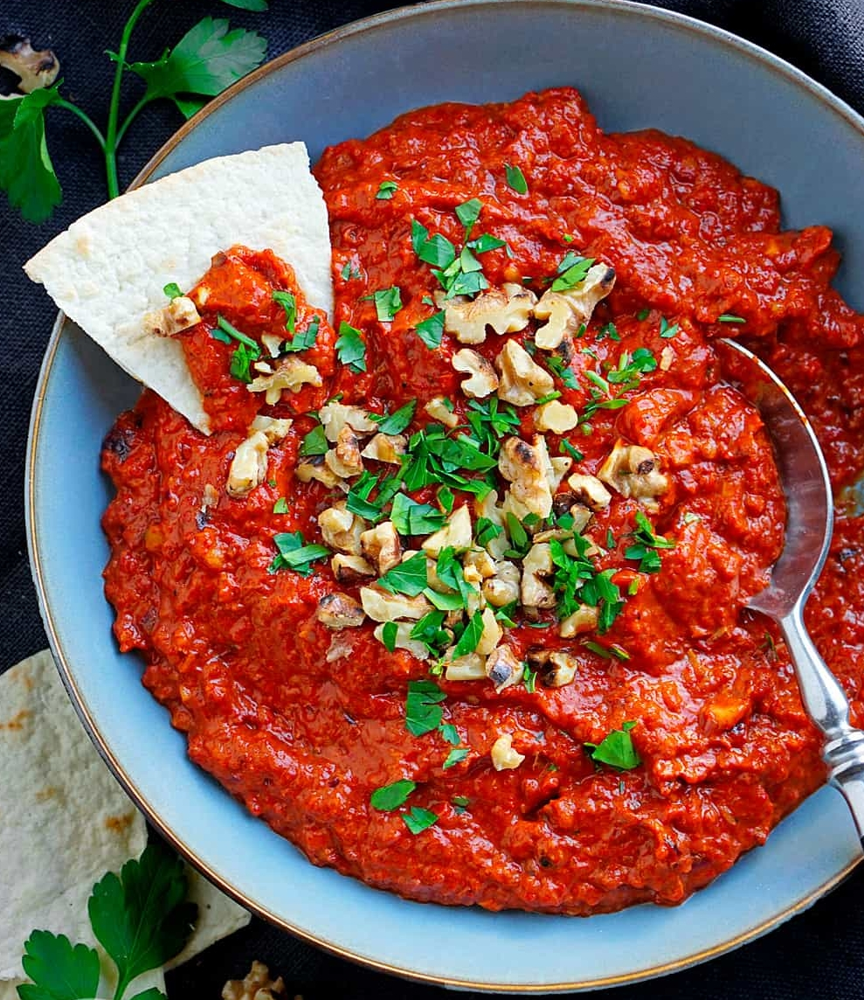

# Muhammara

|                             |                                                                                        |
| --------------------------- | -------------------------------------------------------------------------------------- |
|                             | Backofen auf 220 deg aufheizen.                                                        |
| 5 rote Paprikaschoten       | vierteln und entkernen, in einer Schüssel mit                                          |
| 1 EL Öl                     | mischen. Auf Blech mit Backpapier verteilen und 15 min backen.                         |
| 8 Knoblauchzehen            | schälen und mit in den Ofen weitere 15 min bis goldbraun und Paprika weich und dunkel. |
| 60 gr. Walnüsse             | rösten und grob hacken.                                                                |
| 3/4 TL mildes Paprikapulver |                                                                                        |
| 1/2 TL Chiliflocken         |                                                                                        |
| 2 TL Balsamico Essig        |                                                                                        |
| 1/2 TL Salz                 | mit Paprika, Knoblauch, Walnüsse im Mixer groß pürieren                                |
| Petersilie                  | zum garnieren                                                                          |
|                             |                                                                                        |
