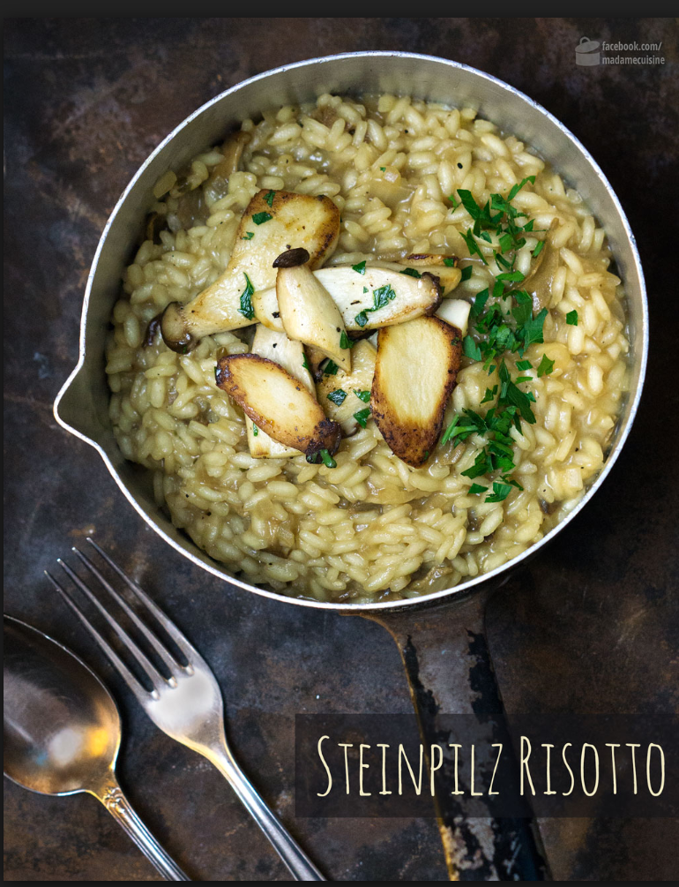
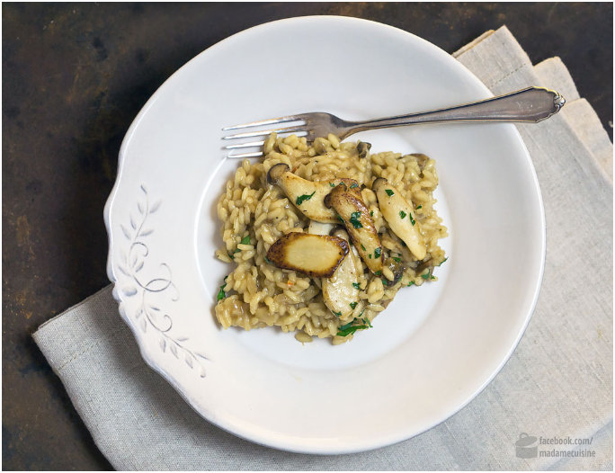

  
  
Eine Zutat, die ich nahezu immer im Vorratsschrank habe, sind getrocknete Steinpilze. Ich finde, es gibt nichts, was einer Pasta-Soße oder einem Risotto mehr Geschmack und Aroma verleiht. Und gerade weil getrocknete Steinpilze so ein tolles Aroma haben, braucht es auch kaum weitere aufwendige Zutaten, um ein tolles Essen auf dem Teller zu haben. Die besten getrockneten Steinpilze bekommt man – wie sollte es anders sein – in Italien. Wir Münchner sind diesbezüglich sehr privilegiert – einmal über den Brenner, bietet sich uns ein kulinarisches Einkaufsparadies. Aber keine Sorge, fast jeder gut sortierte Supermarkt hat mittlerweile getrocknete Steinpilze für Euer Steinpilz-Risotto im Sortiment!

**ZUTATEN FÜR 2-3 HUNGRIGE ESSER**

- 20g getrocknete Steinpilze
    
- 2 Schalotten
    
- 300g Risottoreis, z.B. Arborio oder Vialone
    
- einen Schuss Weißwein
    
- ca. 500ml Gemüsebrühe plus das Einweichwasser von den Steinpilzen
    
- 1 El Butter + 1 EL Olivenöl
    
- frisch geriebener Parmesan
    
- Salz und Pfeffer
    
- ggf. etwas fein gehackte Petersilie
    

  
  

**ZUBEREITUNG: STEINPILZ-RISOTTO**

1. Die Steinpilze in eine Schüssel geben und mit kochendem Wasser übergießen, bis die Pilze geradeso bedeckt sind. Die Schüssel abdecken und die Pilze mindestens 2-3 Stunden ziehen lassen.
    
2. Schalotten fein würfeln und die Gemüsebrühe zum Kochen bringen.
    
3. In einem großen Topf 1EL Butter zusammen mit 1 EL Olivenöl erhitzen. Die Schalotten darin unter Rühren 1-2 Minuten glasig dünsten. Den Risottoreis hinzufügen und mit anschwitzen, bis alle Reiskörner mit Fett überzogen sind. Anschließend mit einem ordentlichen Schuss Weißwein ablöschen.
    
4. Sobald die Reiskörner die Flüssigkeit vollständig aufgenommen haben, nach und nach die heiße Gemüsebrühe hinzufügen und rühren, rühre, rühren, damit nichts anbrennt. Die Steinpilze abgießen, dabei die Flüssigkeit auffangen und zur heißen Gemüsebrühe geben. Die Steinpilze fein hacken und zum Reis geben.
    
5. Das Prozedere beim Risotto kochen kennt ihr ja schon aus meinen diversen anderen [Risottorezepten](https://www.madamecuisine.de/pasta-gnocchi-risotto/) – Kellenweise heiße Flüssigkeit zum Reis und fleißig rühren. Nach etwa 20-25 Minuten ist der Reis al dente.
    
6. Nun bitte keine Flüssigkeit mehr hinzufügen, dafür aber kräftig mit Salz und Pfeffer abschmecken und den frisch geriebenen Parmesan unterrühren. Deckel auf den Topf, Herd aus und ein paar Minuten sitzen lassen. Vor dem Servieren ggf. noch mit etwas fein gehackter Petersilie verfeinern. Lecker!
    

Als Schmankerl habe ich noch frische Kräuter-Seitlinge vom Markt besorgt. In Scheiben geschnitten und in etwas Butter angebraten, schon hatte ich ein schmackhaftes Topping für mein Steinpilz-Risotto 

