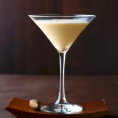
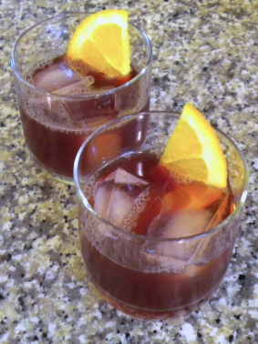

# Asbach Alexander

(aus Brandy Alexander)

## Im Shaker mixen:

| Menge | Zutat                      |
| ----- | -------------------------- |
|       | Zerstoßenes     Eis        |
| 3 cl  | Asbach Privatbrand 8 Jahre |
| 3 cl  | Orangenlikör               |
| 3 cl  | süße Sahne                 |

- In ein geeignetes Glas abseihen und mit Muskat bestreuen

# Asbachied Port

(aus Brandied Port)

| Menge  | Zutat                      |
| ------ | -------------------------- |
|        | Zerstoßenes Eis            |
| 3 cl   | Asbach Privatbrand 8 Jahre |
| 3 cl   | Tawny-Portwein             |
| 1,5 cl | Kirschlikör (Maraschino)   |
| 3 cl   | Zitronensaft               |
|        | Orangenscheibe             |

- Zutaten, ohne Orangenscheibe, mit zerkleinertem Eis im Shaker mischen und kräftig schütteln. 

- In das gekühlte Cocktailglas abseihen und mit Orangenscheibe garnieren

# Asbach Espresso Martini

(aus # Courvoisier Espresso Martini)

![[AsbachEspressoMartini.png]]

| Menge | Zutat                      |
| ----- | -------------------------- |
|       | Zerstoßenes Eis            |
| 3 cl  | Asbach Privatbrand 8 Jahre |
| 1 cl  | Kaffee-Likör               |
| 3 cl  | Espresso (kalt)            |
| 1 cl  | Zuckersirup                |

- Alle Zutaten in der genannten Reihenfolge in den Shaker geben, Eis hinzufügen und ca. 8 Sekunden kräftig shaken.
- Anschließend in eine Cocktail-Schale abseihen und mit 3 Kaffeebohnen und eventuell Schokoladenpulver garnieren.