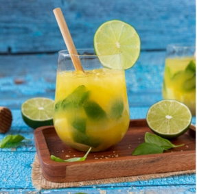

# Basil Boy

- alkoholfreier Sommerdrink mit Basilikum und Orangensaft

- Basil Boy ist ein alkoholfreier Sommerdrink mit
  Orangensaft, Limetten und Basilikum. Er schmeckt
  erfrischend spritzig und ist auch perfekt für Kinder

## Zutaten 2 Gläser

- 1 Limette

- 30 Blätter Basilikum

- 2 TL brauner Zucker

- 300 ml Orangensaft

- Crushed Ice

## Zubereitung

1. Die Schale der Limette mit einem Messer runterschneiden und dabei so 
   viel weißes von der Schaleninnenseite wie möglich mit abschneiden. Die 
   Limette halbieren und dann würfeln. Jeweils eine Hälfte in ein Glas 
   geben.  

2. Je 15 Basilikumblätter in ein Glas geben und den 
      braunen Zucker dazu geben. Mit einem Stößel alles gut zerdrücken. Eine 
      gute Handvoll "Crushed Ice" dazu geben und mit 150 ml Orangensaft 
      auffüllen. Mit einem Strohhalm servieren und vor dem Trinken mit dem 
      Strohhalb einmal alles durchrühren.
