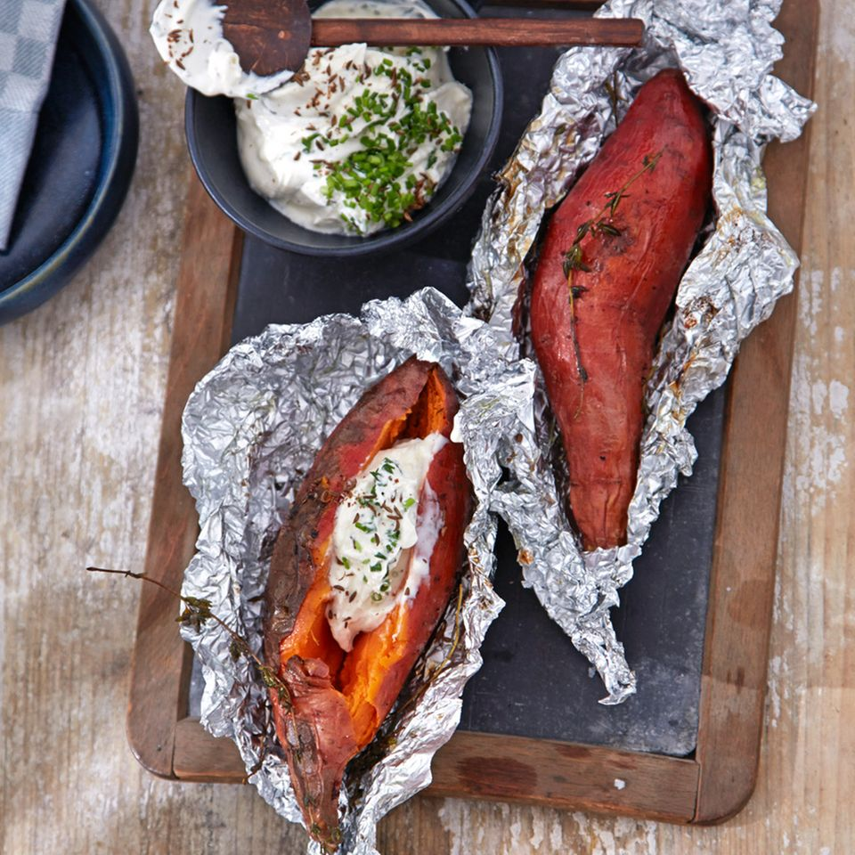

# Gebackene Süßkartoffeln

Perfekt kombiniert: Kümmelsaat und Schnittlauch verfeinern die Sour Creme zu Süßkartoffeln mit Thymian.

ZutatenFür 6 Portionen

## Zutaten

Für 6 Portionen

### Süßkartoffel

- 6 Süßkartoffeln, (à ca. 400 g)

- 3 El Olivenöl

- 18 Stiele Thymian

- Salz

- Pfeffer

### Sour Cream

- 1 El Kümmelsaat
- 1 Bund Schnittlauch
- 150 g Crème fraîche
- 200 g Doppelrahmfrischkäse
- Salz
- Pfeffer

### Alufolie

## 

## Zubereitung

1. Die Süßkartoffeln gründlich waschen, 6 Stücke Alufolie (à 20 x 20 cm) ausbreiten und die Kartoffeln jeweils in die Mitte legen. 

2. Mit je 1⁄2 El Olivenöl beträufeln und mit 3 Thymianstielen belegen. Mit Salz und Pfeffer würzen. Folie um die Kartoffeln wickeln. 

3. Kartoffeln auf dem heißen Grill 20–25 Minuten garen.

4. Für die Sour Creme Kümmel in einer Pfanne ohne Fett rösten, abkühlen lassen, im Mörser fein zerstoßen. 

5. Schnittlauch in feine Röllchen schneiden. 

6. Crème fraîche und Frischkäse mit dem Schneebesen in einer Schüssel cremig rühren. 

7. Kümmel und Schnittlauch untermischen und mit Salz und Pfeffer würzen. 

8. Die Kartoffeln zusammen mit der Sour Creme servieren.

Süßkartoffeln sorgen für Abwechslung auf dem Grill. Außerdem sind sie viel schneller fertig als die normalen Backkartoffeln.
