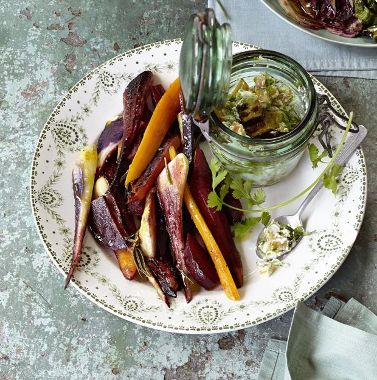

Zutaten
Für 8 Portionen
• 2 Zweige Rosmarin
• 10 El Olivenöl
• 4 El Orangensaft
• 2 El Ahornsirup
• Salz
• Pfeffer
• 8 Pastinaken
• 4 kleine junge Rote Bete
• 4 Möhren
• 4 violette Urmöhren

Zubereitung
Rosmarinnadeln von den Zweigen streifen und fein hacken. Mit Öl, Orangensaft, Ahornsirup, Salz und Pfeffer verrühren.
Gemüse schälen und in gleichmäßig dicke 2 cm große Spalten schneiden. 4 doppellagige Alufolienquadrate vorbereiten (25x25 cm). Das Gemüse mit der Vinaigrette mischen und auf
 2 Alufolienquadraten verteilen. Mit den restlichen Folienquadraten bedecken und die Ränder gut verschließen.
Die Gemüsepäckchen auf dem Grill bei mittlerer bis kleiner Hitze 20-30 Minuten grillen. Päckchen vom Grill nehmen, öffnen und mit Avocado-Dip (siehe Rezept: Avocado-Dip) und Baguette servieren.
Die Grillzeit ist abhängig von der Glut, sie dient als Richtwert.
