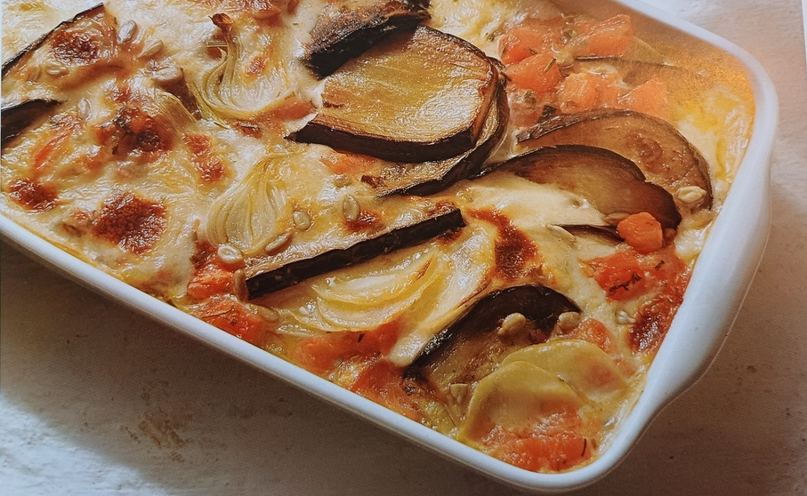

# Auberginen Auflauf

**Zutaten für 6 Personen:**  

- 500 g vollreife Tomaten. 

- 750 g  Auberginen 

- 1 Bund Frühlingszwiebeln 

- 3 Knoblauchzehen  

- 2 Bund Petersilie. 

- je 2 Zweige frischer Thymian und Rosmarin  

- 1/8 kaltgepreßtes Olivenöl  

- 40 g Weizenvollkornmehl  

- 1/8 Gemüsebrühe 

- 1/4 Milch  

- 100 g Crème fraîche  

- 1 kg mehligkochende  Kartoffeln 

- 50 g Sonnenblumenkerne. 

- 175 g frischgeriebener Bergkäse oder  mittelalter Goudakäse 

- Vollmeersalz 

- frisch gemahlener  schwarzer Pfeffer 

- Cayennepfeffer 

- frisch geriebene  Muskatnuss 

- 20 g Butter  

Pro Person etwa 2800 kJ/670 kcal 20 g Eiweiß. 43 g Fett - 47 g Kohlenhydrate 11 g Ballaststoffe,  

Vorbereitungszeit: 1½ Stunden  

Backzeit: 1 Stunde  

- Die Tomaten mit kochen- dem Wasser übergießen, häuten und würfeln, dabei die Stielansätze und die Kerne entfernen. 

- Die Auberginen waschen, abtrocknen, von den Stiel- und Blütenansätzen befreien und der Länge nach in etwa 1 cm dicke Scheiben schneiden. 

- Die Frühlingszwiebeln putzen, waschen und mit etwa zwei Dritteln ihres Grüns in feine Ringe teilen. 

- Die Knoblauchzehen schälen und fein hacken. 

- Die Petersilie, den Thymian und den Rosmarin waschen, trockentupfen, die Blättchen beziehungsweise die Nadeln abzupfen und ebenfalls fein zerkleinern. 

- Etwa ein Drittel des Öls in einer Pfanne erhitzen. Die erste Portion 
  Auberginen bei schwacher Hitze von beiden Seiten darin anbraten, 
  wieder herausnehmen und auf Küchenpapier abtropfen lassen.  

- Nach und nach das restliche Öl heiß werden lassen und alle Auberginenscheiben darin braten. 

- Die Tomaten und die Frühlingszwiebeln in die Pfanne geben und bei mittlerer Hitze unter Rühren so lange schmoren, bis die Flüssigkeit, die sich dabei bildet, wieder verdampft ist. 

- Den Knoblauch und die Kräuter dazugeben und noch einige Sekunden mit schmoren. Die Pfanne vom Herd ziehen.  

- Das Mehl in einem Topf ohne Fett bei mittlerer Hitze unter Rühren so lange anrösten, bis es einen zarten Duft ausströmt.  

- Zuerst die Gemüsebrühe, dann die Milch langsam hinzugießen und dabei 
  kräftig mit einem Schneebesen rühren, damit das Mehl nicht zu sehr 
  klumpt. Alles aufkochen und dabei weiter mit dem Schneebesen schlagen,
   bis sich eine glatte, sämige Sauce bildet. Die Sauce zugedeckt bei 
  schwächster Hitze 5 Minuten kochen, vom Herd ziehen und die Crèmefraîche
   daruntermischen. 

- Während die Sauce kocht, die Kartoffeln vorbereiten: schälen, waschen, abtrocknen und auf dem Gurkenhobel in hauch- dünne Scheibchen hobeln. Die Scheiben mit Küchenpapier trockentupfen.

- Den Backofen auf 200° vorheizen. Die Sonnenblumenkerne und den Käse in die Sauce rühren. Die Sauce mit Salz, Pfeffer, Cayennepfeffer und 
  Muskatnuss abschmecken. Die Auberginen- und die Kartoffelscheiben sowie
   die geschmorten Tomaten und die Sauce schichtweise in eine ofenfeste 
  Form geben. Nur die Kartoffeln mit etwas Salz würzen. Als oberste 
  Schicht die restliche Sauce auf der Moussaka verteilen und mit Butterflöckchen belegen. 

- Die Form auf den Rost in den Backofen (Mitte) stellen und die Moussaka etwa 1 Stunde backen. Dazu passt Bauernsalat oder ein anderer gemischter Salat.
