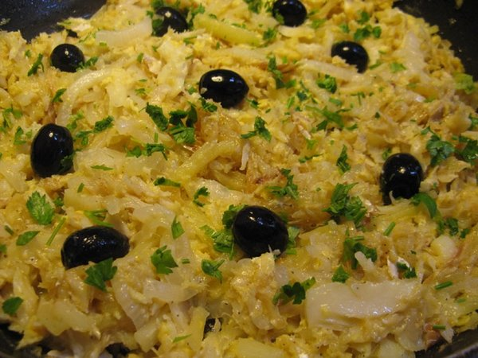

# Bacalhau à Brás

Stockfisch auf Brás Art

Zutaten:

600 g gewässerten Stockfisch, in 4 Stücke geschnitten
1 kg Kartoffeln, zu „Strohkartoffeln“* geschnitten
2 in dünne Scheiben geschnittene Zwiebeln
Olivenöl
Pflanzenöl zum Frittieren
3 Eier
1 Zweige gehackte Petersilie
200 g schwarze Oliven
Salz und Pfeffer

* In 5-6 cm lange strohhalmdicke Stäbchen schneiden

Zubereitung:

1. Stockfisch kochen, enthäuten und entgräten. In ein Küchentuch wickeln und darauf klopfen, bis der Fisch grobfaserig wird.
2. Strohkartoffeln leicht frittieren, salzen und beiseite legen. 
3. Eier mit etwas Petersilie leicht verquirlen. Nicht salzen. 
4. Olivenöl in einen Topf geben. Zwiebeln, Kartoffeln und Stockfisch hinzufügen. In geschlossenem Topf leicht schmoren lassen. 
5. Zum Schluss die Eier zugeben und unter ständigem Rühren leicht stocken lassen. Die Kunst besteht darin, dass die Eierflocken sehr locker und klein bleiben. 
6. Das Gericht auf einer Platte anrichten, mit gehackter Petersilie und frischgemahlenem Pfeffer bestreuen und mit Oliven garnieren.
