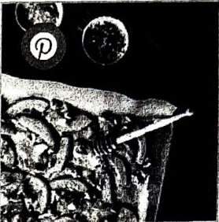

# Butternut Kürbis mit Feta und Pilzen

Butternutkürbis aus dem Ofen mit Feta und Walnüssen

1 Butternut-Kürbis
Olivenöl
Pfeffer
Salz
2 Zweige Rosmarin
100g Ziegenkäse (alternativ Feta)
2 EL Honig
Zur Beilage
Save Prin

**Instructions**

Heize den Ofen auf 175 Grad vor

1. Schneide die beiden Enden des Butternut-Kürbis ab
   3 Stelle den Kürbis senkrecht hin und entferne die Schale mit einem scharfen Messer
2. Halbiere den Butternut-Kürbis
3. Entferne die Kerne mit einem Löffel
4. Halbiere die Hälften nochmal
5. Schneide 2-3 cm große Scheiben aus dem Kürbis
   S. Mariniere ihn mit Olivenöl, Pfeffer, Salz und Rosmarin-Nadeln
6. Gebe die Kürbisspalten auf ein mit Backpapier ausgelegtes Backblech
7. Backe sie ca. 20 min.
8. Gebe dann Walnüsse und Ziegenkäse hinzu
9. Beträufle alles mit Honig
10. Backe das Ganze nochmal 10 min. weiter
11. Serviere den Butternut-Kürbis mit Walnüssen und Ziegerkäse mit frischem Brot oder Baguette und mehr Ziegenkäse
