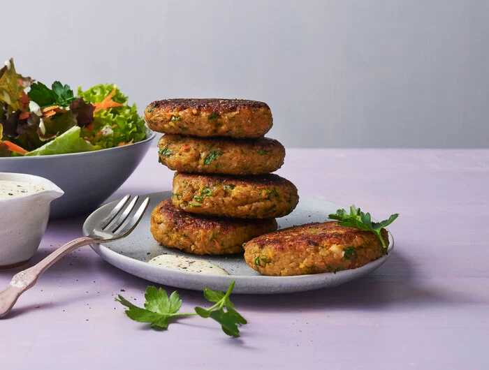

#### # Grünkern Bratlinge

https://www.eatbetter.de/rezepte/gruenkernbratlinge-einfach-super-knusprig

## Für die Bratlinge (4 Portionen)

- 200 g Grünkernschro- t

- 300 ml Gemüsebrühe - (am besten selbst gekocht; alternativ Bio-Instantbrühe)

- 1 Möhre

- 2 Schalotten

- 1 Bd.-  Petersilie

- 2 Eie- r (Größe M)

- Salz

- Pfeffer

- 60 - 80 g Semmelbrösel

- 45 g geriebener Parmesan (oder z. B. Montello)

- 1 TL mittelscharfer Senf

- 2 EL Rapsöl
1. Schritt

**Für die Bratlinge** den Grünkern in der Gemüsebrühe 
einmal aufkochen. Die Hitze reduzieren und den Grünkern ca. 20 Minuten 
quellen lassen, bis er die gesamte Flüssigkeit aufgenommen hat. 
Ausdampfen und etwas abkühlen lassen.

2. Schritt

Inzwischen Möhren für Bratlinge waschen und putzen, falls 
nötig schälen, und fein raspeln. Die Schalotten abziehen und fein 
würfeln. Petersilie abbrausen, trockenschütteln und fein hacken.

3. Schritt

Die Eier mit etwas Salz und Pfeffer verquirlen. Den aufgequollenen 
Grünkern mit den Eiern, Möhren, Schalotten, Petersilie, 60 g 
Semmelbrösel, Parmesan und 1 TL Senf gut mischen und zu einer 
einheitlichen Masse verarbeiten. Falls der Teig noch zu feucht ist, die 
übrigen Semmelbrösel zugeben.

4. Schritt

Das Rapsöl in einer weiten Pfanne erhitzen. Aus dem Grünkern-Mix 8 
Bratlinge formen, nacheinander in die Pfanne geben, leicht andrücken und
 von beiden Seiten ca. 6-8 Minuten braten.
