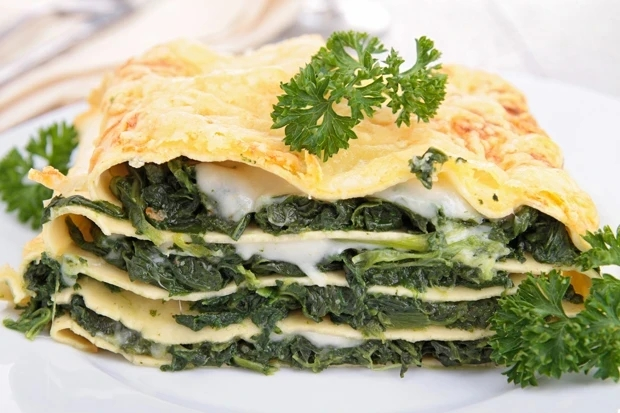

# Lasagne vegetarisch

## Zutaten für 4 Portionen

| 1   | EL    | Öl für die Form                                                                     |
| --- | ----- | ----------------------------------------------------------------------------------- |
| 250 | g     | Fetakäse                                                                            |
| 2   | Stk   | [Zwiebel](https://www.gutekueche.at/zwiebel-artikel-1206)                           |
| 4   | Stk   | [Knoblauchzehen](https://www.gutekueche.at/knoblauch-artikel-1222)                  |
| 2   | EL    | Öl                                                                                  |
| 600 | g     | [Spinat (TK)](https://www.gutekueche.at/spinat-artikel-1203)                        |
| 1   | Prise | [Salz](https://www.gutekueche.at/salz-artikel-1241)                                 |
| 1   | Prise | [Pfeffer](https://www.gutekueche.at/pfeffer-artikel-1236)                           |
| 1   | Msp   | [Muskatnuss](https://www.gutekueche.at/muskat-muskatnuss-muskatbluete-artikel-1233) |
| 16  | Stk   | Lasagne-Blätter                                                                     |
| 120 | g     | Käse (gerieben)                                                                     |

### Zutaten für die Sauce

| 50  | g     | [Butter](https://www.gutekueche.at/margarine-butter-artikel-1547)                   |
| --- | ----- | ----------------------------------------------------------------------------------- |
| 50  | g     | [Mehl](https://www.gutekueche.at/mehl-artikel-1544)                                 |
| 0.5 | l     | [Milch](https://www.gutekueche.at/milch-artikel-1553)                               |
| 0.5 | l     | Suppe (klar)                                                                        |
| 1   | Prise | [Pfeffer](https://www.gutekueche.at/pfeffer-artikel-1236)                           |
| 1   | Prise | [Salz](https://www.gutekueche.at/salz-artikel-1241)                                 |
| 1   | Msp   | [Muskatnuss](https://www.gutekueche.at/muskat-muskatnuss-muskatbluete-artikel-1233) |

Einkaufsliste

Kochansicht

## Kategorien

[Lasagne Rezepte](https://www.gutekueche.at/lasagne-rezepte) [Backrezepte](https://www.gutekueche.at/backrezepte-rezepte) [Spinat Rezepte](https://www.gutekueche.at/spinat-rezepte) [Vegetarische Rezepte](https://www.gutekueche.at/vegetarische-rezepte) [Fetakäse Rezepte](https://www.gutekueche.at/fetakaese-rezepte)

## Benötigte Küchenutensilien

Schneebesen Auflaufform Kochtopf

## Zeit

55 min. Gesamtzeit 20 min. Zubereitungszeit 35 min. Koch & Ruhezeit

## Zubereitung

1. Für die Spinatlasagne mit Bechamelsauce zuerst das Backrohr auf 200 Grad
   Ober-/Unterhitze vorheizen und eine feuerfeste Form mit Öl 
   ausstreichen. Den Fetakäse fein würfeln.
2. Dann die Zwiebeln und Knoblauch schälen und fein hacken. Beides in 
   etwas Öl in einem Topf anschwitzen. Den noch gefrorenen Spinat dazugeben
   und erwärmen. Mit Salz, Pfeffer und Muskat würzen.
3. Für die Bechamelsauce die Butter in einem Topf schmelzen, dann das 
   Mehl unterrühren. Nach und nach Milch und die Suppe hinzu gießen und gut
   mit einem Schneebesen verrühren, so dass keine Klumpen entstehen. Mit 
   Salz, Pfeffer und Muskat würzen und einige Minuten köcheln lassen.
4. Nun in die Auflaufform abwechselnd Sauce, Lasagneblätter, Spinat und
   Feta übereinander schichten. Mit der Sauce beginnen und abschließen. 
   Zuletzt den Käse über die Lasagne streuen und im Backrohr 35 Minuten 
   backen.
