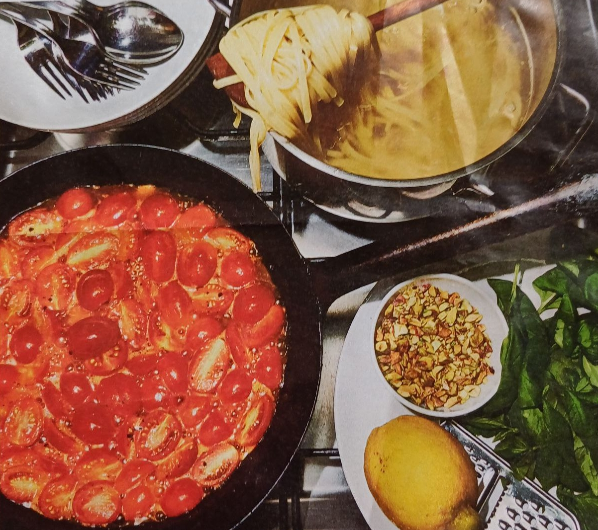

# Linguine mit geschmolzenen Tomaten und Zitrone

| Zubereitungszeit: 25 Minuten | Für 4 Personen                     |
| ---------------------------- | ---------------------------------- |
| 1 Knoblauchzehe              | 20 ml Zitronensaft                 |
| 100 ml Olivenöl              | schwarzer Pfeffer                  |
| 600 g Kirschtomaten          | 1 Bund (80 g) Basilikum            |
| 15 g Salz                    | 500 g Linguine                     |
| 10 g Zucker                  | 1 Bio-Zitrone (abgeriebene Schale) |
| 20 ml heller Aceto Balsamico | 40 g Pistazien (geröstet)          |

 
\pagebreak 

| Zutaten                                                                                            | Vorgehen                                                                                                                                                                                                                                                             |
| -------------------------------------------------------------------------------------------------- | -------------------------------------------------------------------------------------------------------------------------------------------------------------------------------------------------------------------------------------------------------------------- |
| 1 Knoblauchzehe                                                                                    | Den Knoblauch schälen und in feine Scheiben schneiden. In Olivenöl in einer Pfanne sachte erhitzen er soll nicht braun werden.                                                                                                                                       |
| 600 g Kirschtomaten   15 g Salz   10 g Zucker   20 ml heller Aceto Balsamico           | Die Kirschtomaten halbieren und zusammen mit Salz, Zucker und Balsamico dazugeben. Dann 15 bis 20 Minuten langsam schmelzen, die Tomaten sollten nicht zur Sauce verkocht werden.                                                                                    |
| 20 ml Zitronensaft   schwarzer Pfeffer   1/2 Bund (40 g) Basilikum                         | Zum Schluss den Zitronentaft, etwas Pfeffer und die Hälfte vom gezupften Basilikum in die Pfanne geben                                                                                                                                                               |
|                                                                                                    | Inzwischen die Linguine in reichlich Salzwasser bissfest kochen, Die Nudeln abgießen und ohne abzuschrecken zu den geschmolzenen Tomaten geben.                                                                                                                      |
| 1 Bio-Zitrone (abgeriebene Schale)   1/2 Bund (40 g) Basilikum   40 g Pistazien (geröstet) | Alles durch- rühren und auf vier Tellern anrichten. Mit einer feinen Reibe die Schale der Zitrone darüber verteilen. Das restliche gezupfte Basilikum, grob gehackte Pistazien, etwas Pfeffer und etwas Olivenöl darauf geben, nach Belieben auch Chili oder Kapern. |

Ohne Nudeln passen diese Tomaten als Vorspeise zu einer Burrata, auf 
eine Focaccia oder auf Fein gerostetes Weißbrot, in diesem Fall sogar 
kalt serviert.
