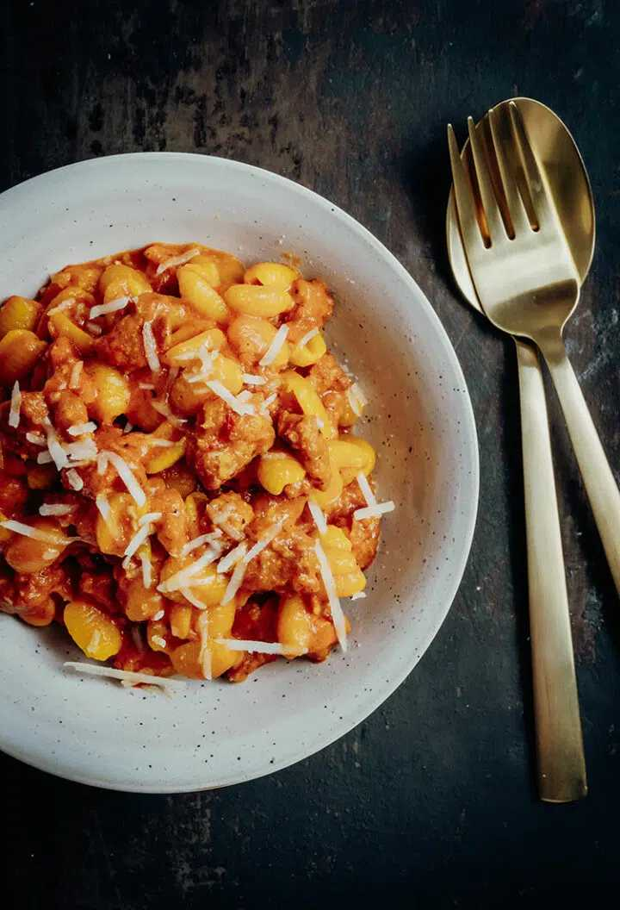

# Malloreddus alla Campidanese

Malloreddus alla Campidanese oder auch schnelles und einfaches Rezept für Gnocchi sardi mit Salsiccia-Ragù aus Sardinien.

https://reisehappen.de/malloreddus-alla-campidanese/

Vorbereitung 10 Minuten Min.

Zubereitung 1 Stunde Std. 10 Minuten Min.

Gesamtzeit 1 Stunde Std. 20 Minuten Min.

Gericht Pasta, Nudelgerichte

Küche Italien

Portionen 4 Personen

- 500 g Malloreddus (Gnocchi sardi)
- 750 ml passierte Tomaten
- 1 Zwiebel
- 400 g frische Salsiccia sarda
- 100 g Pecorino sardo
- 1-2 Sternanis
- 1 Tütchen gemahlener Safran (0,125 g)
- 1 gehäufter TL Fenchelsamen
- Olivenöl
- Salz
- frisch gemahlener schwarzer Pfeffer

## Zubereitung

1. (1 Zwiebel, 400 g frische Salsiccia sarda, 100 g Pecorino sardo) Zunächst die Zwiebel abziehen und fein würfeln. Die Salsiccia aus dem Darm herausdrücken und mit den Fingern klein zupfen. Den Pecorino fein reiben.

2. Dann etwas Olivenöl in einer Pfanne erhitzen und die Zwiebeln bei mittlerer Temperatur glasig anschwitzen. 
   Anschließend die Salsiccia hinzufügen und die Temperatur erhöhen.

3. Die Salsiccia unter gelegentlichem Rühren 5-6 Minuten anbraten, bis sie leicht Farbe angenommen hat. Dann die (1 gehäufter TL Fenchelsamen) Fenchelsamen hinzugeben und kurz anrösten.

4. Nun die passierten Tomaten (750 ml passierte Tomaten) und den(1-2 Sternanis)  Sternanis dazugeben. Die Tomatensauce bei niedriger Temperatur in der geschlossenen Pfanne etwa 40 Minuten köcheln lassen. Zwischendurch die Tomatensauce 1-2 Mal umrühren.

5. Dann den Safran (1 Tütchen gemahlener Safran) hinzufügen und die Sauce weitere 20 Minuten einköcheln lassen.

6. In der Zwischenzeit die Malloreddus (500 g Malloreddus) in kochendem Salzwasser etwa 1 Minute kürzer als auf der Packungsanweisung angeben, garen.

7. Den Pecorino (100 g Pecorino) in einem hohen Gefäß zusammen mit einer Kelle des Nudelwassers mit einem [Stabmixer](https://amzn.to/3eqpMJo) pürieren, sodass eine cremig weiße Masse entsteht. Wenn diese zu fest ist, kannst Du noch ein wenig Wasser hinzufügen.

8. Nun die tropfnassen Gnocchi sardi zur Tomatensauce geben und die Pecorino-Creme ebenfalls. Alle Zutaten gut vermengen. Sind die Pasta zu trocken, kannst Du nun noch ein wenig Nudelwasser hinzugeben.

9. Das Pastagericht mit Salz und Pfeffer abschmecken und schon sind die Malloreddus alla Campidanese fertig.

10. Die Gnocchi sardi alla Campidanese mit etwas frisch geriebenem Pecorino servieren.
