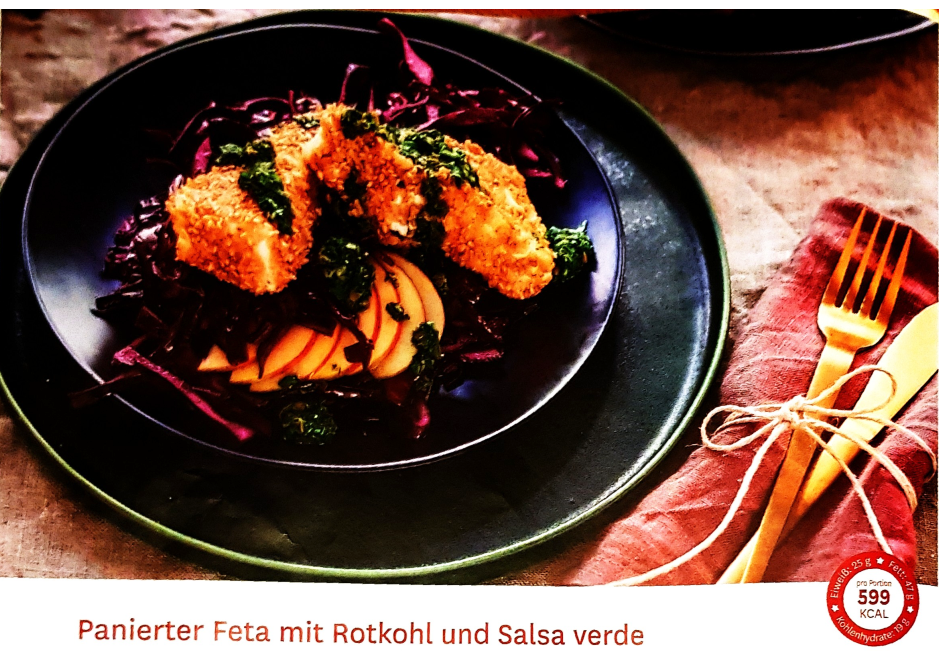

# Panierter Feta mit Rotkohl und Salsaverde

Herzhaft trifft süß im mediterranen Stil in 30 min

FÜR 4 PORTIONEN:

- 1 EL Kapern (15 g; Glas, Abtropfgewicht)

- 1 Knoblauchzehe

- 1/2 Bund Petersilie (10 g)

- 1/2 Bund Basilikum (10 g)

- 1 Handvoll Dill (5 g)

- 1 EL Orangensaft

- 3 EL Olivenöl

- Salz

- Pfeffer

- 1 Stück Rotkohl (400 g)

- 1/2 TL Kümmel

- 1 TL Honig

- 2 Msp. Zimt

- 400 g Feta (45% Fett i. T.)

- 1 EL Dinkel-Vollkornmehl (15 g)

- 1 Ei

- 6 EL helle Sesamsamen (90 g)

- 1 EL helles Sesamöl

- 1 Apfel
1) Kapern abtropfen lassen und fein hacken. Knoblauch schälen und ebenfalls fein hacken. Petersilie, Basilikum und Dill waschen, trocken schütteln und fein hacken. Kapern, Knoblauch und Kräuter mit Orangensaft und 2 EL Olivenöl mischen und mit Salz und Pfeffer würzen. Salsa beiseite stellen.

2) Rotkohl Strunk entfernen, Rest in feine Streifen schneiden und salzen. Kümmel in einer heißen Pfanne ohne Fett 2 Minuten anrösten, bis es anfängt zu duften. Im Mörser grob zerstoßen und zum Rotkohl geben. Honig, Zimt und restliches Olivenöl zugeben und 3 Minuten lang mit den Händen verkneten, bis Kohl geschmeidig ist, dann beiseitestellen.

3) Feta gut abtropfen lassen, trocken tupfen und in Dreiecke schneiden. Mehl in einen tiefen Teller geben, Ei ebenfalls in einen tiefen Teller schlagen, mit Salz und Pfeffer würzen und verrühren. In einen 3. Teller die Sesamsamen geben. Feta Ecken zuerst im Mehl, dann im verrührten Ei und anschließend in den Sesamsamen rundherum wenden.

4) Sesamöl in einer Pfanne erhitzen. Panierten Feta ca. 5 Minuten rundherum bei mittlerer Hitze braten. Inzwischen Apfel waschen, vierteln, entkernen und in feine Spalten scheiden. Rotkohl auf 4 Teller verteilen, Apfelspalten und Feta darauf anrichten und Salsa darüber-träufeln.

Gesund weil:

Der Pflanzenfarbstoff Anthycan aus Rosenkohl hilft die Körperzellen vor Schädigungen zu bewahren und kann der Entstehung von Krebserkrankungen vorbeugen. Feta liefert zudem eine optimale Mineralstoffmischung für Knochen und Zähne: Calcium und Phosphor stärken beide.
