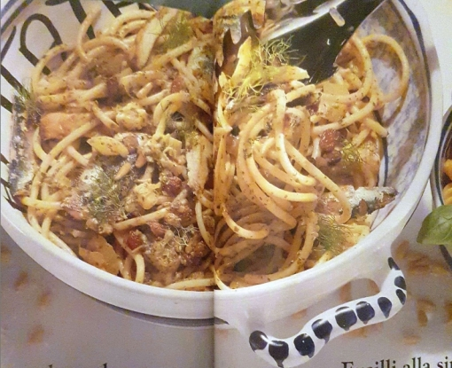

# Pasta con le sarde

Nudeln mit Sardinen und Fenchel (Sizilien)

| Zutaten für 4-6 Portionen:                      | Zubereitungszeit: 1 3/4 Std                           |
| ----------------------------------------------- | ----------------------------------------------------- |
| 500 g frische Sardinen                          | 400 g Bucatini (dicke, hohle Spaghetti) oder Makkaron |
| 1 Fenchelknolle (etwa 200 g) mit reichlich Grün | 1 TL Fenchelsamen                                     |
| 1 unbehandelte Zitrone (Saft + Schale)          | 1 mittelgroße Zwiebel                                 |
| 1 Bund glatte Petersilie                        | 3 Knoblauchzehen                                      |
| 4 eingelegte Sardellenfilets                    | etwa 100 ml Olivenöl                                  |
| 50 g Sultaninen                                 | Salz                                                  |
| 2 EL Pinienkerne                                | Pfeffer aus der Mühle                                 |

 
\pagebreak 

- Bei 6 Portionen pro Portion: 2500 kJ/600 kcal
1. Sardinen ausnehmen und den. Gründlich waschen, abtrocknen. Leicht salzen, mit dem Saft von 1 Zitrone beträufeln und kühlstellen.

2. 250g Sultaninen in 1/8 Wasser einweichen. Fenchel putzen, harte Stellen entfernen. Zartes Grün aufbewahren. 1 I Salzwasser auf- kochen, Fenchel 10 Min. garen. Abtropfen lassen, Kochwasser aufbewahren. Fenchel in Würfel schneiden.

3. 1/2 Bund Petersilie sehr fein hacken. 4 Sardellenfilets abspülen, trocknen und kleinschneiden. 3 Knoblauchzehen hacken. Die 3 Zutaten in einem Mörser mit 4 EL Olivenöl, abgeriebener Schale von 1/2 Zitrone und 1 TL Fenchelsamen zu einer Paste zermahlen.

4. Zwiebel fein hacken. In einer Pfanne 2 EL Olivenöl erhitzen, Zwiebel glasig dünsten. Fenchel einrühren und kurz anbraten. Temperatur verringern, Sardellenpaste, Sultaninen mit Sud, einige EL Fenchelbrühe und 2 EL Pinienkerne untermischen. Sanft köcheln.

5. Fenchelwasser auf 3 l auffüllen, salzen und erhitzen. 400 g Nudeln in etwa 10 Min. bissfest garen. Gut abtropfen lassen, 2 EL Olivenöl unter- mischen.

6. Inzwischen in einer zweiten Pfanne 4 EL Olivenöl erhitzen. Sardinen mit Küchenkrepp abtrocknen, von jeder Seite 2 Min. braten, salzen und pfeffern. 1/2 Bund Petersilie und Fenchelgrün grob hacken.

7. Nudeln lagenweise in eine vorgewärmte Form schichten, salzen und pfeffern. Jede Schicht mit einem Teil der Sardellensauce begießen, einige gebratene Sardinen darauf verteilen. Petersilie und Fenchelgrün aufstreuen, mit 2-3 EL Olivenöl beträufeln.
- Wird in Sizilien mit wildem Bergfenchel zubereitet, teilweise auch mit Tomaten gemischt und kurz überbacken.
