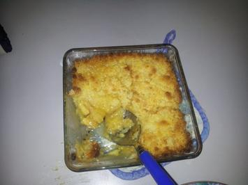

Von www.kochbar.de

Zubereitung 

- 2 StückÄpfel säuerlich 
- etwasZitronensaft 
- etwasZimt
- 100 gr.Mehl
- 75 gr.Zucker
- 75 gr.Butter zimmerwarm
- 1 PäckchenVanillesoße

Lies mehr über Apple Crumble Rezept - Rezepte kochen - kochbar.de 

Ofen auf 175 Grad vorheizen. Äpfel schälen, entkernen und in Scheiben schneiden. Diese dann in eine Auflaufform geben und mit etwas Zitronensaft beträufeln. Anschließend den Zimt darüber geben.  

Die lauwarme Butter in einer kleinen Schüssel mit dem Mehl und dem Zucker zu Streuseln vermengen. Nach belieben mehr Mehl oder Butter hinzugeben, damit sich leichter Streusek formen lassen. 

Die Streusel nun über die Äpfel geben und ca. 20 Minutern, bis die Streusel braun sind, im Ofen ausbacken.   

 Den Apple Crumble noch warm am besten mit Dänischer Vannillesoße genießen. Guten Appetit :)