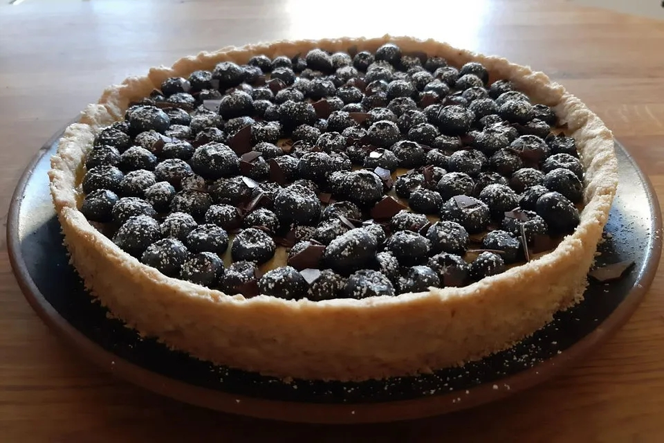

# Blaubeer-Zitronen-Tarte

## Zutaten

für

| Für den Mürbeteig: |                                                                                                                       |
| ------------------ | --------------------------------------------------------------------------------------------------------------------- |
| 150 g              | Mehl                                                                                                                  |
| 1 Msp.             | Backpulver                                                                                                            |
| 1 TL               | Kardamom                                                                                                              |
| 40 g               | Zucker                                                                                                                |
| 1 EL               | Vanillezucker                                                                                                         |
| 100 g              | Butter, weiche, evtl. Butterersatz                                                                                    |
| 1 EL               | [Wasser](https://www.chefkoch.de/magazin/artikel/752,0/Chefkoch/Wasser-alles-ueber-Mineralwasser-Trinkwasser-Co.html) |

## Füllung mit Ei

- 3 Bio-Eigelb

- 3 Bio-Eier

- 180 g Zucker

- 180 ml Zitronensaft

- 2 El Bio-Zitronenschale

- 185 g Butter

## Füllung vegan

- 300 g Blaubeeren

- 400 ml Milch, evtl. Soja-, Mandelmilch ...

- 1 Zitrone(n), Schale und Saft davon

- 1 Pck.Vanillepuddingpulver  

- Zimtpulver, Kardamom, Salz

- n. B. Lebensmittelfarbe, gelb Schokoladenraspel, dunkel Puderzucker

## Zubereitung

** Arbeitszeit ca. 30 Minuten ** Ruhezeit ca. 30 Minuten ** Koch-/Backzeit ca. 20 Minuten ** Gesamtzeit ca. 1 Stunde 20 Minuten

| Zutaten              | Boden                                                                                                                                                                                                                      |
| -------------------- | -------------------------------------------------------------------------------------------------------------------------------------------------------------------------------------------------------------------------- |
| 150 g Mehl           | Für den Mürbeteig Mehl mit Backpulver, Salz und Kardamom mischen.                                                                                                                                                          |
| 1 Msp. Backpulver    | Zucker,Butter und Wasser hinzugeben und alles kurz zu einem glatten Teig verkneten.                                                                                                                                        |
| 1 TL Kardamom        | Sollte es zu trocken sein, noch etwas Wasser hinzufügen.                                                                                                                                                                   |
| 40 g Zucker          | Den Teig 20 - 30 Min. im Kühlschrank luftdicht verpackt ruhen lassen, dann auf einer bemehlten Arbeitsfläche ausrollen und eine gefettete Form (24 cm) damit auslegen. Den Boden dann mit einer Gabel mehrfach einstechen. |
| 1 EL Vanillezucker   | Den Boden im vorgeheizten Ofen bei 160 °C Umluft ca. 20 Min. backen.                                                                                                                                                       |
| 100 g Butter, weiche | Den Boden erkalten lassen, dann auf eine Servierplatte schieben.                                                                                                                                                           |
| 2 EL Wasser          |                                                                                                                                                                                                                            |
| etwas Salz           |                                                                                                                                                                                                                            |

| Zutaten                 | Füllung mit Ei                                                                              |
| ----------------------- | ------------------------------------------------------------------------------------------- |
| 3 Bio-Eigelb            | In einem Topf alle Zutaten mischen und auf dem Herd bei mittlerer Hitze erwärmen.           |
| 3 Bio-Eier              | Dabei regelmäßig rühren, bis das Eigelb stockt und die Flüssigkeit eine feste Masse ergibt. |
| 180 g Zucker            | Vom Herd nehmen und durch ein grobmaschiges Sieb laufen lassen.                             |
| 180 ml Zitronensaft     | Die gesiebte Masse kann dann auf den Kuchenboden gegeben werden.                            |
| 2 El Bio-Zitronenschale |                                                                                             |
| 185 g Butter            |                                                                                             |

Anschließend 2-3 Stunden in den Kühlschrank stellen. Zur Dekoration beim
 Servieren eignen sich Zitronenscheiben und frische Pfefferminzblätter 
sowie etwas Puderzucker.

150 g der Blaubeeren mit einem Schluck Wasser zu einem Mus köcheln 
lassen. Dabei mit Zimt und Kardamom abschmecken. Dann das Mus 
gleichmäßig auf dem Boden verstreichen.  

Aus dem Saft der Zitrone und der Milch (zusammen 500 ml) nach 
Packungsanleitung den Vanillepudding zubereiten. Diesen mit einer Prise 
Salz und evtl. dem Abrieb der Zitrone abschmecken.  
Tipp: Dem Pudding kann mit etwas Lebensmittelfarbe zu einem schöneren satteren Gelb verholfen werden.  

Den Pudding nun gleichmäßig auf dem Fruchtmus verteilen. Die Tarte mit 
den restlichen Blaubeeren garnieren und nach Belieben mit Puderzucker 
und Schokoladenraspeln verzieren.
