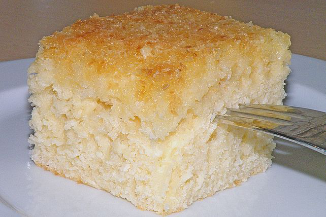

https://www.chefkoch.de/rezepte/1577681265284007/Kokos-Buttermilch-Kuchen.html

|            |                                                                                                                       |
| ---------- | --------------------------------------------------------------------------------------------------------------------- |
| 3 Tasse/n  | Zucker                                                                                                                |
| 2 Tasse/n  | Buttermilch                                                                                                           |
| 1 Prise(n) | [Salz](https://www.chefkoch.de/magazin/artikel/1054,2/Chefkoch/Salz-unser-wichtigstes-Gewuerz.html)                   |
| 1 Pck.     | Vanillinzucker                                                                                                        |
| 3          | [Ei(er)](https://www.chefkoch.de/magazin/artikel/908,0/Chefkoch/Das-Ei-der-heimliche-Kuechenstar-im-Rampenlicht.html) |
| 4 Tasse/n  | Mehl                                                                                                                  |
| 1 Pck.     | Backpulver                                                                                                            |

| ### Für den Belag: |             |
| ------------------ | ----------- |
| 1 Tüte/n           | Kokosraspel |
| ½ Tasse            | Zucker      |

| ### Für den Guss: |        |
| ----------------- | ------ |
| 1 Becher          | Sahne  |
| 150 g             | Butter |

## Nährwerte pro Portion

##### kcal

7109

##### Eiweiß

96,46 g

##### Fett

299,95 g

##### Kohlenhydr.

997,31 g

## Zubereitung

__ Arbeitszeit ca. 15 Minuten __ Gesamtzeit ca. 15 Minuten

1 Tasse fasst 125 ml.  

Teig:  
3 Tassen Zucker, 1 Prs. Salz, 2 Tassen Buttermilch, 1 Pä. Vanillezucker und 3 Eier gut miteinander verrühren.  
4 Tassen Mehl mit 1 Pä. Backpulver mischen und mit den anderen Zutaten gut verrühren.  
Diesen recht flüssigen Teig auf ein mit Backpapier belegtes Backblech gießen.  

Gut 1/2 Tasse Zucker mit 1 Pä. Kokosflocken vermischen und gleichmäßig mit einem Esslöffel auf dem Teig verteilen.  

Bei 200°C (Gas Stufe 3 - 4) auf mittlerer Schiene für ca. 20 - 30 Minuten backen, bis die Kokosflocken gleichmäßig goldbraun sind.  

Während des Backens 150 g Butter zusammen mit einem Becher Sahne aufkochen.  
Mit einem Esslöffel dieses Gemisch auf dem fertig gebackenen, noch heißen Kuchen, gleichmäßig (auch an den Rändern) verteilen.  

Den Kuchen vollständig auf dem Blech auskühlen lassen und zum Servieren in kleine Stücke schneiden.  

PS.: Ich verwende immer eine ganz normale Kaffeetasse aus meinem Service und mache diese bis oben hin voll. (Ein Henkelbecher wäre zu groß).  
Der Kuchen geht richtig gut auf.  
Das Sahne-Gemisch macht den Kuchen so besonders saftig!  
Er war bis jetzt auf jeder Party DER Renner. Lässt sich wunderbar stapeln und transportieren und hält sich in Alufolie oder Tupper mind. eine Woche frisch.  
Bei warmer Witterung besser im Kühlschrank aufbewahren.