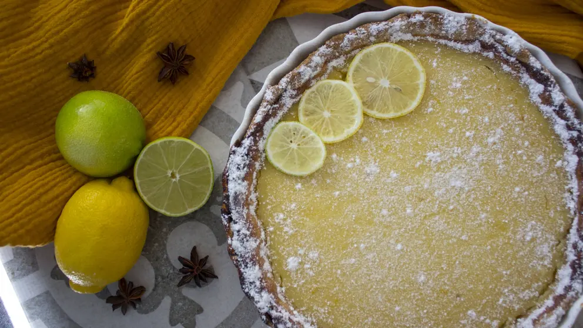

https://www.woman.at/rezepte/zitronentarte

Das Rezept für die erfrischendste Torte schlechthin stammt natürlich aus Italien: Aber die "Crostata al limone" schmeckt nicht nur im Sommer!

## Zutaten

- 125 g kalte Butter

- 250 g Mehl

- 275 g Zucker

- 1 Pkg. Vanillezucker

- 1Prise(n) Salz

- 1 Eigelb

- 2 Eier

- 2 Bio-Zitronen

- 500 g Ricotta

- 50 ml Limoncello

- Puderzucker zum Bestreuen

- Butter für die Kuchenform

## Zubereitung

1. Tarteform mit etwas Butter einfetten. Mehl mit 75 g Zucker, Vanillezucker, Salz, Butter in Stückchen, 1 Eigelb und 1-2 EL kaltes Wasser erst mit dem Handrührgerät und danach mit den Händen glatt verkneten.

2. Teig auf etwas Mehl ausrollen. Form damit auslegen, dabei am Rand in die Rillen drücken. Teigboden mehrmals mit einer Gabel einstechen. Ca. 30 Minuten kalt stellen.

3. Zitronen waschen und trocken reiben. Von einer Zitrone die Schale fein abreiben, danach auspressen. Die Eier mit 150 g Zucker schaumig schlagen. Ricotta portionsweise darunter rühren. Zum Schluss die Zitronenschale und den Zitronensaft unterrühren.  
    Masse auf den Teig streichen.

4. Im vorgeheizten Backofen (E-Herd 175 Grad/Umluft 150 Grad) auf der untersten Schiene ca. 40 Min. backen. Danach Temperatur hoch schalten (E-Herd 200 Grad/Umluft 175 Grad) und weitere 15-25 Minuten backen.

5. In der Form auskühlen lassen. Währenddessen die zweite Zitrone in sehr dünne Scheiben schneiden. Likör, 3 EL Wasser und 50 g Zucker in einen Topf geben und bei starker Hitze ca. 2 Minuten kochen.

6. Zitronenscheiben zufügen und im Sirup bei mittlerer Hitze ca. 8 Minuten köcheln. Anschließend abkühlen lassen. Zitronenscheiben auf der Tarte verteilen. Nach Geschmack kann man noch etwas vom Sirup darüber träufeln. Auskühlen lassen. Tarte mit Puderzucker bestreuen und genießen!
