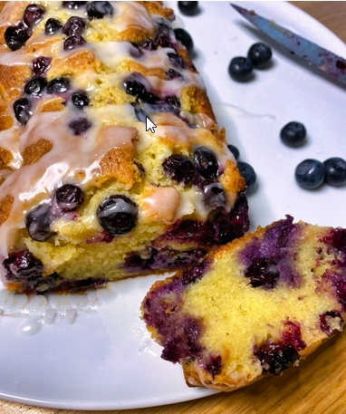

# Heidelbeerkuchen mit Mandeln und Zitrone

| Für 8 Personen:                                                    |                                                    |
| ------------------------------------------------------------------ | -------------------------------------------------- |
| 150 g weiche Butter, plus mehr für die Form                        | 90 g Mehl vermischt mit 3/4 TL Backpulver, gesiebt |
| 190 g Zucker                                                       | 110 g gemahlene Mandeln                            |
| 2 Bio-Zitronen, 2 TL Schale abgerieben, dann 2 EL Saft ausgepresst | 200 g Heidelbeeren                                 |
| 1 TL Vanilleextrakt oder das Mark von1 Vanilleschote               | 70g Puderzucker                                    |
| 3 große Eier, verquirlt                                            | Salz                                               |

 
\pagebreak 

| Zutaten                                                                                                                 | Aktion                                                                                                                                                                                                                                                                                                                                                                                                                                                                                                                                   |
| ----------------------------------------------------------------------------------------------------------------------- | ---------------------------------------------------------------------------------------------------------------------------------------------------------------------------------------------------------------------------------------------------------------------------------------------------------------------------------------------------------------------------------------------------------------------------------------------------------------------------------------------------------------------------------------- |
|                                                                                                                         | Den Backofen auf 180 °C (Umluft) vorheizen. Eine Kastenform (11x21 cm) ausbuttern und mit Backpapier auskleiden.                                                                                                                                                                                                                                                                                                                                                                                                                         |
| 150 gr Butter,  190 g Zucker,  2 TL Schale Zitrone abgerieben,  Vanilleextrakt,  3 große Eier verquirlt | Butter, Zucker, Zitronenschale, 1 EL Zitronensaft und Vanilleextrakt in die Rührschüssel der Küchenmaschine geben und mit dem Flachrührer 3-4 Minuten auf hoher Stufe hellgelb und schaumig rühren. Anschließend die Geschwindigkeit auf mittlere Stufe herunterstellen. In kleinen Mengen die Eier zugeben. Keine Sorge, wenn die Mischung ausflockt, sie wird mit der Zeit wieder glatt.                                                                                                                                               |
| 90 g Mehl vermischt mit 3/4 TL Backpulver,  110 g gemahlene Mandeln,  150g Heidelbeeren                         | In drei Portionen das Mehl mit 1 kräftigen Prise Salz und Mandeln einarbeiten. Zuletzt von Hand 150g Heidelbeeren unterziehen und die Masse in die vorbereitete Form füllen.                                                                                                                                                                                                                                                                                                                                                             |
|                                                                                                                         | Den Kuchen 15 Minuten im Ofen backen, dann gleichmäßig mit den restlichen Heidelbeeren (50g) bestreuen und weitere 15 Minuten backen, bis er goldbraun, aber noch nicht durchgegart ist. Locker mit Alufolie zudecken und weitere 25-30 Minuten backen, bis der Kuchen aufgegangen und durchgegart ist. Für die Garprobe in der Mitte mit einem Messer einstechen: bleibt kein Teig haften, ist er fertig. Aus dem Ofen nehmen und 10 Minuten in der Form abkühlen lassen. Herauslösen und auf einem Gitter vollständig erkalten lassen. |
| Zitronensaft                                                                                                        | Inzwischen für den Zuckerguss den restlichen Zitronensaft (1 EL) in einer Schüssel mit dem Puderzucker glatt rühren. Über den Kuchen gießen und behutsam verstreichen - der Saft der Heidelbeeren wird den Guss ein wenig einfärben, umso schöner                                                                                                                                                                                                                                                                                        |
