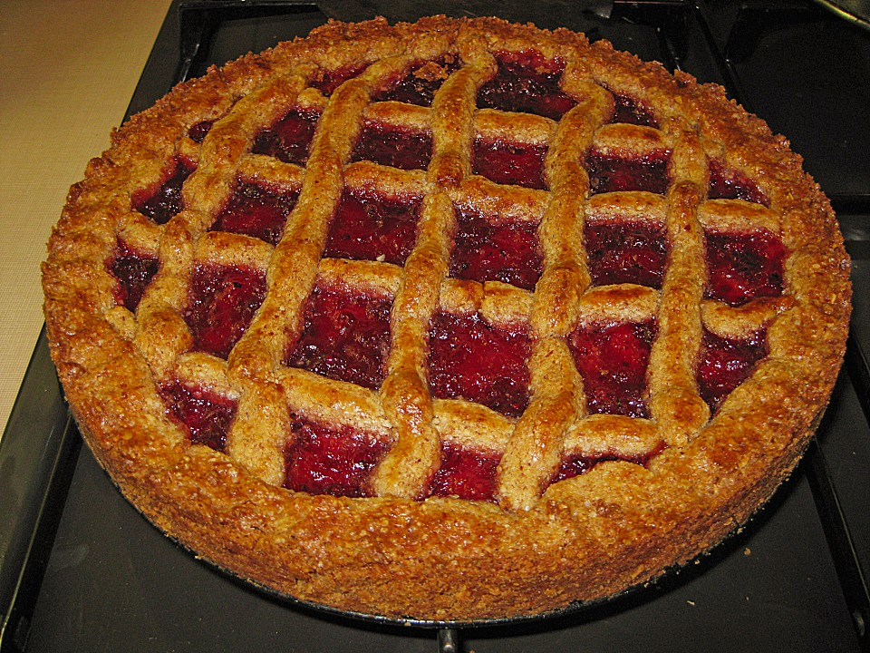

Zutaten

- 250 g     Mehl
- 250 g     Zucker
- 250 g     Mandel(n) oder Haselnüsse, gemahlen
- 1/2 TL     Zimt
- 1 Msp.     Nelke(n)
- 250 g     Butter
- 2      Ei(er)
- 250 g     Marmelade (Himbeere)
- 3 EL     Himbeergeist oder Cognac
- 2 EL     Puderzucker

Zubereitung

Arbeitszeit: ca. 1 Std. 15 Min. Ruhezeit: ca. 1 Tag / Schwierigkeitsgrad: normal / Brennwert p. P.: keine Angabe
Aus Mehl, Zucker, Mandeln, Zimt, Nelkenpulver, Butter und 1(!) Ei einen Mürbeteig herstellen, 30 Min. kühlen.
Den Boden einer Springform von 28 cm Durchmesser fetten. Den Teig aus dem Kühlschrank holen, etwa drei Viertel davon zwischen zwei Folien für den Springformboden und -rand ausrollen und in die Form legen. Der Teig ist matschig, notfalls mit den Händen nacharbeiten, das Backergebnis wird nicht schlecht dadurch.
Den Backofen auf 175°C vorheizen.

Die Himbeermarmelade mit dem Himbeergeist/Cognac verrühren und auf dem Teigboden verteilen, Teig Rest ausrollen, in schmale Streifen schneiden und gitterförmig auf die Marmelade legen, an den Ränder festdrücken.
Das andere Ei in einer Tasse mit einer Gabel verschlagen und mit einem Pinsel auf das Teiggitter streichen.
Den Kuchen etwa 45 Min. backen.

Die Linzer Torte sollte unbedingt, damit sie noch besser schmeckt, einen Tag durchziehen!
Kurz vor Verzehr mit Puderzucker bestäuben.

Man kann geschlagene Sahne dazu reichen, der Kuchen schmeckt aber auch ohne. 