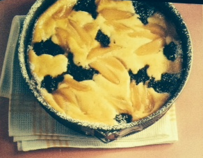

# Mohn-Quark-Kuchen

| Zutaten                  | Verarbeitung                                                                                                                            |
| ------------------------ | --------------------------------------------------------------------------------------------------------------------------------------- |
| 100 gr Butter            | zerlassen,                                                                                                                              |
| 200 gr. Butterkekse      | fein zerstoßen, mit der Butter mischen in eine Springform (26 cm) drücken und einen Rand von 2 cm formen                                |
|                          |                                                                                                                                         |
| 120 gr weiche Butter     | und                                                                                                                                     |
| 60 gr Zucker             | mit Rührer  5 min cremig rühren.                                                                                                        |
| 3 Eigelb                 | unterrühren,                                                                                                                            |
| 250 gr Magerquark        | und                                                                                                                                     |
| 20 gr Vanillepudpulv.    | unterrühren.                                                                                                                            |
| 3 Eiweiß                 | mit                                                                                                                                     |
| 1 Prise Salz             | steif schlagen                                                                                                                          |
| 60 gr. Zucker            | einrieseln und 3 min weiterschlagen und unter die Quarkmasse heben. Die Masse in die Form geben                                         |
| 250 gr Mohnmasse         | punktuell auf die Masse geben und etwas unterheben                                                                                      |
| 1 Dose Birnen            | abgießen und in Spalten schneiden, diese dann auf die Masse legen. Bei 180 Grad (Umluft 160 Grad) auf der 2. Schiene 55 - 60 min backen |
| 50 gr Aprokosenkonfitüre | auf heißen Kuchen verstreichen und mit                                                                                                  |
| 2 TL Puderzucker         | bestreuen.                                                                                                                              |
