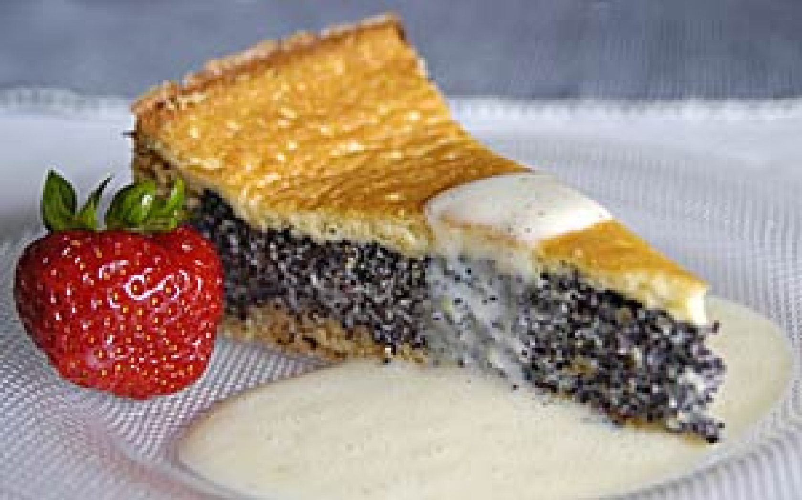

Kategorien: Backen, Mohn
Menge: 1 Springform 28 cm Ø (in Klammern die Angaben für eine 24

### MÜRBETEIG

- 100 (74) Gramm Butter
- 100 (74) Gramm Zucker
- 200 (147) Gramm Weizenmehl Type 405
- 1 (1) Ei, Größe M
- 1/2 (10g) Pack. Backpulver

## BELAG

- 50 (37) Gramm Speisestärke
- 620 (440) ml Milch
- 250 (183) Gramm Mohn, gemahlen
- 2 (1) Pack. Vanillezucker
- 86 (63) Gramm Zucker
- 50 (37) Gramm Butter
- 200 (147) Gramm Schmand

## DECKE 

- 3 (2, Größe S) Eier, Größe M
- 100 (74) Gramm Puderzucker
- 200 (147) Gramm Schmand
