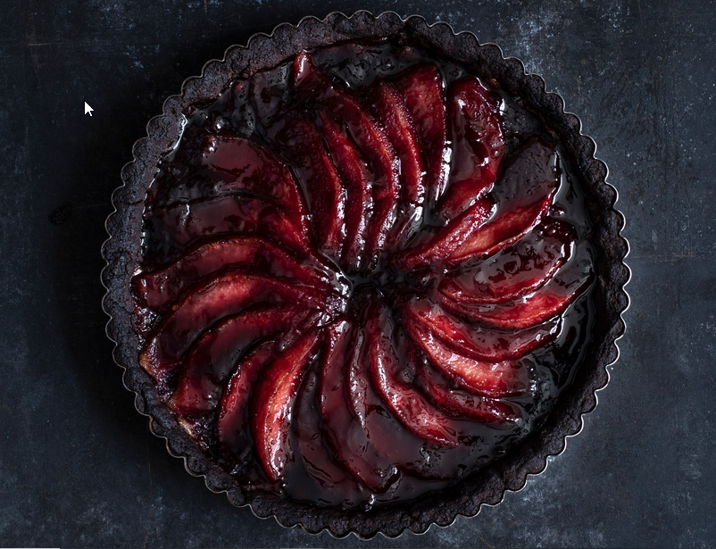

# Quitten Tarte

aus: [Feiner Quittenkuchen Rezept | EAT SMARTER](https://eatsmarter.de/rezepte/feiner-quittenkuchen)

Zutaten:

125 g kalte [Butter](https://eatsmarter.de/lexikon/warenkunde/fette/butter "Butter-Rezepte") (in Stücken) + 1 TL für die Form

70 g [Vollrohrzucker](https://eatsmarter.de/lexikon/warenkunde/suesses/rohrzucker "Vollrohrzucker-Rezepte")

220 g [Dinkelmehl](https://eatsmarter.de/lexikon/warenkunde/getreide/dinkel "Dinkelmehl-Rezepte") Type 630

4 EL stark entöltes [Kakaopulver](https://eatsmarter.de/lexikon/warenkunde/superfood/kakao "Kakaopulver-Rezepte") (à 15 g)

1 [Ei](https://eatsmarter.de/lexikon/warenkunde/huehnereier "Ei-Rezepte")

1 Prise [Salz](https://eatsmarter.de/lexikon/warenkunde/gewuerze/salz "Salz-Rezepte")

3 große [Quitten](https://eatsmarter.de/lexikon/warenkunde/obst/quitten "Quitten-Rezepte") (à 250 g)

1 [Zimtstange](https://eatsmarter.de/rezepte/zutaten/zimtstange-rezepte "Zimtstange-Rezepte")

1 [Gewürznelke](https://eatsmarter.de/lexikon/warenkunde/gewuerze/nelken "Gewürznelke-Rezepte")

150 g [Sonnenblumenkerne](https://eatsmarter.de/lexikon/warenkunde/nuesse/sonnenblumenkerne "Sonnenblumenkerne-Rezepte")

1 EL Pflaumenkernöl oder [Mandelöl](https://eatsmarter.de/rezepte/zutaten/mandeloel-rezepte "Mandelöl-Rezepte")

70 g schwarzes [Johannisbeergelee]

## Küchengeräte

1 Tarteform (24 cm Ø)

## Zubereitungsschritte

1. Für den Boden Butterstückchen, 30 g Zucker, Mehl, die 
   Hälfte des Kakaopulvers, Ei und 1 Prise Salz verkneten. Teig auf einer 
   mit restlichem Kakaopulver bestreuten Fläche ausrollen, in einer 
   gefetteten Tarteform auslegen und den überstehenden Rand abschneiden. 
   Teig mit einer Gabel mehrmals einstechen und für ca. 1 Stunde kalt 
   stellen.

2. Inzwischen für die Füllung Quitten putzen, schälen, 
   vierteln und die Kerngehäuse entfernen. Mit 500 ml Wasser, restlichem 
   Zucker, Zimtstange und Nelke ca. 25 Minuten auf kleiner Hitze köcheln. 
   Anschließend Quitten aus dem Sud nehmen und 10 Minuten auskühlen 
   lassen. Sud durch ein Sieb gießen, auffangen und in 7 Minuten auf ca. 
   100 ml einkochen lassen. Abgekühlte Quitten längs in dünne Scheiben 
   schneiden.

3. Sonnenblumenkerne in einen Mixer geben und sehr fein mixen. 
   Pflaumenkernöl hineingießen und weitermixen. Sonnenblumenkernmus dünn 
   auf der Tarte verteilen.

4. Quittenscheiben kreisförmig auf dem feinen Quittenkuchen 
   verteilen. Johannisbeergelee in den Quittensud rühren und die Quitten 
   mit dem Sud einstreichen. Feinen Quittenkuchen auf mittlerer Schiene im 
   vorgeheizten Backofen bei 200 °C (Umluft 180 °C; Gas: Stufe 3) 30 
   Minuten backen. Feinen Quittenkuchen mit restlichem 
   Johannisbeer-Quitten-Sud bestreichen und servieren.

