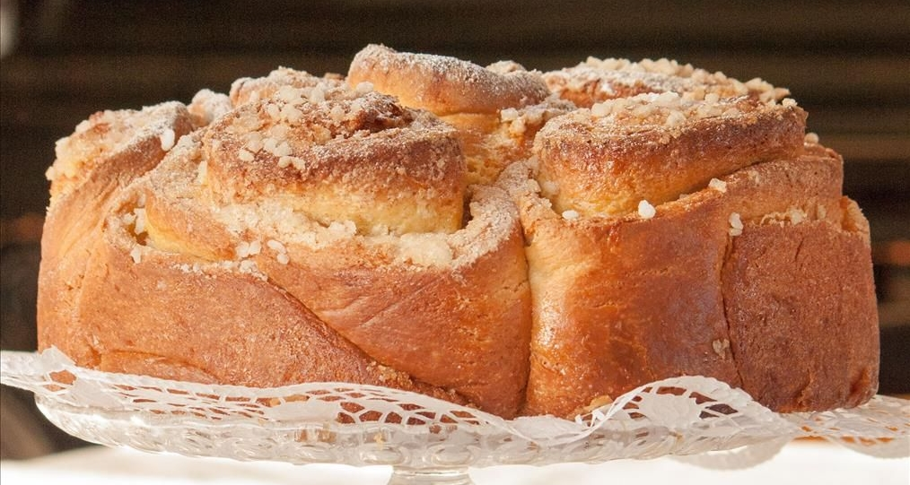

# Torta delle Rose

Das feine Germgebäck wurde in der Renaissance für die Marquise von Mantua gebacken 

(aus: https://a-modo-mio.at/rosenkuchen/)

**Vorteig**

- 1 Packung Trockenhefe oder 1 Würfel frische Germ
- 260 g Mehl glatt
- circa 175 ml (anstatt 260 ml) lauwarme Milch

**Teig**

- 340 g Mehl, glatt
- 80 g Zucker
- 80 g Butter bei Raumtemperatur
- eine Prise Salz
- 6 Eigelb bei Raumtemperatur
- 1 TL Vanilleextrakt

**Füllung**

- 140 g Butter bei Zimmertemperatur
- 140 g Zucker
- Zimtpulver (geröstet)
- Abrieb von 2 Zitronen (unbehandelt)

**Glasur**

- 1 Eiweiß
- Hagelzucker zum Bestreuen

**Zubereitung**

**Vorteig:** Am Vorabend das Mehl mit der trockenen Germ
 vermischen. Langsam die lauwarme Milch hinzufügen und die Zutaten mit 
Hilfe einer Küchenmaschine zu einem weichen Teig rühren, bis er sich von
 den Seiten der Schüssel löst. Wer frische Germ verwendet, den 
Germwürfel zerbröckeln und in wenig warmer Milch auflösen, erst dann mit
 dem Mehl vermischen. Den Teig auf die Arbeitsfläche geben, noch einige 
Minuten mit der Hand kneten und zu einem Bündel rollen. In eine Schüssel
 geben und mit Plastikfolie zudecken. Eine halbe Stunde ruhen lassen und
 über Nacht in den Kühlschrank geben.

Am nächsten Tag den Vorteig aus dem Kühlschrank nehmen und den Ofen auf 180 Grad vorheizen.

**Teig:** Für den Teig Butter, Eigelb und Vanilleextrakt
 sowie die trockenen Zutaten mit einer Küchenmaschine mischen. 
Währenddessen den in kleine Stücke geteilten Vorteig langsam 
untermengen. Den Teig kneten, bis eine gleichmäßige Masse entsteht und 
diese sich von den Seiten der Schüssel löst. Den Teig auf die 
Arbeitsfläche geben und einige Minuten mit der Hand kneten, zu einem 
Bündel formen und ruhen lassen.

**Füllung**: Währenddessen Zucker und Butter mit der 
Küchenmaschine cremig schlagen. Den Teig auf einem mit Mehl bestäubten 
Backpapier ausrollen, sodass die gesamte Oberfläche des Backpapiers mit 
dem Teig bedeckt wird. Mit einer Kuchenspachtel die cremige Buttermasse 
gleichmäßig auf den Teig streichen. Die Oberfläche mit Zimt bestreuen 
und Zitronenschale darauf reiben. Den Teig wie bei einer Roulade – eher 
locker, damit er gut aufgeht – einrollen. Eine 26-cm-Springform mit 
Backpapier auslegen. Die Rolle in acht bis zwölf Scheiben (circa fünf 
Zentimeter dick) schneiden und diese mit etwas Abstand in die Backform 
legen.

**Glasur:** Die Oberfläche mit Eiweiß bestreichen und mit Hagelzucker bestreuen.

Den Teig noch eine Stunde bei Raumtemperatur zugedeckt aufgehen 
lassen, danach 45 Minuten im vorgeheizten Backrohr bei 180 Grad 
goldbraun backen. Abkühlen lassen und genießen.

Buon appetito!

Die Milch zum Vorteig ist zuviel, aber insgesamt richtig

Backen mit auf Stufe 8, nach 15 min war schon die Oberseite hinten zu braun

Habe insgesamt 8 min kürzer gebacken

Deswegen, mal mit Stufe 7 probieren, 
