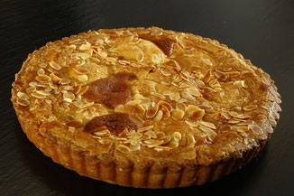

## Zitronenkuchen der Fugger

**Zutaten Teig:**

250 g Mehl
125 g kalte Butter in Stückchen
50 g Zucker
1 Ei
1  Eigelb
1 Prise(n) Salz

**Füllung:**

150 g gemahlene Mandeln
125 g Zucker
1  Abrieb einer Zitrone
140 g Zitronensaft  

**Deckel:**

50 g gehackte Mandeln 
1 EL Milch
1 EL Eiweiß  

Mehl für die Arbeitsfläche  

Fett für die Form

Die Zutaten für den Mürbeteig kneten und den fertigen Teig in eine 
größere und eine kleinere Portion teilen. Die kleinere Portion auf einem
 bemehlten Arbeitsbrett bis zur Tarteformgröße ausrollen
 und mit der umgedrehten Form den Deckel ausstechen. Den 
überschüssigen Teig zur anderen Portion dazugeben und unterkneten. 
Diesen Teig auf etwas mehr als die Größe der Kuchenform ausrollen und
 die leicht gefettete Tarteform mit dem Rand damit auslegen. Beide 
Teige für eine halbe Stunde in den Kühlschrank stellen.  

Den erkalteten Teigboden mehrmals mit einer Gabel einstechen. Die 
Zutaten für die Füllung zusammenrühren und auf dem Boden verteilen. Nun 
den Deckel auflegen und ringsherum den Rand
 zusammendrücken.  
Das Eiweiß mit der Milch verschlagen und den Deckel damit 
einstreichen. Auch den Rand dabei nicht vergessen. Nochmals den Rand gut
 andrücken. Jetzt auch den Deckel mit der Gabel mehrmals
 einstechen und alles mit den gehackten Mandeln bestreuen.

**Zubereitung:**  
Bei 200 °C ca. 40 Minuten backen.
