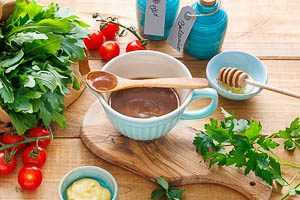

# Vinagrette Balsamico

## Balsamico-Dressing selber machen

https://emmikochteinfach.de/balsamico-dressing/#wprm-recipe-container-39045

Das dunkle Dressing mit Balsamico und Olivenöl für alle kräftigen Salate 
wie Rucola oder Feldsalat ist in nur 5 Minuten zubereitet.

ZUBEREITUNG5 Minuten Minuten

ZEIT GESAMT5 Minuten Minuten

PORTIONEN4 Personen

### ZUTATEN

- ▢ 90 ml Olivenöl
- ▢ 30 ml dunkler Balsamico-Essig - Aceto balsamico di Modena (IGP)
- ▢ 15 g Senf
- ▢ 10 g Honig
- ▢ ½ TL Salz
- ▢ ⅛ TL Zucker
- ▢ 1 Prise schwarzer Pfeffer aus der Mühle

### ANLEITUNG

- In eine Schüssel gibst du **alle Zutaten:** 90 ml **Olivenöl,** 30 ml **dunklen Balsamico-Essig,** 15 g **Senf,** 10 g **Honig,** ½ TL **Salz,** ⅛ TL **Zucker** und 1 Prise **schwarzen Pfeffer.** Kräftig mit dem Schneebesen verrühren, bis die Zutaten emulgieren.

- Dunkles Balsamico-Dressing passt unter anderem zu Feldsalat, Tomatensalat, und Caprese (Mozzarella auf Tomaten).

- Ich wünsche dir **guten Appetit**.

## Meine Mischung

- 1 Schalotte

- 5 EL Balsamico

- 3 EL Weißweinessig

- 1 TL mittel scharfer Senf

- Salz und Pfeffer

- 1 TL Honig

- 12 EL Oliven Öl

- 1 TL Salatkräuter

Alles mischen und mit Pürierstab mixen Emulsion
