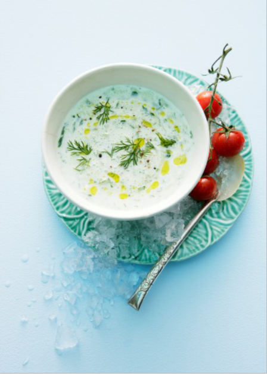

Zubereitung für 4 Personen

Kalte Gurken-Joghurt-Suppe 
Zutaten
- 2 kleinere Salatgurken
- 1 Knoblauchzehe
- 400 g fettarmer Joghurt
- 150 ml Buttermilch
- 1 El Honig
- 1 Bund Dill
- Kalahari Salz, Cayennepfeffer
- Saft und Schale von ½ unbehandelten Limone
- 3-4 El Olivenöl

Rezept 
1.
Gurke schälen und grob raspeln, Knoblauch schälen und fein hacken. Beides mit Joghurt, Buttermilch und Honig mischen. Die Hälfte davon in einen Mixer geben, fein pürieren und zur restlichen Gurken-Joghurt-Mischung geben und verrühren.
2.
Dill abbrausen, trocken schütteln, Blätter vom Stiel zupfen und hacken. Gehackter Dill unter die Suppe rühren und diese mit Salz, Cayennepfeffer, Limonensaft und fein abgeriebener Schale würzig abschmecken. Kühl stellen.
3.
Kalte Gurken-Joghurt-Suppe in tiefe Schalen füllen und mit Olivenöl beträufeln.
