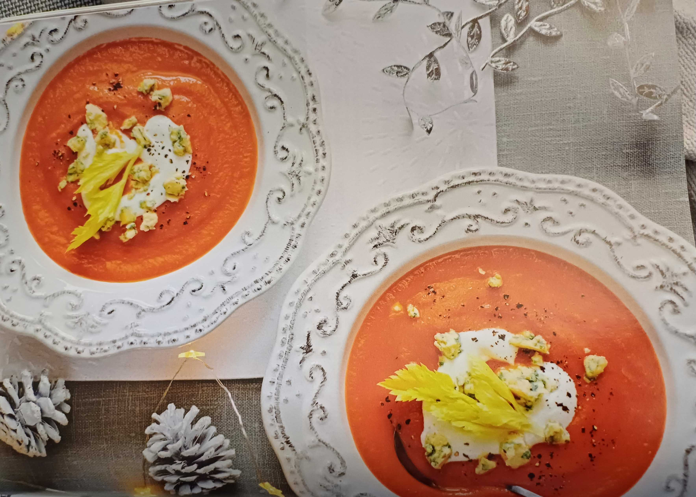

## Tomaten-Sellerie-Suppe-mit-Stilton

Für ein warmes Gefühl im Bauch

Arbeit 20 MIN FERTIG IN 35 MIN 

FÜR 4 PORTIONEN:

- 2 Zwiebeln

- 2 Knoblauchzehen

- 1 Möhre

- 4 Stangen Staudensellerie

- 2 Zweige Thymian

- 2 EL Olivenöl

- 1 EL Ahornsirup

- 800 g geschälte Tomaten (Dose)

- 250 ml Gemüsebrühe

- Salz, Pfeffer

- Cayennepfeffer

- 4 EL Joghurt (3,5% Fett)

- 150 g Stilton (48% Fett i. Tr.)
1. (2) Zwiebeln und (2) Knoblauch schälen und fein würfeln. (1) Möhre putzen, waschen, schälen und klein schneiden. (4 Stangen Stauden-) Sellerie putzen, waschen, das Grün beiseitelegen und Stangen in feine Ringe schneiden. (2 Zweige) Thymian waschen, trocken schütteln und Blätter von den Zweigen abzupfen.

2. (2 EL) Olivenöl in einem Topf erhitzen und Gemüse darin bei starker Hitze ca. 3 Minuten anbraten. (1 EL) Ahornsirup dazugeben und mit (800 g) Tomaten und (250 ml) Gemüsebrühe angießen. Mit Salz, Pfeffer und Cayennepfeffer würzen. Suppe für ca. 15 Minuten bei kleiner Hitze köcheln lassen und anschließend fein pürieren. In der Zwischenzeit (4 EL) Stilton in ca. 1 cm große Würfel schneiden.

3. Tomaten-Sellerie-Suppe in tiefen Tellern anrichten, je 1 EL Joghurt und etwas Stilton darauf geben, mit Pfeffer bestreuen und mit Selleriegrün garnieren.
