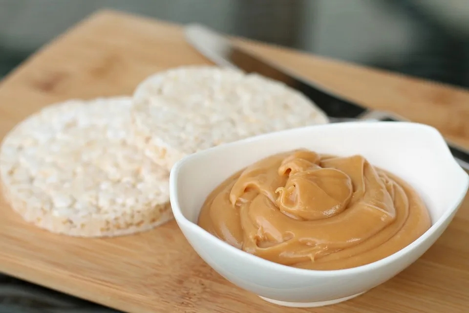

# Dulce de Leche

## Zutaten

4 Becher

- [ ] 50 g Butter

- [ ] 150 g Zucker

- [ ] 1 Päckchen Vanillezucker

- [ ] 1 Prise(n) Salz

- [ ] 1 Dose(n) (340 g) Kondensmilch (10 %)

- [ ] 150 ml Milch

Gewählte Zutaten:

## Utensilien

- Schraubgläser

## Zubereitung

1. Schritt
   
   Zutaten
   
   - 50 g Butter
   - •150 g Zucker
   - •1 Päckchen Vanillezucker
   - •1 Prise(n) Salz
   
   Die
   Butter in einem Topf oder in einer beschichteten Pfanne schmelzen 
   lassen. Zucker, Vanillezucker und Salz hinzufügen und unterrühren.

2. Schritt
   
   Zutaten
   
   - 1 Dose(n) (340 g) Kondensmilch (10 %)
   - •150 ml Milch
   
   Unter
   Rühren Kondensmilch und Milch dazugeben und weiterrühren, bis sich 
   alles zu einer homogenen Masse verbunden hat. Die Hitze reduzieren und 
   die Creme ca. 45 Minuten auf mittlerer Stufe köcheln lassen. Dabei 
   regelmäßig umrühren, damit nichts anbrennt. 

3. Schritt
   
   Nach etwa 40 Minuten erstmals testen, ob die Creme schon die richtige 
   Konsistenz hat. Dazu etwas von dem Karamell auf einen Unterteller 
   träufeln – wird es schnell fest, ist die Dulce de Leche fertig. 

4. Du brauchst
   
   - Schraubgläser
   
   Die Karamellcreme in ein sauberes Schraubglas füllen, abkühlen lassen und im Kühlschrank aufbewahren.

Diese Karamellcreme, die ihren Ursprung in Lateinamerika hat, schmeckt als 
Aufstrich auf Brot oder Pfannkuchen, macht sich aber auch großartig als 
Kuchenfüllung, Eis-Topping oder zum Süßen von Desserts.

Karamellaufstrich

# Dulce de Leche

Arbeitszeit 15 Min. Kühlen 12 h, Niveau Einfach

Wer diesen süßen Karamellaufstrich noch nicht kennt, sollte ihn 
unbedingt probieren. Mit unserem Dulce de Leche begeisterst du Jeden. 
Super lecker und ideal zum Verschenken!

 

Rezept von [Siggi](https://www.einfachbacken.de/autoren/siggi)

(https://www.einfachbacken.de/print/pdf/node/2274?&portions=3)

## Zutaten

3 Gläser

300 g Zucker

200 g Sahne

50 g Butter

300 ml Milch

½ TL Salz

300 g Zucker

Die Hälfte des Zucker in einem Topf karamellisieren lassen. Die zweite 
Hälfte des Zuckers zugeben und unter Rühren auflösen lassen.

200 g Sahne

50 g Butter

300 ml Milch

½ TL Salz

200g Sahne zugeben und bei starker Hitze 2-3 Min. köcheln lassen, bis der 
Karamell sich in der Sahne wieder gelöst hat. Restliche Zutaten zugeben 
und 10 Min. bei niedriger Hitze einköcheln lassen.

Vorsichtig und mit einer kleinen Schaumkelle in drei saubere
 Gläser (à 250 ml) füllen, luftdicht verschließen und mind. 12 Std. 
ziehen lassen. Im Kühlschrank aufbewahren. Der Aufstrich hält sich mind.
 3 Monate.

(Besser 200 ml Milch anstat 300 ml Milch)

# ein weiteres Rezept

## Zutaten

für 1 Portion

| 50 g       | Butter                                                                                              |
| ---------- | --------------------------------------------------------------------------------------------------- |
| 250 g      | Zucker                                                                                              |
| 1 Pck.     | Vanillezucker                                                                                       |
| 1 Prise(n) | [Salz](https://www.chefkoch.de/magazin/artikel/1054,2/Chefkoch/Salz-unser-wichtigstes-Gewuerz.html) |
| 250 ml     | Milch                                                                                               |
| 200 ml     | Kondensmilch, 10 % Fett                                                                             |

## Zubereitung

** Arbeitszeit ca. 10 Minuten ** Koch-/Backzeit ca. 1 Stunde 10 Minuten ** Gesamtzeit ca. 1 Stunde 20 Minuten

Das Karamell am besten in einer beschichteten Pfanne oder einem Topf
 zubereiten, so kann nichts anbrennen. Dafür die Butter in einer Pfanne 
bzw. in einem Topf schmelzen lassen. Zucker, Vanillezucker und 1 Prise 
Salz hinzugeben und kurz mit anschmelzen lassen. Milch und Kondensmilch 
hinzugeben und gut umrühren, bis sich alles gut aufgelöst hat. Hitze 
runterstellen (auf mittlere Stufe, am besten aber kleinste Stufe) und 
gute 45 - 60 Minuten köcheln lassen. Bitte mindestens alle 5 Minuten 
umrühren, damit nichts anbrennen kann. Die Zeitangabe ist relativ 
variabel, es kommt auf den Herd an und ob man Topf oder Pfanne nimmt.  

Ab der 40. Minute immer etwas vom Karamell nehmen und die Konsistenz 
testen, d. h. auf einen Teller etwas Karamell träufeln. Wird es fest, 
ist es genau richtig und das Dulce de Leche kann in Gläser abgefüllt 
werden. Aber bitte Vorsicht: Es ist super heiß.  

Die Gläser am besten im Kühlschrank aufbewahren, so erreicht es den perfekten Härtegrad und bleibt länger "frisch".  

Nun kann man es aufs Brot streichen, für Torten oder Kuchen verwenden etc.  

Reicht für ca. 1 Glas à 400 ml.
