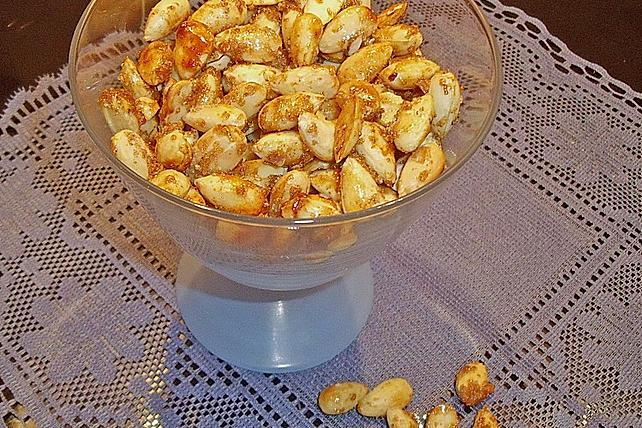

## Gebrannte Mandeln salzig - süß

## Zutaten

für

| 200 g        | [Mandel(n)](https://www.chefkoch.de/magazin/artikel/3679,0/Chefkoch/Mandeln-gesund-und-lecker-als-Snack-Gebaeck-und-Co.html) |
| ------------ | ---------------------------------------------------------------------------------------------------------------------------- |
| 30 g         | Zucker                                                                                                                       |
| ½ TL, gestr. | [Salz](https://www.chefkoch.de/magazin/artikel/1054,2/Chefkoch/Salz-unser-wichtigstes-Gewuerz.html)                          |
| ½ TL         | [Zimt](https://www.chefkoch.de/magazin/artikel/628,0/Chefkoch/Zimt-Vom-Zimtstern-ueber-Kochen-bis-zu-Wellness.html)          |
| ⅛ TL         | Kreuzkümmel                                                                                                                  |
| ½ Prise(n)   | Nelkenpulver                                                                                                                 |
| ¼ TL         | Currypulver                                                                                                                  |
| ¼ TL         | Pfeffer, schwarzer                                                                                                           |

## Nährwerte pro Portion

##### kcal

658

##### Eiweiß

24,23 g

##### Fett

53,24 g

##### Kohlenhydr.

22,02 g

## Zubereitung

Arbeitszeit ca. 20 Minuten *Gesamtzeit ca. 20 Minuten*

Die Mandeln schälen (statt Mandeln kann man auch Hasel- oder Walnüsse nehmen) und auf einem Backblech ausbreiten.  

Im vorgeheizten Backofen bei 180°C ca. 10-15 Min. goldgelb rösten und abkühlen lassen.  

Nun die Gewürze mit Salz und Zucker mischen. Die Mandeln nun in einer 
Pfanne erhitzen. Die Gewürzmischung darüber geben und so lange braten, 
bis alles karamellisiert ist.  

Auf einem Backpapier auseinander brechen und auskühlen lassen.
