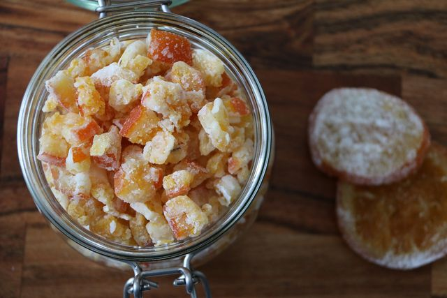

# Kandierte Früchte selber machen: Schritt-für-Schritt-Anleitung

\7. Juni 2021 von [Julia Kloß](https://utopia.de/author/juliakloss/) Kategorien: [Ernährung](https://utopia.de/ernaehrung/) 

Foto: CC0 / Pixabay / isromar

Kandierte Früchte sind eine leckere und  zugleich haltbare Süßigkeit, die du einfach zuhause selber machen  kannst. Alles, was du dafür brauchst, sind drei Zutaten und ein paar  Tage Geduld.

## Kandierte Früchte selber machen: Zutaten

Kandieren ist eine leichte traditionelle Methode, um Früchte länger haltbar zu  machen. Dafür entziehst du den Früchten Wasser und erhöhst ihren  Zuckergehalt auf mindestens 70 Prozent. Der hohe Zuckergehalt ist dann  auch für die lange Haltbarkeit verantwortlich.

**Für selbst kandierte Früchte benötigst du nur drei Zutaten:**

- Früchte deiner Wahl
- Wasser
- Zucker

**Tipp:** Eigentlich kannst du so gut wie alle Früchte kandieren. Sehr gut eignen sich zum Beispiel Trauben, Orangen, Kiwis, Himbeeren, Bananen, Äpfel  und Birnen. Am besten suchst du das **[Obst nach Saison](https://utopia.de/galerien/lebensmittel-saison-sommer/)** aus. So kannst du deine kandierten Früchte aus der Region beziehen, ohne dass sie durch den Import hohe **[CO2-Emissionen](https://utopia.de/ratgeber/co2-emissionen-das-musst-du-darueber-wissen/)** verursachen. Welche Früchte wann Saison haben, erfährst du in unserem **[Saisonkalender](https://utopia.de/ratgeber/saisonkalender-gemuese-und-obst-weihnachtsgeschenk/)**.

## Anleitung: Kandierte Früchte ganz leicht selber machen

Früchte kandieren ist nicht schwierig. Allerdings brauchen die Früchte **vier bis fünf Tage**, bis sie fertig sind und du sie essen kannst. Daran solltest du denken, wenn du sie für einen bestimmten Anlass benötigst.

**Die Vorbereitung der Früchte:**

1. Bereite die einzelnen Früchte vor. Je nachdem, welche Früchte du ausgewählt  hast, musst du sie gründlich waschen und schälen (zum Beispiel Kiwis  oder **[Ananas](https://utopia.de/ratgeber/ananas/)**).
2. Schneide das Obst entweder in dünne Scheiben oder in mundgerechte Stücke.  Früchte, die nicht zerschnitten werden, solltest du mehrmals einstechen. Dazu zählen zum Beispiel Kirschen und Aprikosen. Obst mit Kernen  solltest du entkernen. Achte darauf, dass dein Obst keine faulen Stellen hat.
3. Sehr harte Früchte wie Äpfel und Birnen kannst du vor dem Kandieren noch kurz **[blanchieren](https://utopia.de/ratgeber/blanchieren-so-bleibt-dein-gemuese-knackig/)**: Gib dazu das Obst für zwei bis drei Minuten in einen Topf mit heißem  Wasser und danach für die gleiche Zeit in eine Schale mit Eiswasser.

## Früchte kandieren: Schritt für Schritt

Kandierte Früchte kannst du leicht selber machen. (Foto: CC0 / Pixabay / mosauerin)

**Nach der Vorbereitung kannst du mit dem eigentlichen Kandieren beginnen:**

1. Stelle einen Sirup aus Zucker und Wasser her. Um zu testen, wie viel Wasser du benötigst, kannst du die Früchte in ein Sieb geben, dieses in einen  Topf hängen und mit so viel Wasser übergießen, bis sie bedeckt sind.  Diese Menge an Wasser nutzt du dann zur Herstellung der Zuckerlösung.  Die Früchte kannst du im Sieb lassen, bis sie gebraucht werden. **Tipp:** Stelle am besten etwas mehr Sirup her, sodass es am Ende auf jeden Fall ausreicht.
2. Fülle die benötigte Wassermenge nun in einen Kochtopf und gib Zucker im **Verhältnis 1:1** hinzu. Für einen halben Liter Wasser benötigst du also 500 Gramm Zucker.
3. Erhöhe die Temperatur etwas und koche die Wasser-Zucker-Mischung so lange, bis sie Fäden zieht.
4. Lasse den Sirup dann ein wenig abkühlen, bis er nur noch lauwarm ist.
5. Hänge die Früchte im Sieb währenddessen in einen zweiten Topf.
6. Gieße dann den Sirup darüber. **Wichtig:** Die Früchte müssen unbedingt vollständig bedeckt sein.
7. Setze dann einen Deckel auf den Topf und lasse die Früchte einen Tag so stehen.
8. Nimm am nächsten Tag das Sieb mit den Früchten aus dem Topf und koche den Sirup erneut auf.
9. Gieße die Flüssigkeit dieses Mal noch warm über die Früchte und lasse sie wieder einen Tag lang stehen.
10. Wiederhole am dritten Tag die Prozedur.
11. Am vierten und letzten Tag gießt du den Sirup nach dem Aufkochen noch heiß über das Obst.
12. Hole dann die Früchte aus dem Sirup und lege sie zum Beispiel auf einem Gitterrost aus.
13. Lasse sie gut trocknen.

Die Früchte sind nun einige Monate bis zu einem Jahr haltbar. Lagere sie trocken und dunkel.