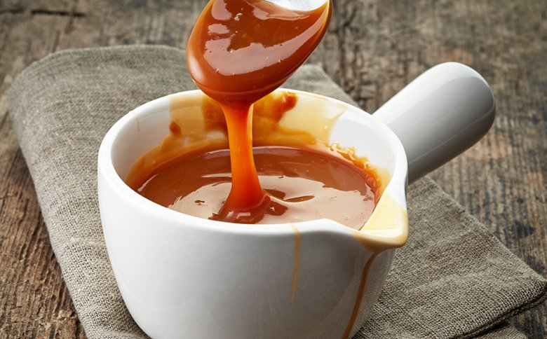

# Karamellsoße

## Zutaten für 4 Portionen

| 150 | g   | Zucker        |
| --- | --- | ------------- |
| 5   | EL  | Wasser        |
| 150 | ml  | Schlagsahne   |
| 1   | Pk  | Vanillezucker |
| 40  | g   | Butter        |

## Rezept Zubereitung

1. Für die **selbstgemachte Karamellsauce** eine Pfanne (oder einen Edelstahltopf) auf den Herd stellen und den Zucker und den Vanillezucker hineingeben.
2. Die angegebene Menge Wasser hinzufügen und alles bei mittlerer Hitze zum Kochen bringen.
3. Anschließend die Hitze reduzieren und den Pfanneninhalt solange 
   köcheln (rund 10-15 Minuten) lassen, bis er eine goldbraune Farbe 
   angenommen hat.
4. Nun die Pfanne von der Kochplatte nehmen und die Butter sowie die 
   Schlagsahne einrühren. Danach weiterrühren, bis die Butter geschmolzen 
   und eine glatte Masse entstanden ist.
5. Zuletzt die Karamellsauce in ein verschließbares Gefäß füllen und abkühlen lassen.

## Tipps zum Rezept

Basis für diese Sauce ist ein Karamellsirup, das aus 
Zucker und Wasser entsteht. Der Vorteil bei dieser Methode ist, dass der
 Zucker beim Karamellisieren nicht anbrennt, weil das Wasser das 
Erhitzen des Zuckers verlangsamt.

Der Karamellsirup ist fertig, wenn er eine Temperatur von 170 °C 
erreicht hat. Schon bei 176 °C verbrennt er! Also die Temperatur 
entweder mit einem Thermometer prüfen oder genau beobachten. Ist er 
tiefbraun und leicht rötlich? Etwas dickflüssiger als Ahornsirup und 
glänzend? Perfekt, ist er fertig.

Die Sahne und die Butter sollten vor dem Einrühren in den Karamellsirup Raumtemperatur angenommen haben.

Fest verschlossen hält sich die Sauce im Kühlschrank bis zu 3 Wochen,
 denn der Zucker wirkt wie ein Konservierungsstoff. Im Gefrierschrank 
hält sie sich sogar bis zu 3 Monate.
