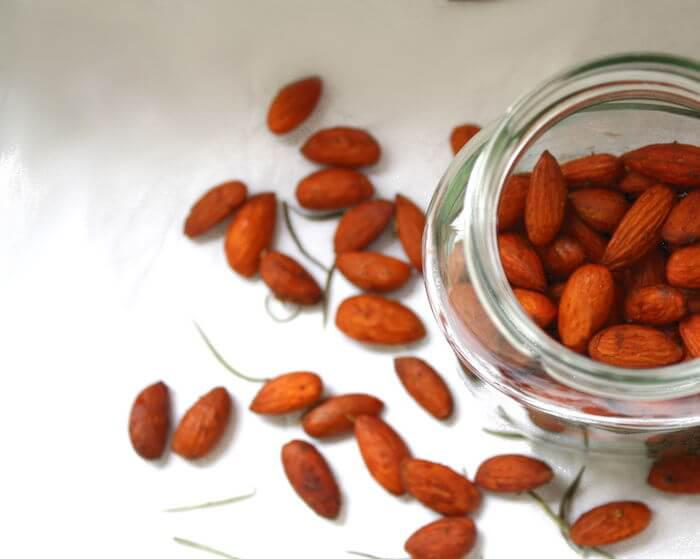

# Würzige Mandeln aus dem Ofen - ein salziger Snack zum Mitnehmen

## Zutaten für  Portionen

- 200 g Mandeln ungeschält
- 1 EL Rosmarin gerebelter, getrocknet
- Salz, Pfeffer, Knoblauchgranulat
- 1 EL Wasser
- 1 TL Ahornsirup

## Zubereitung (15 Minuten)

1. Alle Zutaten in einer Schüssel mischen, bis die Gewürze gleichmäßig verteilt sind.
2. Ein Backblech mit Backpapier auslegen und die marinierten Mandeln darauf verteilen.
3. Im vorgeheizten Ofen bei 180° für 10 Minuten rösten 
   lassen, währenddessen die Mandeln ein paar Mal wenden.
4. Nach dem Abkühlen bewahrt man die Mandeln am besten 
   in einem Glas mit Schraubverschluss auf - So sind sie für längere Zeit 
   haltbar.

Chips, Salzstangen und Co. sind beliebte Snacks. Um gestärkt 
weiterarbeiten zu können, sollten sie in der Arbeits-Pause jedoch lieber
 zu gesunden Alternativen greifen.
Dieses Rezept für würzige Mandeln ist ganz einfach zuzubereiten. Man 
kann eine größere Menge herstellen und ein Glas Mandeln für den kleinen 
Hunger im Büro aufbewahren. So ist man für eventuelle Hungeranfälle 
gewappnet und muss nicht zu ungesunden Snacks greifen. [Mandeln](https://www.issgesund.de/a/nuesse-nussarten-nusssorten#mandeln "Mandeln") liefern neben Kohlenhydraten und Eiweiß jede Menge ungesättigter 
Fettsäuren, Magnesium, Calcium und Vitamine.
Durch den Ahornsirup erhalten sie eine leichte Bräune und ein feines 
Karamellaroma. Knoblauch und Rosmarin bringen die nötige Würze mit, um 
die kleinen Kerne in einen leckeren Snack zu verwandeln.
Da Mandeln sehr fettreich sind, enthalten 100g über 500 Kalorien. Aus 
diesem Grund sollte man beim Snacken auf eine gesunde Portionsgröße 
achten: Eine Handvoll Mandeln enthält rund 150 Kalorien und ist eine 
ideale Portionsgröße, um den kleinen Hunger zwischendurch zu stillen.
Verpackt man diesen selbstgemachten Snack in hübsche Gläser, eignet er 
sich außerdem als Geschenk oder Mitbringsel zu einer Party!
Wenn Sie noch mehr zum Thema "gesunde Snacks" wissen möchten, werfen Sie
 einen Blick auf unsere Tipps zum gesunden [Snacken](https://www.issgesund.de/t/snacks "Snacken")!
