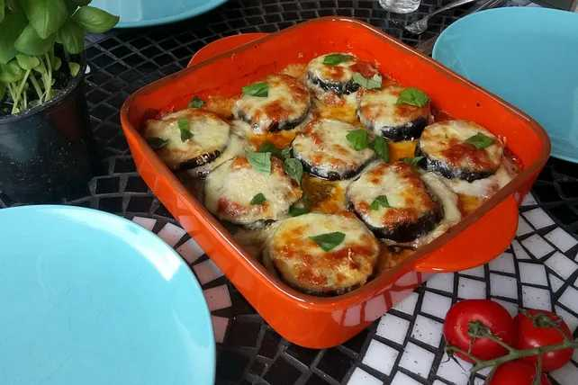

# Parmigiana di Melanzane

| Menge      | 4 Portionen                                                                                                                         |
| ---------- | ----------------------------------------------------------------------------------------------------------------------------------- |
| 4          | große Auberginen                                                                                                                    |
| 500 g      | [Tomate(n), passierte](https://www.chefkoch.de/magazin/artikel/46,0/Chefkoch/Tomaten-Pflanzen-ernten-tolle-Gerichte-entdecken.html) |
| 3 EL       | [Olivenöl](https://www.chefkoch.de/magazin/artikel/66,0/Chefkoch/Olivenoel-und-die-richtige-Verwendung-in-der-Kueche.html)          |
| 1 Handvoll | Basilikum, frisches                                                                                                                 |
| 300 g      | Parmesan, frisch geriebener                                                                                                         |
| 350 g      | Mozzarella, in Scheiben geschnitten                                                                                                 |
| 1          | m.-große Zwiebel(n)                                                                                                                 |
|            | Öl zum Frittieren                                                                                                                   |
|            | Mehl zum Frittieren                                                                                                                 |
|            | Salz und Pfeffer                                                                                                                    |
| 3          | Zehe/n Knoblauch                                                                                                                    |

## Zubereitung

* Arbeitszeit ca. 35 Minuten  

* Koch-/Backzeit ca. 50 Minuten

* Gesamtzeit ca. 1 Stunde 25 Minuten

| Was                                                                                                                          | Wie                                                                                                                                                                                                                                                                                                                                                                                                                                                                                                                   |
| ---------------------------------------------------------------------------------------------------------------------------- | --------------------------------------------------------------------------------------------------------------------------------------------------------------------------------------------------------------------------------------------------------------------------------------------------------------------------------------------------------------------------------------------------------------------------------------------------------------------------------------------------------------------- |
| 4 große Auberginen 3 EL Olivenöl                                                                                         | Die Auberginen in fingerdicke Scheiben schneiden und mit etwas Salz  bestreuen. Anschließend beiseitestellen und ca. eine Stunde ziehen  lassen (Achtung: sie ziehen Wasser, also in ein entsprechendes Gefäß  geben).  Danach gut abtupfen und in Mehl wälzen. Das Öl in einer Pfanne erhitzen  und die Auberginen darin frittieren, danach gut mit Küchenkrepp abtupfen  (die leichtere Variante: nicht frittieren, sondern in der Pfanne  grillen - schmeckt aber dafür nicht so gut). |
| 1 - 2 Zehen Knoblauch  500 g Tomate(n), passierte 1 Handvoll     Basilikum, frisches   1 m.-große     Zwiebel(n) | Währenddessen eine Salsa aus den passierten Tomaten, 1 - 2 Zehen  Knoblauch, Zwiebel, Basilikum und Olivenöl wie folgt herstellen: In  einem Topf die klein geschnittene Zwiebel und den gepressten bzw.  geschnittenen Knoblauch im Olivenöl goldbraun braten, die Tomaten  hinzugeben und am Schluss mit den klein geschnittenen Basilikumblättern  abschmecken (Tipp: einige Pinienkerne geben ein besonderes Aroma).                                                                          |
| 300 g  Parmesan, frisch geriebener  350 g Mozzarella, in Scheiben geschnitten                                            | Nun eine Backofenform mit etwas Olivenöl ausstreichen, den restlichen  Knoblauch fein schneiden und einen Teil davon am Boden der Form  verteilen. Darauf Auberginen verteilen, Salsa darauf verteilen, mit  Mozzarellascheiben belegen und etwas Parmesan darüber streuen. Nun  wieder Knoblauch, Auberginen, Salsa, Mozzarella und zum Schluss den  restlichen Parmesan schichten.                                                                                                              |
|                                                                                                                              | Im vorgeheizten Backofen bei 200 °C so lange überbacken, bis eine goldbraune Kruste entsteht, das dauert ca. 35 - 40 Minuten. Für den besonderen Geschmack, gebe ich in die letzte Schicht zusammen  mit dem Parmesan noch ca. 100 g geriebenen Pecorino, das gibt einen  intensiveren Geschmack.                                                                                                                                                                                                         |
