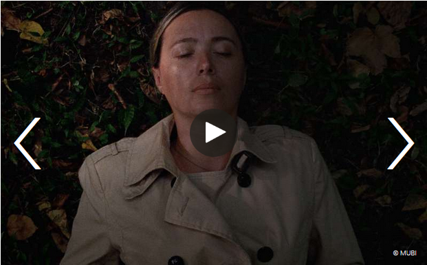

Ein georgischer Spielfilm mit langen Standszenen ind dem Mileu der Zeugen Jehovas
sehr verstörender Film, insbesondere das Ende, wo die Haptdarstellerin ihren sohn umbringt.

 Stillstand, Aufbruch, Ausbruch   
Ganze zwei sichtbare Kamerabewegungen geschehen während des mehr als zweistündigen Films „Beginning“ von Dea Kulumbegashvily — und doch versteht es das ergreifende Drama von Beginn an, seine Figuren und das Publikum in Bewegung zu versetzen. Unterteilt in streng komponierte Tableaus, die sich langsam entwickeln und erst mit der Dauer ihre ganze Wirkung entfalten, erzählt der Film von Yana (Ia Sukhitashvili), der Ehefrau von David (Rati Oneli, der auch am Drehbuch mitwirkte), der einer Gemeinde der Zeugen Jehovas in einem abgelegenen Winkel Georgiens vorsteht. Zu Beginn sehen wir, wie sich ihr Gemeindesaal langsam füllt und Yana hin und her eilt, um renitente Kinder zur Ordnung zu rufen, die eintreffenden Besucher des Gottesdienstes zu begrüßen und nach dem Rechten zu schauen. In aller Ausführlichkeit, ohne jeden Schnitt und in Echtzeit entfaltet sich hier der gemächliche Gang der Dinge und dennoch meint man zu spüren, dass hinter all dieser Langsamkeit etwas anderes lauert, eine Vorahnung, dass diese Anfangsszene nicht so ruhig bleiben wird, wie dies zunächst scheint. Und tatsächlich: Mitten in Davids Rede an die Gemeinde hinein fliegen zwei Brandsätze in den Saal und lösen ein unvorstellbares Chaos aus.

Bereits diese erste Szene gibt eine Ahnung davon, was sich in den folgenden mehr als zwei Stunden auf der Leinwand abspielen wird, in genau kadrierten Szenen, die den Stillstand und die Erstarrung Yanas ebenso perfekt einfangen wie deren Ausbruchsversuche, ihr Bemühen, zwischen der Rolle der treusorgenden Ehefrau, die ihr Mann und die Gemeinde von ihr erwarten; und ihrer eigenen Unruhe auf der Suche nach einem Ausweg aus diesem Gefängnis, etwas zu finden, das allein ihr gehört. „Es ist“, so sagt sie sinngemäß im Verlauf dieses Gesprächs, „als würde ich drauf warten, dass etwas beginnt. Oder etwas endet.“ David aber interessiert sich herzlich wenig für die Situation, in der sich seine Frau befindet, sondern erwartet vielmehr von ihr, dass sie ihn auf seiner anstehenden Reise in die Hauptstadt begleitet, um ihn zu unterstützen, wenn er den Ältestenrat der Zeugen Jehovas davon zu überzeugen versucht, das Gebetshaus so schnell wie möglich neu aufzubauen. Und so bleibt Yana gemeinsam mit ihrem Sohn Giogri (Saba Gogichaishvili) allein in dem Städtchen, in dem die Glaubensgemeinschaft argwöhnisch bis feindlich beäugt wird, und sieht sich immer seltsameren Vorkommnissen ausgesetzt: angefangen vom Besuch eines merkwürdigen vorgeblichen Polizeiinspektors bis hin zu ihrer Vergewaltigung durch ebenjenen Mann, was Yanas ohnehin schon verzweifelte Lage noch weiter verschärft.

Immer wieder findet Dea Kulumbegashivili eindrucksvolle Bilder für die Einsamkeit, Isolation und Verzweiflung Yanas. Besonders eindrücklich wird dies an einer Stelle ungefähr in der Mitte des Films, als Yanas Gesicht bewegungslos und mit geschlossenen Augen auf dem Waldboden liegend gezeigt wird. So schmerzhaft lang (sieben Minuten sind es) verharrt die Kamera dabei auf ihrem Gesicht und für einen kurzen Moment hofft man für sie, dass dies endlich ein Moment der Ruhe sein könnte, ein Augenblick des Zu-sich-Findens, eine Hoffnung, die der Film aber rüde negiert und zurückweist, denn wie sich in der nächste Szene herausstellt, war dies ein „Spiel“ mit dem Sohn, in dessen Verlauf sie sich tot stellte. Eine von vielen Szenen von gespenstischer Intensität und quälender Länge, die man am Schluss kaum mehr aushält.

Dea Kulumbegashivilis ganz eigener und zutiefst origineller Film atmet den Geist großer Vorbilder: Ihr Szenenaufbau erinnert vage an Roy Anderssons (viel statischere) Tableaus, ihr Interesse an Beziehungen und Glaubensfragen verweist auf Carlos Reygadas (der übrigens als Executive Producer an dem Film beteiligt war), ihre Bildfindungen in privaten Räumen und der Fokus auf Momente der Stille, Leere und Einsamkeit indes weisen eine Wahlverwandtschaft mit Chantal Akermans Jeanne Dielmann, 23, quai du Commerce, 1080 Bruxuelles (1975) auf, womit sich eine elegante kuratorische Linie zur diesjährigen Retrospektive Le Deuxième Souffle des IFFMH zeigt, in der exakt dieser Film zu sehen ist.

Der Assoziationsreichtum, den Kulumbegashvilis klug konstruierter Film hervorruft, und die Querverweise auf andere Filmemacher*innen, bedeutet aber in diesem Fall kein bloßes Epigonentum, sondern das souveräne Spiel mit Vorgefundenem und die Entwicklung hin zu einer Bildsprache und narrativen Technik, die ganz selbstverständlich eine klare, eigene Handschrift ausformt. Und so staunt man am Ende des wuchtigen Dramas nicht nur über die unerbittliche Konsequenz dieses Films, sondern auch darüber, wie weit eine Filmemacherin am Anfang ihrer Karriere und mit ihrem Debütlangfilm schon sein kann. Dass ihr Film nicht nur in der Auswahl von Cannes war, sondern auch im Wettbewerb von San Sebastian lief sowie bei den Festivals in Toronto, New York und Busan zu sehen war, verwundert jedenfalls kaum.

Von Dea Kulumbegashvili jedenfalls wird man noch viel hören und sehen. Ihr erster Film ist nicht nur eine beeindruckende Entdeckung, sondern birgt auch das Versprechen auf eine große Karriere als Filmemacherin in sich.
