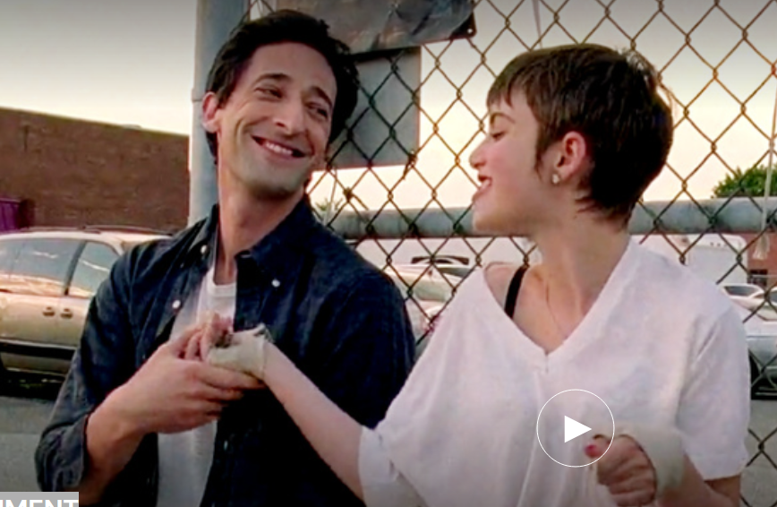

In Mubi gesehen:

DETACHMENT  

Regie von Tony Kaye USA, 2011Drama

FÜR ERWACHSENEDarum geht's
Henry Barthes ist der Aushilfslehrer, den sie holen, wenn jemand krank ist. Sein neuer Job an einer Schule wie ein Kriegsgebiet fordert ihn besonders, sieht er doch Hoffnungsschimmer in der Klasse, die andere längst aufgegeben haben.

Darum sehenswert
Tony Kaye (American History X) bringt seinen düsteren Realismus in diese Geschichte eines engagierten Lehrers, der in einem mangelhaften Bildungssystem arbeitet und sich mit seinem eigenen Trauma auseinandersetzt. Der Film besticht durch sein tolles Ensemble, angeführt vom brillanten Adrien Brody.

Guter Film, sehr berührend, wie der Lehrer an der Schule arbeitet. Sehr amerikanisch, die Distanz und doch auch zugewandt
